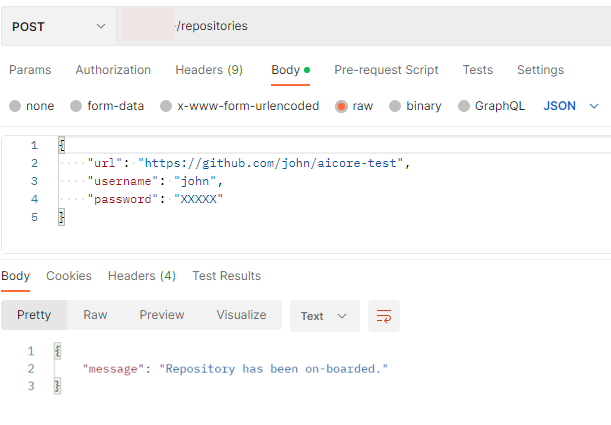

<!-- loiob6681769f191490f8832d3fbb6794e89 -->

# Add a Git Repository

You can use your own git repository to version control your SAP AI Core templates. The GitOps onboarding to SAP AI Core instances involves setting up your git repository and synchronizing your content.


<a name="loiob6681769f191490f8832d3fbb6794e89__section_tx5_1c3_dxb"/>

## Context

Git repositories are managed by creating personal access tokens registering them in SAP AI Core. Personal access tokens are a means of allowing and controlling connections to GitHub repositories without compromising your credentials.


<a name="loiob6681769f191490f8832d3fbb6794e89__section_w25_mqn_hvb"/>

## Prerequisites

-   You have access to a git repository over the Internet.
-   You have generated a personal access token for your git repository. For more information, see [Create a Personal Access Token](https://docs.github.com/en/authentication/keeping-your-account-and-data-secure/creating-a-personal-access-token).
-   If you want to onboard a git repository hosted on GitLab, make sure that the repository URL contains the `.git` suffix.
-   Secrets are not permitted in your repository. If secrets are used, it is not possible to synchronize content.

> ### Note:  
> When you synchronize resources, make sure that there are no naming collisions. This is particularly important if you use multiple repositories or applications in one tenant. If you experience difficulties during synchronization, we recommend that you use only one repository or application per tenant.


<a name="loiob6681769f191490f8832d3fbb6794e89__section_m1h_pvs_hvb"/>

## Using Postman

Send a POST request to the endpoint `{{apiurl}}/v2/admin/repositories` and include your credentials in JSON format in the *raw* body:




<a name="loiob6681769f191490f8832d3fbb6794e89__section_tpw_mws_hvb"/>

## Using curl

Submit a POST request to the endpoint <code><code>{{apiurl}}/v2/admin/repositories</code></code> and include your credentials:

```
curl --location --request POST "$AI_API_URL/v2/admin/repositories" \
--header "Authorization: Bearer $TOKEN" \
--header 'Content-Type: application/json' \
--data-raw '{
        "url": "https://github.com/john/examplerepo",
        "username": "john",
        "password": "<GIT_PAT_USER_TOKEN>"
    }'

```


You specify your unique git repository details as follows:

-   `url`: URL of the git repository

-   `username`: \(Service\) user that is accessing the git repository

-   `password`: git personal access token. For more information, see [Create a Personal Access Token](https://docs.github.com/en/authentication/keeping-your-account-and-data-secure/creating-a-personal-access-token).


