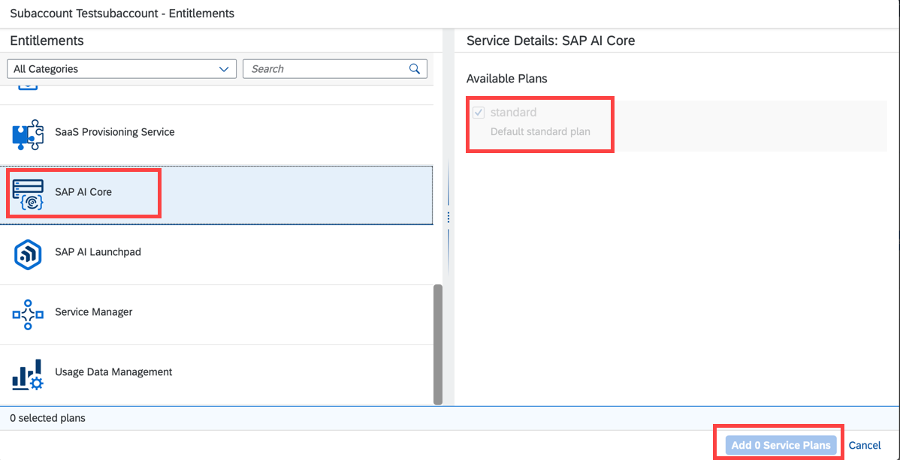

<!-- loio86002d926eba4fb9ba0a80e342af7295 -->

# Add a Service Plan

## Procedure

1.  SAP BTP cockpit, navigate to your global account, and choose *Entitlements* and then *Entity Assignments*.

2.  From the *Select Entities* box, select your subaccount and click *Select*.

3.  Choose *Configure Entitlements*.

    

4.  Choose *Add Service Plans*.

    

5.  Select SAP AI Core and pick a service plan.

    

6.  Save your changes.

    

**Parent topic:** [Initial Setup](initial-setup-38c4599.md "You provision SAP AI Core from the SAP BTP cockpit in SAP Business Technology Platform. After provisioning, you will have your service key, which provides URLs and credentials for accessing the SAP AI Core instance through SAP AI Launchpad Postman, or curl.")

**Next:** [Create a Space](create-a-space-4c1190c.md "")

**Previous:** [Create a Service Instance](create-a-service-instance-34761f9.md "")

**Related Information**  

[Service Plans](service-plans-c7244c6.md "The SAP AI Core service plan you choose determines pricing, conditions of use, resources, available services, and hosts.")

