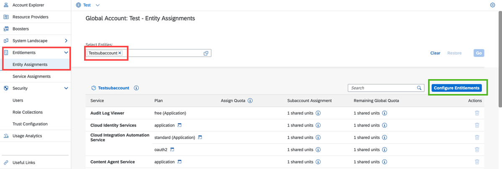
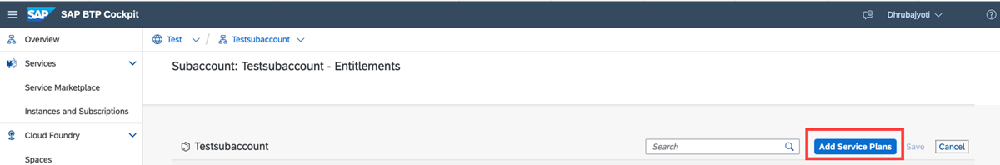
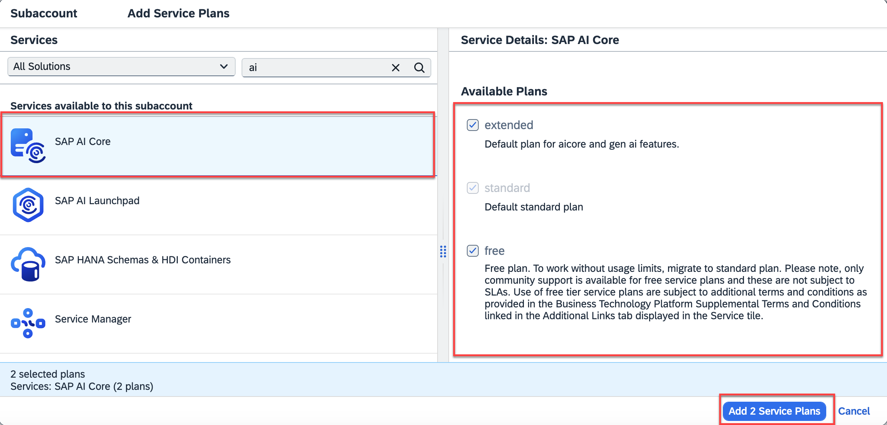

<!-- loio86002d926eba4fb9ba0a80e342af7295 -->

# Add a Service Plan

Configure the required entitlements to make SAP AI Core accessible in your subaccount.

## Procedure

1.  In SAP BTP cockpit, navigate to your global account and choose *Entitlements* and then *Entity Assignments*.

2.  Use the input help to select your subaccount and click *Edit*.

3.  Choose *Edit*.

    

4.  Choose *Add Service Plans*.

    

5.  Select SAP AI Core and pick your chosen service plan or plans.

    

    > ### Note:  
    > To use generative AI capabilities, choose the extended plan.For more information, see [Service Plans](service-plans-c7244c6.md). 

6.  Save your changes.

    

-   **[Service Plans](service-plans-c7244c6.md "The SAP AI Core service plan you choose determines pricing,
		conditions of use, resources, available services, and hosts.")**  
The SAP AI Core service plan you choose determines pricing, conditions of use, resources, available services, and hosts.

