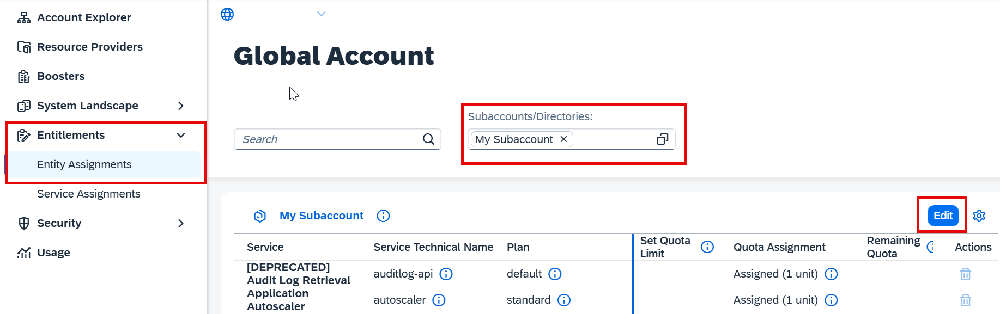

<!-- loio86002d926eba4fb9ba0a80e342af7295 -->

# Add a Service Plan

<a name="loio86002d926eba4fb9ba0a80e342af7295__prereq_pzq_c14_5pb"/>

## Prerequisites

-   The subaccount is in the SAP Business Technology Platform, Cloud Foundry environment with enabled Cloud Foundry capabilities. For more information, see [Enable Cloud Foundry](enable-cloud-foundry-cf0d5d2.md).

-   Your SAP BTP administrator has set the entitlement to a subaccount so that you can provision SAP AI Core. For more information, see [Managing Entitlements and Quotas Using the Cockpit](https://help.sap.com/docs/btp/sap-business-technology-platform/managing-entitlements-and-quotas-using-cockpit).

## Procedure

1.  On the page for your global account, choose *Entity Assignments*.

2.  Select your subaccount from the *Select Entities* box and click *Go*.

3.  Choose *Configure Entitlememts*.

    

4.  Click *Add Service Plans*.

    

5.  Select SAP AI Core and select the checkbox of your chosen plan, to add it to your service plan.

    

6.  Save your changes.

    

