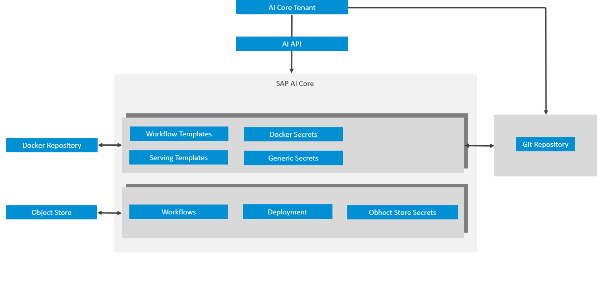
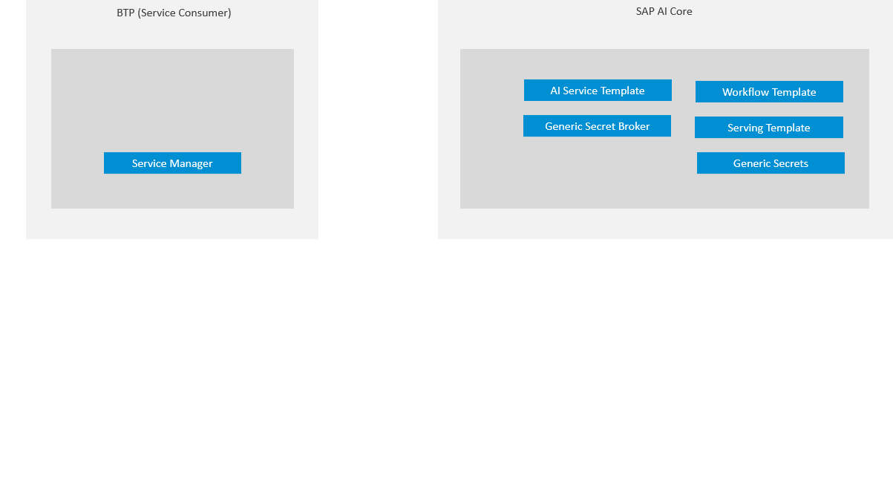

<!-- loio3fb039080ce14bad9a773e1a473ce24e -->

# AI Content as a Service

SAP AI Core helps users provide their AI content available as a service on the SAP BTP *Service Marketplace*, using GitOps.

**Service Providers** are an entity acting as SAP AI Core main tenant, who have chosen to make their AI Content \(for example Serving Template, Workflow Template, Docker Container\) available for consumption as a service through SAP BTP *Service Marketplace*.

**Service Consumer** are an entity acting as a consumer for Service exposing AI content from a Service Provider. Consumers can create service instance and use AI API \(serviceUrl\) to use available AI content. They can start executions or deployments.

<a name="loio3fb039080ce14bad9a773e1a473ce24e__section_wrl_ts3_1fc"/>

## Service Provider Flow

1.  Create AI content such as a workflow, serving template, or Docker registry that is consumer ready.
2.  Create a generic secret for broker registration. For more information, see [Create a Generic Secret](create-a-generic-secret-1831845.md).
3.  Provide a service custom resource YAML in a registered git repository.
4.  SAP AI Core creates a service broker for the content to be made available to the SAP BTP *Service Marketplace*. The service broker handles onboarding and offboarding for end consumers.
5.  Fetch the service broker information by calling the endpoint: `{{apiurl}}/v2/admin/services`.
6.  Register the service broker in the SAP BTP *Service Marketplace* and SAP Cloud Management service.

<a name="loio3fb039080ce14bad9a773e1a473ce24e__section_g43_ws3_1fc"/>

## Service Conusmer Flow

1.  The consumer creates service instance from the SAP BTP *Service Marketplace*.
2.  SAP AI Core creates a resource group for the consumer with *<resourceGroupId\>* == `serviceInstanceId`.
3.  The consumer creates a service key and starts using the service.

    > ### Note:  
    > The service provider main tenant is allowed to provision only 1 Service.

4.  Consumer: Starts consuming the service via provided url.

-   **[Service Custom Resource](service-custom-resource-59f767c.md "The service provider main tenant needs to prepare the service custom resource. The custom resource contains service details, reference to
		broker credentials or secrets, and capabilities configured for service consumers.")**  
The service provider main tenant needs to prepare the service custom resource. The custom resource contains service details, reference to broker credentials or secrets, and capabilities configured for service consumers.
-   **[Getting Started as a Service Provider](getting-started-as-a-service-provider-50a6d9f.md "")**  

-   **[Metering](metering-6152f95.md "Describes how SubaccountID and ServiceInstanceID are available as environment variables in the workflow runtime for metering.")**  
Describes how SubaccountID and ServiceInstanceID are available as environment variables in the workflow runtime for metering.
-   **[Offboarding](offboarding-1a33323.md "")**  

-   **[Shared Resource Group](shared-resource-group-dc1e577.md "")**  

**Parent topic:**[Advanced Features](advanced-features-24f2fbb.md "Explore advanced features, within SAP AI Core.")

