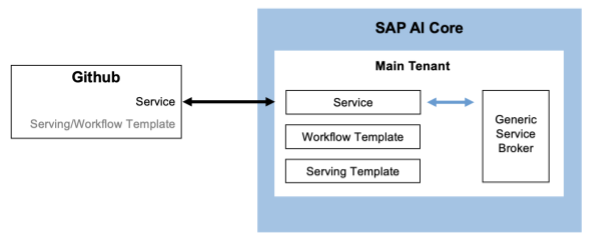

<!-- loio3fb039080ce14bad9a773e1a473ce24e -->

# AI Content as a Service

SAP AI Core helps users provide their AI content available as a service on the *Service Marketplace*, using GitOps.

Consumers can create service instances using SAP AI Core to use available content, and create their own executions or deployments. If the person acting as the main tenant chooses to make this available externally through the *Service Marketplace*, they become a service provider. The onboarding process for service providers and their content is as follows:

1.  Create AI content such as a workflow, serving template, or Docker registry that is consumer ready.
2.  Create a generic secret for broker registration. For more information, see [Create a Generic Secret](create-a-generic-secret-1831845.md).
3.  Provide a service custom resource YAML in a registered git repository.
4.  SAP AI Core creates a service broker for the content to be made available to the *Service Marketplace*. The service broker handles onboarding and offboarding for end consumers.
5.  Fetch the service broker information by calling the endpoint: `{{apiurl}}/v2/admin/services`.
6.  Register the service broker in the *Service Marketplace* and SAP Cloud Management service.
7.  The consumer creates service instance from the *Service Marketplace*.
8.  SAP AI Core creates a resource group for the consumer with *<resourceGroupId\>* == `serviceInstanceId`.
9.  The consumer creates a service key and starts using the service.

    > ### Note:  
    > The service provider main tenant is allowed to provision only 1 Service.

SAP AI Core deploys a generic service broker instance for the main tenant as follows:

-   **[Service Custom Resource](service-custom-resource-59f767c.md "The service provider main tenant needs to prepare the service custom resource. The custom resource contains service details, reference to
		broker credentials or secrets, and capabilities configured for service consumers.")**  
The service provider main tenant needs to prepare the service custom resource. The custom resource contains service details, reference to broker credentials or secrets, and capabilities configured for service consumers.
-   **[Onboarding](onboarding-50a6d9f.md "")**  

-   **[Offboarding](offboarding-1a33323.md "")**  

**Parent topic:**[Advanced Features](advanced-features-24f2fbb.md "Explore advanced features, within SAP AI Core.")

