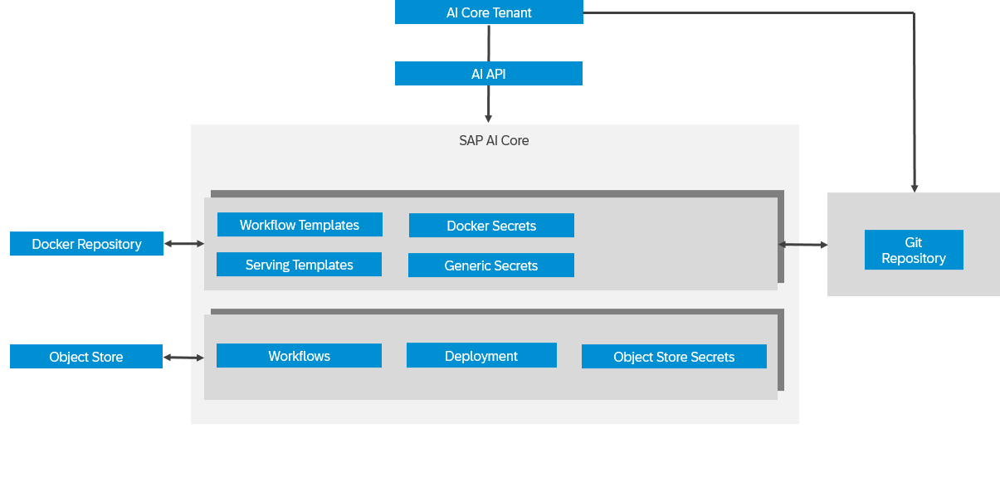

<!-- loio3fb039080ce14bad9a773e1a473ce24e -->

# AI Content as a Service

With SAP AI Core, you can publish AI content such as workflows, serving templates, or Docker images as a managed service on the SAP BTP *Service Marketplace*. This allows other tenants to consume your content through standard APIs.

A **service provider** is the main SAP AI Core tenant that publishes AI content as a service. For example, the service provider provides a workflow template for other users.

> ### Note:  
> A service provider tenant can provision only one service.

A **service consumer** is the tenant that consumes AI content published by a provider. Consumers create service instances, generate service keys, and use the provided service URL to access the content. They can also start executions or deployments.

<a name="loio3fb039080ce14bad9a773e1a473ce24e__section_wrl_ts3_1fc"/>

## Service Provider Flow

As a service provider, you publish your AI content to the SAP BTP *Service Marketplace* as follows:

1.  Create consumer-ready AI content \(for example, a workflow, serving template, or Docker image\).

2.  Create a generic secret for broker registration. For more information, see [Create a Generic Secret](create-a-generic-secret-1831845.md).

3.  Provide a service custom resource YAML in a registered git repository.

4.  Fetch the service broker information by calling the endpoint: `{{apiurl}}/v2/admin/services`.

5.  Register the service broker in the SAP BTP *Service Marketplace* and SAP Cloud Management service.

Your AI content is now available in the SAP BTP *Service Marketplace* for consumers to use. The service broker manages onboarding and offboarding of consumers automatically.

<a name="loio3fb039080ce14bad9a773e1a473ce24e__section_g43_ws3_1fc"/>

## Service Consumer Flow

As a service consumer, you create and use a service instance based on the provider’s content.

1.  In the SAP BTP *Service Marketplace*, create a service instance.

    SAP AI Core creates a resource group for you with:

    <code><i class="varname">&lt;resourceGroupId&gt;</i> == <code>serviceInstanceId</code></code>.

2.  Create a service key to authenticate against the service.

3.  Use the service URL to start executions or deployments with the AI API \(`serviceUrl`\).

-   **[Service Custom Resource](service-custom-resource-59f767c.md "The service provider main tenant needs to prepare the service custom resource. The custom resource contains service details, reference to
		broker credentials or secrets, and capabilities configured for service consumers.")**  
The service provider main tenant needs to prepare the service custom resource. The custom resource contains service details, reference to broker credentials or secrets, and capabilities configured for service consumers.
-   **[Getting Started as a Service Provider](getting-started-as-a-service-provider-50a6d9f.md "")**  

-   **[Metering](metering-6152f95.md "Describes how SubaccountID and ServiceInstanceID are available as environment variables in the workflow runtime for metering.")**  
Describes how SubaccountID and ServiceInstanceID are available as environment variables in the workflow runtime for metering.
-   **[Offboarding](offboarding-1a33323.md "")**  

-   **[Shared Resource Group](shared-resource-group-dc1e577.md "")**  

**Parent topic:**[Advanced Features](advanced-features-24f2fbb.md "Explore advanced features, within SAP AI Core.")

