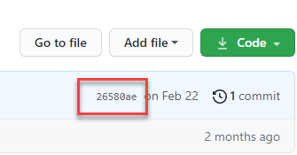

<!-- loio7f1e35be58fb4f909e43d44d994ab77d -->

# Application


<a name="loio7f1e35be58fb4f909e43d44d994ab77d__section_n1k_yqk_vsb"/>

## Templates are not synced via applications

After you have deleted or created an application, templates are not synced.


### Follow the solution:

1.  Delete the synced application using the endpoint:

    `DELETE``{{apiurl}}/v2/admin/applications/{{appName}}`

2.  Offboard the associated GitHub repository using the endpoint:

    `DELETE``{{apiurl}}/v2/admin/repositories/{{repositoryName}}`

3.  Onboard the associated GitHub repository using a personal access token instead of your GitHub password. For more information, see [Creating a personal access token](https://docs.github.com/en/authentication/keeping-your-account-and-data-secure/creating-a-personal-access-token).

    `POST``{{apiurl}}/v2/admin/repositories`

    > ### Sample Code:  
    > Body:
    > 
    > ```
    > {
    > "name": "aicore-test",
    >  "url": "https://github.com/john/aicore-test", 
    >  "username": "john", 
    >  "password": "yourGitHubPersonalAccessToken" 
    > }
    > ```

4.  Create the application using the endpoint:

    `POST``{{apiurl}}/v2/admin/applications` 

5.  Check the ArgoCD applications to determine if the repository has been synchronized correctly for the tenant. For example, check that there are no duplicated workflow names. The value of the `name` parameter is considered as an executable ID.

    ```
    name: text-clf-train-tutorial
    		annotations:
    			...apiVersion: argoproj.io/v1alpha1
    kind: WorkflowTemplate
    metadata:
    	
    ```

6.  Check that you’re calling SAP AI Core using the expected tenant.
7.  Check if the workflow templates contain the correct scenario label.
8.  Get your application sync status using the endpoint:

    `GET``{{apiurl}}/v2/admin/applications/{{appName}}/status`

    The status will any return errors in your templates. When your templates are updated, the application will resync automatically after approximately three minutes.


<a name="loio7f1e35be58fb4f909e43d44d994ab77d__section_gtk_yqk_vsb"/>

## Executables do not appear when you retrieve them from a scenario


### Follow the solution:

1.  Delete the synced application using the endpoint:

    `DELETE``{{apiurl}}/v2/admin/repositories/{{appName}}`

2.  Offboard the associated GitHub repository using the endpoint:

    `DELETE``{{apiurl}}/v2/admin/repositories/{{repositoryName}}`

3.  Onboard the associated GitHub repository using a personal access token instead of your GitHub password. For more information, see [Creating a personal access token](https://docs.github.com/en/authentication/keeping-your-account-and-data-secure/creating-a-personal-access-token).

    `POST``{{apiurl}}/v2/admin/repositories`

    > ### Sample Code:  
    > Body:
    > 
    > ```
    > apiVersion: argoproj.io/v1alpha1{
    > "name": "aicore-test",
    >  "url": "https://github.com/john/aicore-test", 
    >  "username": "john", 
    >  "password": "yourGitHubPersonalAccessToken" 
    > }
    > ```

4.  Create the application using the endpoint:

    `POST` `{{apiurl}}/v2/admin/applications`

5.  Check the ArgoCD applications to determine if the repository has been synchronized correctly for the tenant. For example, check that there are no duplicated workflow names. The value of the `name` parameter is considered as an executable ID.

    ```
    apiVersion: argoproj.io/v1alpha1
    kind: WorkflowTemplate
    metadata:
    	name: text-clf-train-tutorial
    		annotations:
    			...
    ```

6.  Check if the user is calling SAP AI Core using the expected tenant.
7.  Check that the scenario label is correct in the workflow templates.
8.  Get your application sync status using the endpoint:

    `GET``{{apiurl}}/v2/admin/applications/{{appName}}/status`

    The status will any return errors in your templates. When your templates are updated, the application will resync automatically after approximately three minutes.


<a name="loio7f1e35be58fb4f909e43d44d994ab77d__section_bkl_yqk_vsb"/>

## Application status returns ***healthy***, but most other properties are ***unknown***


### Follow the solution:

1.  Delete the synced application using the endpoint:

    `DELETE``{{apiurl}}/v2/admin/applications/{{appName}}`

2.  Offboard the associated GitHub repository using the endpoint:

    `DELETE`

    `{{apiurl}}/v2/admin/repositories/{{repositoryName}}`

3.  Onboard the associated GitHub repository using a personal access token instead of your GitHub password. For more information, see [Creating a personal access token](https://docs.github.com/en/authentication/keeping-your-account-and-data-secure/creating-a-personal-access-token).

    `POST``{{apiurl}}/v2/admin/repositories`

    > ### Sample Code:  
    > Body:
    > 
    > ```
    > {
    > "name": "aicore-test",
    >  "url": "https://github.com/john/aicore-test", 
    >  "username": "john", 
    >  "password": "yourGitHubPersonalAccessTokenHere" 
    > }
    > ```

4.  Create the application using the endpoint:

    `POST` `{{apiurl}}/v2/admin/applications`

5.  Check the ArgoCD applications to determine if the repository has been synchronized correctly for the tenant. For example, check that there are no duplicated workflow names. The value of the `name` parameter is considered as an executable ID.

    ```
    apiVersion: argoproj.io/v1alpha1
    kind: WorkflowTemplate
    metadata:
    	name: text-clf-train-tutorial
    		annotations:
    			...
    ```

6.  Check if the user is calling SAP AI Core using the expected tenant.
7.  Check if the workflow templates contain the correct scenario label.
8.  Get your application sync status using the endpoint:

    `GET``{{apiurl}}/v2/admin/applications/{{appName}}/status`

    The status will any return errors in your templates. When your templates are updated, the application will resync automatically after approximately three minutes.


<a name="loio7f1e35be58fb4f909e43d44d994ab77d__section_f5w_xlr_xsb"/>

## Application status message:***rpc error: code = Unknown desc = my-path: app path does not exist***

The specified path in your application doesn’t exist in your repository.


### Follow the solution:

Delete your application and create a new one using the correct path.


<a name="loio7f1e35be58fb4f909e43d44d994ab77d__section_sks_lkr_2tb"/>

## Application status message: ***application repo <your git repository\> is not permitted in project 'xyz'***

The repository URL cannot be found in your onboarded repositories.


### Check the following:

Make sure that the repository specified in your application has been successfully onboarded by using `GET` `{{apiurl}}/v2/admin/applications` and checking that the repository url has ***"status": "COMPLETED"***


<a name="loio7f1e35be58fb4f909e43d44d994ab77d__section_t2w_glr_2tb"/>

## Application status message: ***rpc error: code = Unknown desc = Unable to resolve 'not-existing-branch' to a commit SHA***

The revision you specified in your application doesn’t exist in your repository.


### Follow the solution:

Delete your application and create a new one using the correct revision. The revision number is found in GitHub here: 

Alternatively, enter `HEAD` to refer to the latest commit.


<a name="loio7f1e35be58fb4f909e43d44d994ab77d__section_xzt_wnr_2tb"/>

## Application status message: ***rpc error: code = FailedPrecondition desc = Failed to unmarshal \\"worklflow.yaml\\": failed to unmarshal manifest: error converting YAML to JSON: yaml: line 7: mapping values are not allowed in this context***

You have a syntax error in your workflow template.


### Follow the solution:

Use Argo Lint to identify syntax errors in your workflow template. To set up the Argo Lint IDE, refer to [Argo Lint IDE setup](https://argoproj.github.io/argo-workflows/ide-setup/) 


<a name="loio7f1e35be58fb4f909e43d44d994ab77d__section_y41_dpr_2tb"/>

## Application status message: ***spec.source.repoURL and spec.source.path either spec.source.chart are required***

You specified an empty path in your application.

```
{
    "healthStatus": "Unknown",
    "message": "spec.source.repoURL and spec.source.path either spec.source.chart are required",
    "reconciledAt": "Unknown",
    "source": {
        "path": "Unknown",
        "repoURL": "Unknown",
        "revision": "Unknown"
    },
    "syncFinishedAt": "Unknown",
    "syncRessourcesStatus": [],
    "syncStartedAt": "Unknown",
    "syncStatus": "Unknown"
}
```


### Follow the solution:

Delete your application and create a new one, specifying a path. Check its status by using the endpoint: `{{apiurl}}/v2/admin/applications/{{appName}}/status`


<a name="loio7f1e35be58fb4f909e43d44d994ab77d__section_m4l_4cy_3wX"/>

## Sync an Application Manually

Applications sync with your GitHub repository automatically at intervals of ~3 minutes. Use the endpoint below to manually request a sync:`{{apiurl}}/admin/applications/{{appName}}/refresh`

**Parent topic:**[Troubleshooting](troubleshooting-3da90ba.md "For troubleshooting information, see the following sections:")

**Related Information**  


[Repository](repository-fcad603.md "")

[Configuration](configuration-047fad5.md "")

[Artifacts](artifacts-c655daa.md "")

[Execution](execution-5ccde4d.md "")

[Docker](docker-1945aa4.md "")

[Deployment](deployment-a10fa8a.md "")

[Miscellaneous](miscellaneous-10622b5.md "")

