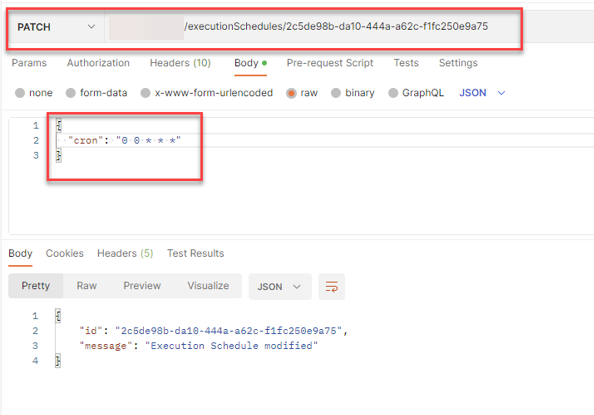

<!-- loio18caf4b12bbe474a85626cec00de4455 -->

# Change an Exisitng Training Schedule


<a name="loio18caf4b12bbe474a85626cec00de4455__section_ccz_4wl_lwb"/>

## Using Curl

You can change the cron definition, start, end, and configuration of an existing training schedule.

You can not change the name field.

Submit a PATCH request:

```
curl --location --request PATCH [/pandoc/div/div/horizontalrule/codeblock/span/code
     {"filepath"}) $AI_API_URL/v2/lm/executions?executionScheduleId=$EXECUTION_SCHEDULE (code]
--header “Authorization: Bearer $TOKEN” \
--header “ai-resource-group: $RESOURCE_GROUP” \
--data-raw '{ "cron": "0 0 * * *"
}'
```


<a name="loio18caf4b12bbe474a85626cec00de4455__section_x1z_4wl_lwb"/>

## Using Postman

You can change the cron definition, start, end, and configuration of an existing training schedule.

You can not change the name field.

Submit your changes in a PATCH request to `{{apiurl}}/v2/lm/executionSchedules/{{executionScheduleId}}`.



**Parent topic:** [Training Schedules](training-schedules-2b702f8.md "")

**Related Information**  


[Create a Training Schedule](create-a-training-schedule-bd409a9.md "")

[List Executions Created by a Training Schedule](list-executions-created-by-a-training-schedule-2c1ecfb.md "")

[Delete a Training Schedule](delete-a-training-schedule-9dc25e1.md "")

