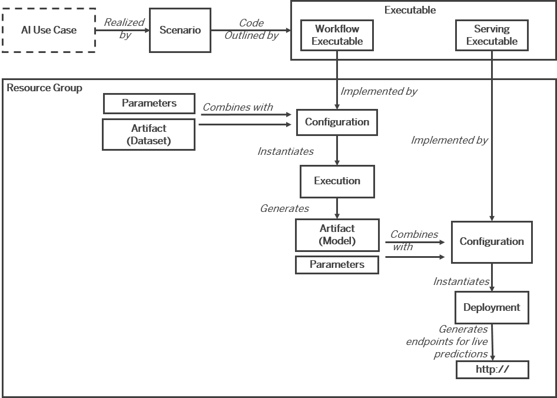

<!-- loio4c6b2dab26e7460a9ef9b8130c8cb3c2 -->

# Concepts

In this section, we'll explore some of the concepts surrounding both the SAP AI Core and SAP AI Launchpad services.

****

<table>
<tr>
<th valign="top">

Term

</th>
<th valign="top">

Definition

</th>
</tr>
<tr>
<td valign="top">

AI API

</td>
<td valign="top">

An application programming interface that manages and organizes AI artifacts and workflows \(such as training scripts, datasets, models, and model servers\) across multiple AI runtimes \(environments where AI models are executed, such as cloud platforms or edge devices\) to facilitate the development, deployment, and monitoring of AI applications.

</td>
</tr>
<tr>
<td valign="top">

AI API connection

</td>
<td valign="top">

A link between SAP AI Launchpad and a runtime. This connection is established through the AI API. For more information, see About the AI API.

</td>
</tr>
<tr>
<td valign="top">

AI scenario consumer

</td>
<td valign="top">

A user, either paying or non-paying, who utilizes an AI-powered software application, API, or platform for tasks such as automation, prediction, or decision-making. The consumer may have varying levels of technical expertise, ranging from non-technical end-users to experienced developers.

</td>
</tr>
<tr>
<td valign="top">

AI scenario producer

</td>
<td valign="top">

The developer or provider responsible for creating, maintaining, and updating an AI scenario. AI scenarios can be managed in three ways:

-   SAP-managed: Developed and maintained by SAP
-   Partner-managed: Developed and maintained by SAP partners
-   In-house: Developed and maintained by the organization using the AI scenario

</td>
</tr>
<tr>
<td valign="top">

AI service

</td>
<td valign="top">

A Software as a Service \(SaaS\) offering provided by SAP Business Technology Platform that enables users to leverage artificial intelligence capabilities for specific use cases. It is typically accessed through an AI API and can be used to expose and deploy AI scenarios as consumable services.

</td>
</tr>
<tr>
<td valign="top">

AI use case

</td>
<td valign="top">

A specific application of AI technology designed to generate business value by improving efficiency, reducing costs, or enhancing customer satisfaction. Examples include invoice matching in finance, product recommendations in e-commerce, product review classification in customer service, fraud detection in banking, and predictive maintenance in manufacturing.

</td>
</tr>
<tr>
<td valign="top">

artifact

</td>
<td valign="top">

Any tangible by-product produced or consumed by an execution or deployment. Artifacts can include data, files, binaries, libraries, packages, or other resources. They serve as inputs or outputs for various stages of the software lifecycle and are often versioned to track changes and maintain a history of the development process.

</td>
</tr>
<tr>
<td valign="top">

configuration

</td>
<td valign="top">

A collection of parameters, artifact references \(such as datasets or models\), and environment settings that are used to instantiate and run an execution or deployment of an executable or template. A configuration binds specific values to input parameters and specifies the versions of artifacts to be used. It is required to run an execution or deployment, and multiple configurations can be associated with a single executable or template \(a 1:n relationship\). Configurations are used in both training and serving processes to train models or serve predictions, respectively. They provide a way to customize and control the behavior of the executable or template for different scenarios or use cases.

</td>
</tr>
<tr>
<td valign="top">

dataset

</td>
<td valign="top">

A collection of data used for training, testing, or analysis in artificial intelligence and machine learning applications. A dataset has the following characteristics:

-   References a specific data source, such as a file, database, or API
-   Includes metadata describing the structure, format, and content of the data
-   May require specific tools, libraries, or credentials to access and process the data
-   Can be used as input to machine learning models, algorithms, or data processing pipelines
-   Is uniquely identified by an ID, which is used to reference the dataset in configurations and bind it to specific components or tasks
-   May be versioned to track changes and ensure reproducibility of results
-   Can be divided into subsets for training, validation, and testing purposes
-   May undergo preprocessing, cleaning, or augmentation steps to prepare the data for use in machine learning tasks

</td>
</tr>
<tr>
<td valign="top">

deployment

</td>
<td valign="top">

An instance of a model serving template \(a serving executable or deployment template\) that is configured to use a model artifact and apply it to data passed in a serving request \(for example, for prediction\). A successful deployment creates a model server and generates a deployment URL for inference. As input, a deployment takes one or more models and parameters from a configuration.

The serving executable or deployment template defines the expected parameters and input dataset required for the serving process. Values for these parameters and input models are provided by a configuration.

Deployments are implemented on a runtime that produces HTTPS endpoints, enabling secure access to the deployed models for inference.

</td>
</tr>
<tr>
<td valign="top">

deployment template

</td>
<td valign="top">

A template that defines the parameters and inputs required to serve or deploy one or more trained models. The template is instantiated with a specific configuration, which provides the necessary parameters and inputs. The resulting instance of the template is then used to serve the trained models. Deployment templates are used in the application to facilitate the deployment and serving of machine learning models.

A deployment template is also known as a “serving executable”.

</td>
</tr>
<tr>
<td valign="top">

embedding

</td>
<td valign="top">

A dense, low-dimensional vector representation that captures the semantic and syntactic information of a discrete input item, such as a word, phrase, or other entity, learned from a large dataset. Embeddings are typically used as input features in machine learning models to represent the underlying meaning and relationships of the items in a continuous space.

</td>
</tr>
<tr>
<td valign="top">

executable

</td>
<td valign="top">

A reusable template that defines a workflow or pipeline for tasks such as training a machine learning model or creating a deployment. It contains placeholders for input artifacts \(datasets or models\) and parameters \(custom key-pair values\) that enable the template to be reused in different scenarios.

There are two types of executables:

-   Non-deployable executables: When instantiated, they result in executions that may produce output artifacts.
-   Deployable executables: When instantiated, they result in deployments that generate URLs for inference.

Executables are referred to as “templates” within the application. They can have user-defined labels applied to them, which are listed with the executable's details.

The code within an executable defines the training pipeline or model deployment pipeline, leveraging the placeholders for input artifacts and parameters to make the template reusable.

</td>
</tr>
<tr>
<td valign="top">

execution

</td>
<td valign="top">

A workflow execution, also known as a “run” in the app, is an instance of a non-deployable executable that represents a single run of a pipeline. There are two types of executions:

-   Training execution: A run of a training pipeline that takes input artifacts and parameters, and produces trained AI models as output artifacts.
-   Batch-inferencing execution: A run of a batch-inferencing pipeline that takes input artifacts and parameters, and produces result sets as output artifacts.

Each execution is associated with metadata, including metrics, labels, tags, and custom information, which can be queried using the execution ID. For example, a training execution might have metrics like accuracy and loss, while a batch-inferencing execution might have metrics like processing time and number of processed records.

</td>
</tr>
<tr>
<td valign="top">

function

</td>
<td valign="top">

A modular, reusable piece of functionality that can be utilized across different scenarios or workflows. Functions are designed to perform specific tasks or computations and can be combined or integrated into larger scenarios to achieve complex business objectives. For example, a data preprocessing function can be used to clean and transform input data before feeding it into a machine learning model, while a model evaluation function can be used to assess the performance of a trained model. Functions promote code reusability, maintainability, and efficiency in building AI solutions.

</td>
</tr>
<tr>
<td valign="top">

input artifact

</td>
<td valign="top">

Placeholder in an executable or template that enables the attachment of datasets or models required for the execution of an AI workflow or pipeline. These artifacts can include training data, validation data, pre-trained models, or any other data or model assets needed for the AI process.

</td>
</tr>
<tr>
<td valign="top">

job executable

</td>
<td valign="top">

A simplified representation of a workflow executable. A job executable encapsulates the essential components and logic of a workflow, allowing users to easily understand and manage the execution of AI and machine learning tasks within the Functions Explorer interface of SAP AI Launchpad.

</td>
</tr>
<tr>
<td valign="top">

job template

</td>
<td valign="top">

A predefined configuration that specifies the parameters and resources required to execute a long-running AI process, such as model training, batch inference, or data preprocessing. It defines the Docker image, compute resources, environment variables, and other settings needed to run the job. Job templates act as blueprints that can be instantiated to create and execute specific job instances with customized parameters.

</td>
</tr>
<tr>
<td valign="top">

knowledge graph

</td>
<td valign="top">

A structured representation of entities, their attributes, and the relationships between them, which can be inferred from various data sources, including structured, semi-structured, and unstructured data. Knowledge graphs enable machines to understand and reason about complex real-world concepts and their interconnections, facilitating tasks such as semantic search, recommendation systems, and question answering. Examples of knowledge graphs include ontologies, taxonomies, and knowledge bases.

</td>
</tr>
<tr>
<td valign="top">

label

</td>
<td valign="top">

A key-value pair attached to a metric to provide additional context and metadata. Labels are used to classify and categorize metrics, enabling users to filter, group, and aggregate data for better insights and analysis. A set of labels can be applied to each instance of a metric record, allowing for more granular and targeted monitoring.

</td>
</tr>
<tr>
<td valign="top">

metrics

</td>
<td valign="top">

A key/value pair where the value is numeric. Metrics are used to measure and monitor the performance, progress, and quality of a model during the training process. Common examples of metrics include accuracy, precision, recall, F1 score, and mean squared error. Metrics can have optional step, timestamp, and label fields, which provide additional information about the metric's context. Every metric \(and associated labels\), tag, and custom info must be associated with a specific training execution. This association allows for proper organization, tracking, and comparison of different training runs. Once the metric, tag, and custom info are saved, they can be queried using an execution ID. SAP AI Launchpad provides a user-friendly interface to visualize and analyze the captured metrics, enabling users to monitor the model's performance and make informed decisions based on the data.

</td>
</tr>
<tr>
<td valign="top">

model

</td>
<td valign="top">

An artifact that is the output of a machine learning training process, representing the learned patterns, parameters, and structure of a trained system.

-   A model is generated by a training process, which optimizes the model's parameters based on training data.
-   A model consists of one or more files stored in a hyperscaler storage system \(such as SAP AI Core's connected data storage\) or the data lake for SAP HANA Cloud.
-   Each model is uniquely identified by a model ID, which is used in a configuration to bind the model as an input artifact to the serving executable for deployment.
-   Models can be manually uploaded to the connected data storage or automatically generated and uploaded as the output of a training execution in SAP AI Launchpad.
-   The model encapsulates the learned knowledge of the AI system and is used for making predictions or decisions on new, unseen data during inference.
-   Different types of models exist, such as neural networks, decision trees, or clustering models, each suited for different AI tasks and data types.
-   In SAP AI Core, models are managed and versioned artifacts that can be deployed to serving endpoints for production inference.

</td>
</tr>
<tr>
<td valign="top">

model serving template

</td>
<td valign="top">

A predefined configuration that specifies how a trained machine learning model is to be deployed and served for inference in a production environment, typically including details such as the model framework, runtime environment, resources required, and API endpoints.

</td>
</tr>
<tr>
<td valign="top">

operations

</td>
<td valign="top">

All activities within the AI lifecycle, including data preparation, model training, model deployment, application integration, model monitoring, and continuous improvement.

</td>
</tr>
<tr>
<td valign="top">

output artifact

</td>
<td valign="top">

Generated results, typically AI models, produced by executing or running a training process or pipeline. When AI models are generated from an execution, they are automatically uploaded and registered to the connected data lake for SAP HANA Cloud or to the hyperscaler data storage, which is a scalable cloud storage solution provided by major cloud service providers such as Amazon Web Services \(AWS\), Microsoft Azure, or Google Cloud Platform \(GCP\).

</td>
</tr>
<tr>
<td valign="top">

parameter

</td>
<td valign="top">

A placeholder in an executable \(script, program, or model\) to which a value of a specific data type \(String, Integer, Float, Boolean, List, or Dictionary\) is assigned during runtime. The values are provided by configurations, which are settings or files that define the parameter values. Parameters are used to provide input data, settings, or options to the executable for customizing its behavior in executions or deployments.

</td>
</tr>
<tr>
<td valign="top">

prompt

</td>
<td valign="top">

A natural language instruction or query given to a generative AI model to elicit a response. An AI platform like SAP AI Launchpad includes capabilities for prompt experimentation, management, and administration:

-   Prompt experimentation: Creating and running natural language prompts with a choice of large language models and adjustable parameters to test and optimize prompts.
-   Prompt management: Saving, organizing, and managing prompts using collections, metadata \(tags and notes\), versioning to track changes over time, and deletion when no longer needed.
-   Prompt administration: Tools for governing prompt usage, monitoring prompt performance, controlling access and permissions, and ensuring responsible AI practices.

</td>
</tr>
<tr>
<td valign="top">

resource group

</td>
<td valign="top">

A dedicated workspace for a specific AI scenario or use case. It allows users to organize, manage, and collaborate on related AI entities such as configurations, executions, deployments, and artifacts within a defined scope. Resource Groups ensure isolation and access control, enabling users to work on their AI projects independently while sharing common resources and artifacts as needed. Each Resource Group is associated with a unique subscription to an SAP AI Launchpad tenant.

</td>
</tr>
<tr>
<td valign="top">

result set

</td>
<td valign="top">

A data artifact or dataset that contains the results of a batch inference run \(execution\). A batch inference run uses a trained machine learning model to process an input dataset containing data points or instances and generates predictions or inferences for each data point. The result set is an output artifact that stores these predictions or inferences.

</td>
</tr>
<tr>
<td valign="top">

run

</td>
<td valign="top">

A training process that generates a model or models based on a run template. Also known as an “execution”.

</td>
</tr>
<tr>
<td valign="top">

run template

</td>
<td valign="top">

A template that defines the components required for an AI pipeline within the ML Operations application. It specifies placeholders for parameters, input artifacts \(such as datasets\), and output artifacts \(such as trained models\) that are necessary to instantiate and run the executable successfully. The actual values for these placeholders are provided by a configuration, which is a set of settings and parameters specific to a particular use case. In SAP AI Launchpad, a run template is also referred to as a “workflow executable”.

</td>
</tr>
<tr>
<td valign="top">

runtime

</td>
<td valign="top">

The environment or platform that provides the necessary processing resources to execute AI and machine learning workloads, such as training and inference. It enables businesses to make their applications intelligent by leveraging AI and machine learning technologies, and allows them to train AI services using their data to automate tasks and processes. SAP AI Core is an example of a runtime.

</td>
</tr>
<tr>
<td valign="top">

SAP AI Core

</td>
<td valign="top">

A service in the SAP Business Technology Platform designed to handle the execution and operations of your AI assets \(machine learning models, datasets, and other AI-related resources\) in a standardized, scalable, and hyperscaler-agnostic way, meaning it can work with different cloud service providers such as AWS, Azure, and Google Cloud Platform. SAP AI Core provides seamless integration with your SAP solutions, enabling you to easily incorporate AI capabilities into applications like SAP S/4HANA, SAP SuccessFactors, or SAP Customer Experience. Any AI function can be realized using popular open-source frameworks such as TensorFlow, PyTorch, or scikit-learn. SAP AI Core supports the full lifecycle management of AI scenarios, including data preparation, model training, deployment, monitoring, and retraining.

</td>
</tr>
<tr>
<td valign="top">

SAP AI Launchpad

</td>
<td valign="top">

A multitenant software as a service \(SaaS\) application on SAP Business Technology Platform \(SAP BTP\). Customers and partners can use SAP AI Launchpad as a centralized platform to manage AI use cases \(scenarios\), which are specific applications or problems that can be solved using AI, across multiple instances of AI runtimes \(such as SAP AI Core\). SAP AI Launchpad also provides access to the generative AI hub, which offers a set of pre-built generative AI models and tools that users can leverage to create and deploy their own generative AI applications.

</td>
</tr>
<tr>
<td valign="top">

scenario

</td>
<td valign="top">

An implementation of a specific AI use case within a user's tenant. It consists of a pre-defined set of AI capabilities in the form of executables \(pre-built AI models or services that can be directly deployed\) and templates \(outlines of AI models or services that need to be trained with customer data\).

A scenario can have multiple versions that correspond to different versions of its contained executables and templates. Placeholders within the executables and templates are populated with customer-specific values using a configuration.

The purpose of a scenario is to group executables and templates related to an AI use case and make them available to all AI consumers in the tenant, while also enabling version tracking as the AI models and services evolve over time.

</td>
</tr>
<tr>
<td valign="top">

serving executable

</td>
<td valign="top">

A predefined AI pipeline that encapsulates the necessary components and logic to deploy an AI model or application. It serves as a blueprint for creating a specific deployment instance.

A deployment template defines placeholders for parameters, input artifacts \(such as datasets\), and output artifacts \(such as trained models\). These placeholders are filled with actual values provided by a configuration when the template is instantiated.

Instantiating a deployment template involves providing the required configuration, which specifies the concrete values for the parameters and input artifacts. This process creates a deployment instance that can be executed to train, evaluate, or serve an AI model or application.

In the SAP AI Launchpad, deployment templates are referred to as “serving executables”.

</td>
</tr>
<tr>
<td valign="top">

tag

</td>
<td valign="top">

A name/value pair that is used to categorize and organize test executions. Tags allow for the segregation and grouping of test executions based on specific criteria, making it easier to manage, analyze, and report on the results. For example, you can assign tags to a group of selected test executions to indicate their purpose, priority, or other relevant characteristics. A set of tags can be associated with a MetricResource, which is an entity that represents a specific metric or measurement. The MetricResource, in turn, is linked to an execution, establishing a connection between the tags and the corresponding test run. This relationship enables the effective tracking, monitoring, and evaluation of test executions based on their assigned tags.

</td>
</tr>
<tr>
<td valign="top">

tenant

</td>
<td valign="top">

A logically separated customer instance that represents an organization or a company. Each tenant has its own isolated collection of customized content and services, which are available only to that specific tenant, its users, and the service provider managing the multi-tenant environment.

</td>
</tr>
<tr>
<td valign="top">

training

</td>
<td valign="top">

The process of running a machine learning algorithm on a dataset to produce a trained model. The trained model is an artifact that captures the patterns and relationships learned from the data, which can then be used to make predictions or decisions on new, unseen data.

</td>
</tr>
<tr>
<td valign="top">

workflow executable

</td>
<td valign="top">

A template that defines the components required for an AI pipeline within the ML Operations application. It specifies placeholders for parameters, input artifacts \(such as datasets\), and output artifacts \(such as trained models\) that are necessary to instantiate and run the executable successfully. The actual values for these placeholders are provided by a configuration, which is a set of settings and parameters specific to a particular use case. In SAP AI Launchpad, a workflow executable is also referred to as a “run template”.

</td>
</tr>
</table>

You can see how these concepts interact from the following diagram:

-   **[SAP AI Core Overview](sap-ai-core-overview-88e0078.md "SAP AI Core is the key to integrating artificial intelligence
		capabilities in your SAP solutions.")**  
SAP AI Core is the key to integrating artificial intelligence capabilities in your SAP solutions.
-   **[Generative AI Hub in SAP AI Core Overview](generative-ai-hub-in-sap-ai-core-overview-a126bd6.md "The generative AI hub incorporates generative AI into your AI activities in SAP AI Core and SAP AI Launchpad. ")**  
The generative AI hub incorporates generative AI into your AI activities in SAP AI Core and SAP AI Launchpad.

