<!-- loiobf0373b1cf2a4680a7044e1a562d3853 -->

# Consume Generative AI Models

You consume a generative AI model by sending a request to the endpoint `{{deploymentUrl}}/chat/completions?api-version={{api-version}}`. LLMs can carry out natural language-related tasks such as answering questions, summarizing text, and extracting information from a body of text.


<a name="loiobf0373b1cf2a4680a7044e1a562d3853__prereq_nzn_mdw_tyb"/>

## Prerequisites

-   You have the deployment URL for your generative AI model. For more information, see [Create a Deployment for a Generative AI Model](create-a-deployment-for-a-generative-ai-model-b32e7a8.md).


<a name="loiobf0373b1cf2a4680a7044e1a562d3853__context_wb4_2fc_zyb"/>

## Context

The body of your request must include the `messages` parameter that defines your query.

Ensure that you have the following headers set:


<table>
<tr>
<th valign="top">

Header

</th>
<th valign="top">

Value

</th>
</tr>
<tr>
<td valign="top">

Authorization

</td>
<td valign="top">

Bearer $TOKEN

</td>
</tr>
<tr>
<td valign="top">

AI-Resource-Group

</td>
<td valign="top">

The resource group used in the activation steps

</td>
</tr>
</table>

You can also include optional parameters such as:


<table>
<tr>
<th valign="top">

Models

</th>
<th valign="top">

Parameters

</th>
</tr>
<tr>
<td valign="top">

Azure

</td>
<td valign="top">

-   `max_tokens`: An integer that defines the maximum number of tokens allowed for the generated answer. The default value is 4,096.

-   `temperature`: A number between 0 and 2. Higher values make the output more random; lower values make it more focused and deterministic.

-   `frequency_penalty`: A number between -2.0 and 2.0. Positive values penalize new tokens based on their existing frequency in the text so far, decreasing the model's likelihood to repeat the same line verbatim.

-   `presence_penalty`: A number between -2.0 and 2.0. Positive values penalize new tokens based on whether they appear in the text so far, increasing the model's likelihood to talk about new topics.

-   `stop`: A string or array. Up to four sequences. If the output generates one of the stop values, it will stop generating content.


For more information, see [Azure Chat Completions Documentation](https://learn.microsoft.com/en-us/azure/ai-services/openai/reference#chat-completions).

</td>
</tr>
<tr>
<td valign="top">

Falcon

</td>
<td valign="top">

-   `max_tokens`: An integer that defines the maximum number of tokens allowed for the generated answer. The default value is 4,096.

-   `temperature`: A number between 0 and 2. Higher values make the output more random; lower values make it more focused and deterministic.

-   `frequency_penalty`: A number between -2.0 and 2.0. Positive values penalize new tokens based on their existing frequency in the text so far, decreasing the model's likelihood to repeat the same line verbatim.

-   `presence_penalty`: A number between -2.0 and 2.0. Positive values penalize new tokens based on whether they appear in the text so far, increasing the model's likelihood to talk about new topics.

-   `stop`: A string or array. Up to four sequences. If the output generates one of the stop values, it will stop generating content.


For more information, see [Tiiuae Falcon 40b Instruct Documentation](https://huggingface.co/tiiuae/falcon-40b-instruct) .

</td>
</tr>
</table>

If you want to remove a model, delete its deployment. For more information, see [Delete Deployments](delete-deployments-0193d17.md).

> ### Caution:  
> SAP does not take any responsibility for quality of the content in the input to or output of the underlying generative AI models, including but not limited to, bias, hallucinations, or inaccuracies. The user is responsible for verifying the content.

> ### Restriction:  
> Do not submit sensitive information in prompts when using generative AI hub.

<a name="concept_ef2_1kz_21c"/>

<!-- concept\_ef2\_1kz\_21c -->

## Content Filtering

Content filtering for the following categories and severities has been enabled for selected Azure models:


<table>
<tr>
<th valign="top">

Category

</th>
<th valign="top">

Low Severity

</th>
<th valign="top">

Medium and High Severity

</th>
</tr>
<tr>
<td valign="top">

**Hate:**

</td>
<td valign="top">

Allow

</td>
<td valign="top">

Block

</td>
</tr>
<tr>
<td valign="top">

**Sexual:**

</td>
<td valign="top">

Allow

</td>
<td valign="top">

Block

</td>
</tr>
<tr>
<td valign="top">

**Self-harm:**

</td>
<td valign="top">

Allow

</td>
<td valign="top">

Block

</td>
</tr>
<tr>
<td valign="top">

**Violence:**

</td>
<td valign="top">

Allow

</td>
<td valign="top">

Block

</td>
</tr>
</table>


<table>
<tr>
<th valign="top">

Category

</th>
<th valign="top">

If Detected

</th>
</tr>
<tr>
<td valign="top">

**Jailbreak risk:**

</td>
<td valign="top">

Block

</td>
</tr>
</table>

For more information, see [Azure Content Filtering Documentation](https://learn.microsoft.com/en-us/azure/ai-services/openai/concepts/content-filter?tabs=warning%2Cpython).

If your response is filtered because of the contents, you will receive an error message instead of the reponse.

<a name="concept_ynz_mgh_tzb"/>

<!-- concept\_ynz\_mgh\_tzb -->

## Prompt Examples

The following examples are provided for Postman. To make a prompt request through curl, adapt the following code:

```
curl --location '$DEPLOYMENT_URL/chat/completions?api-version=<yourVersion>' \
--header 'AI-Resource-Group: <Resource Group Id>' \
--header 'Content-Type: application/json' \
--header "Authorization: Bearer $TOKEN" \
--data '{
	"messages": [
	    {
		"role": "user",
		"content": "sample input prompt"
		}
	],
	"max_tokens": 100,
	"temperature": 0.0,
	"frequency_penalty": 0,
	"presence_penalty": 0,
	"stop": "null"
}'
```

<a name="task_uzg_tyq_zyb"/>

<!-- task\_uzg\_tyq\_zyb -->

## Summarizing

You can provide the LLM with a text and ask for a summary of it.


## Procedure

Send a POST request to the endpoint `{{deploymentUrl}}/chat/completions?api-version={{api-version}}`.

Include your query in the body. Mark the text to be summarized with triple back ticks \(\`\).

> ### Note:  
> Where the model does not have a version, the version is not needed in the endpoint.

> ### Example:  
> This example generates a summary of a product review. Summaries can include topics that aren’t related to the main topic.
> 
> ```
> {
> "messages": [
> 	{
> 		"role": "user",
> 		"content": "Your task is to generate a short summary of a product review from an ecommerce site. Summarize the review below, delimited by triple backticks, in at most 30 words. Review:```Got this panda plush toy for my daughter's birthday, who loves it and takes it everywhere. It's soft and super cute, and its face has a friendly look. It's a bit small for what I paid though. I think there might be other options that are bigger for the same price. It arrived a day earlier than expected, so I got to play with it myself before I gave it to her. ```"
> 	}
> ],
> "max_tokens": 100,
> "temperature": 0.0,
> "frequency_penalty": 0,
> "presence_penalty": 0,
> "stop": "null"
> }
> ```
> 
> 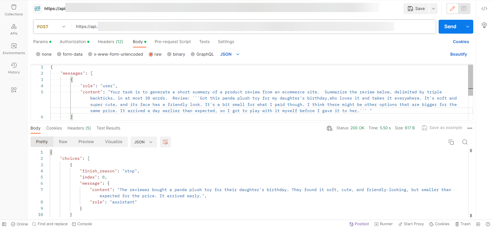

> ### Example:  
> In this example, the prompt is similar but has been refined by adding the intended recipient of the feedback \(the purchasing department\) and the reason for requesting it \(to determine the price of the product\).
> 
> ```
> {
> "messages": [
> 	{
> 		"role": "user",
> 		"content": "Your task is to generate a short summary of a product review from an ecommerce site to give feedback to the pricing department, responsible for determining the price of the product. Summarize the review below, delimited by triple backticks, in at most 30 words, and focusing on any aspects that are relevant to the price and perceived value. Review: ```Got this panda plush toy for my daughter's birthday,who loves it and takes it everywhere. It's soft and super cute, and its face has a friendly look. It's a bit small for what I paid though. I think there might be other options that are bigger for the same price. It arrived a day earlier than expected, so I got to play with it myself before I gave it to her.``` "
> 	}
> ],
> "max_tokens": 100,
> "temperature": 0.0,
> "frequency_penalty": 0,
> "presence_penalty": 0,
> "stop": "null"
> }
> ```
> 
> 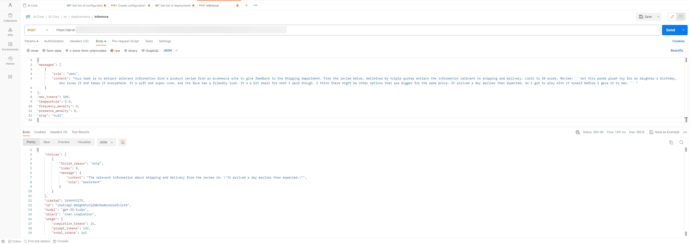

> ### Example:  
> This example uses “extract” instead of “summarize”.
> 
> ```
> {
> "messages": [
> 	{
> 		"role": "user",
> 		"content": "Your task is to extract relevant information from a product review from an ecommerce site to give feedback to the Shipping department. From the review below, delimited by triple backticks extract the information relevant to shipping and delivery. Limit to 30 words. Review: ```Got this panda plush toy for my daughter's birthday,who loves it and takes it everywhere. It's soft and super cute, and its face has a friendly look. It's a bit small for what I paid though. I think there might be other options that are bigger for the same price. It arrived a day earlier than expected, so I got to play with it myself before I gave it to her.``` "
> 	}
> ],
> "max_tokens": 100,
> "temperature": 0.0,
> "frequency_penalty": 0,
> "presence_penalty": 0,
> "stop": "null"
> }
> ```
> 
> 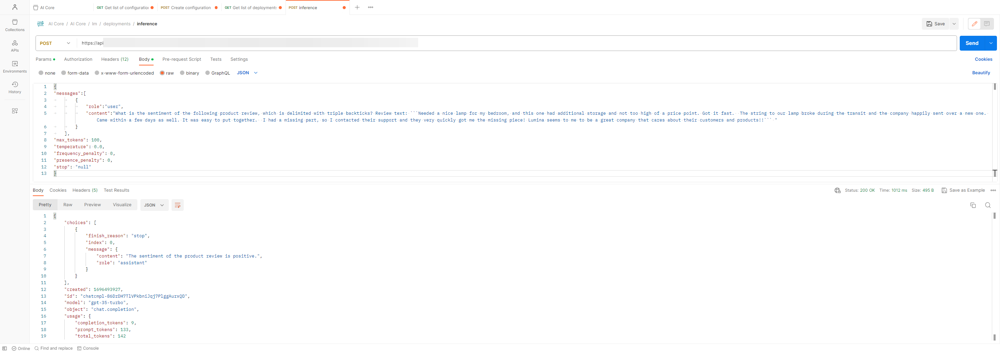

<a name="task_zm3_vyq_zyb"/>

<!-- task\_zm3\_vyq\_zyb -->

## Inferencing

Inferencing uses the information in a given text to draw a conclusion.


## Procedure

Send a POST request to the endpoint `{{deploymentUrl}}/chat/completions?api-version={{api-version}}`.

Include your query in the body. Mark the text to be inferenced with triple back ticks \(\`\).

> ### Example:  
> This example performs a sentiment analysis on a product review.
> 
> ```
> {
> "messages":[
> 		{
> 			"role":"user",
> 			"content":"What is the sentiment of the following product review, which is delimited with triple backticks? Review text: ```Needed a nice lamp for my bedroom, and this one had additional storage and not too high of a price point. Got it fast.  The string to our lamp broke during the transit and the company happily sent over a new one. Came within a few days as well. It was easy to put together.  I had a missing part, so I contacted their support and they very quickly got me the missing piece! Lumina seems to me to be a great company that cares about their customers and products!!``` "
> 		}
> 	],
> "max_tokens": 100,
> "temperature": 0.0,
> "frequency_penalty": 0,
> "presence_penalty": 0,
> "stop": "null"
> }
> ```
> 
> 

> ### Example:  
> This example generates the sentiment as a one word response.
> 
> ```
> {
> "messages":[
> 		{
> 			"role":"user",
> 			"content": "What is the sentiment of the following product review, which is delimited with triple backticks? Give your answer as a single word, either 'positive' or 'negative' Review text: ```Needed a nice lamp for my bedroom, and this one had additional storage and not too high of a price point. Got it fast.  The string to our lamp broke during the transit and the company happily sent over a new one. Came within a few days as well. It was easy to put together.  I had a missing part, so I contacted their support and they very quickly got me the missing piece! Lumina seems to me to be a great company that cares about their customers and products!!```"
> 		}
> 	],
> "max_tokens": 100,
> "temperature": 0.0,
> "frequency_penalty": 0,
> "presence_penalty": 0,
> "stop": "null"
> }
> ```
> 
> 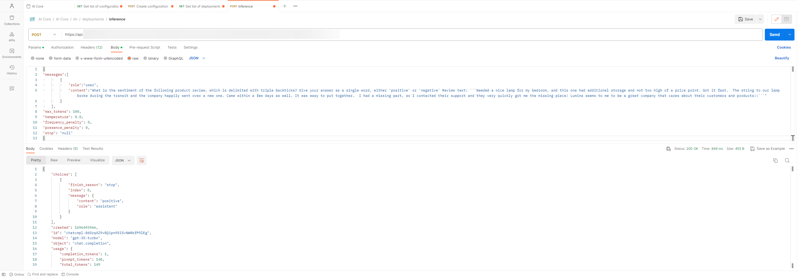

> ### Example:  
> This example analyzes the emotions expressed in the review.
> 
> ```
> {
> "messages":[
> 		{
> 			"role":"user",
> 			"content": "Identify a list of emotions that the writer of the following review is expressing. Include no more than five items in the list. Format your answer as a list of lower-case words separated by commas.Review text: ```Needed a nice lamp for my bedroom, and this one had additional storage and not too high of a price point. Got it fast.  The string to our lamp broke during the transit and the company happily sent over a new one. Came within a few days as well. It was easy to put together.  I had a missing part, so I contacted their support and they very quickly got me the missing piece! Lumina seems to me to be a great company that cares about their customers and products!!```"
> 		}
> 	],
> "max_tokens": 100,
> "temperature": 0.0,
> "frequency_penalty": 0,
> "presence_penalty": 0,
> "stop": "null"
> }
> ```
> 
> 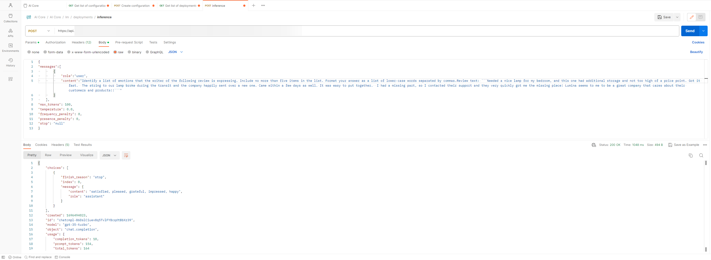

> ### Example:  
> This example detects whether anger is present.
> 
> ```
> {
> "messages":[
> 		{
> 			"role":"user",
> 			"content": "Is the writer of the following review expressing anger? The review is delimited with triple backticks. Give your answer as either yes or no.Review text: ```Needed a nice lamp for my bedroom, and this one had additional storage and not too high of a price point. Got it fast.  The string to our lamp broke during the transit and the company happily sent over a new one. Came within a few days as well. It was easy to put together.  I had a missing part, so I contacted their support and they very quickly got me the missing piece! Lumina seems to me to be a great company that cares about their customers and products!!```"
> 		}
> 	],
> "max_tokens": 100,
> "temperature": 0.0,
> "frequency_penalty": 0,
> "presence_penalty": 0,
> "stop": "null"
> }
> ```
> 
> 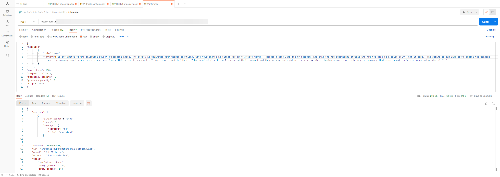

> ### Example:  
> This example detects product and company names from the customer review.
> 
> ```
> {
> "messages":[
> 		{
> 			"role":"user",
> 			"content": "Identify the following items from the review text:  - Item purchased by reviewer - Company that made the item The review is delimited with triple backticks. Format your response as a JSON object with 'Item'and 'Brand' as the keys. If the information isn't present, use 'unknown' as the value. Make your response as short as possible. Review text: ```Needed a nice lamp for my bedroom, and this one had additional storage and not too high of a price point. Got it fast.  The string to our lamp broke during the transit and the company happily sent over a new one. Came within a few days as well. It was easy to put together.  I had a missing part, so I contacted their support and they very quickly got me the missing piece! Lumina seems to me to be a great company that cares about their customers and products!!```"
> 		}
> 	],
> "max_tokens": 100,
> "temperature": 0.0,
> "frequency_penalty": 0,
> "presence_penalty": 0,
> "stop": "null"
> }
> ```
> 
> 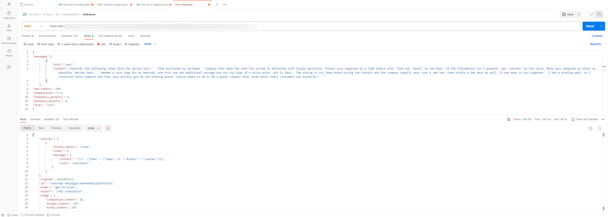

> ### Example:  
> This example performs multiple tasks in a single query.
> 
> ```
> {
> "messages":[
> 		{
> 			"role":"user",
> 			"content": "Identify the following items from the review text: - Sentiment (positive or negative) - Is the reviewer expressing anger? (true or false) - Item purchased by reviewer - Company that made the item The review is delimited with triple backticks. Format your response as a JSON object with 'Sentiment', 'Anger', 'Item'and 'Brand' as the keys. If the information isn't present, use 'unknown' as the value. Make your response as short as possible. Review text: ```Needed a nice lamp for my bedroom, and this one had additional storage and not too high of a price point. Got it fast.  The string to our lamp broke during the transit and the company happily sent over a new one. Came within a few days as well. It was easy to put together.  I had a missing part, so I contacted their support and they very quickly got me the missing piece! Lumina seems to me to be a great company that cares about their customers and products!!```"
> 		}
> 	],
> "max_tokens": 100,
> "temperature": 0.0,
> "frequency_penalty": 0,
> "presence_penalty": 0,
> "stop": "null"
> }
> ```
> 
> 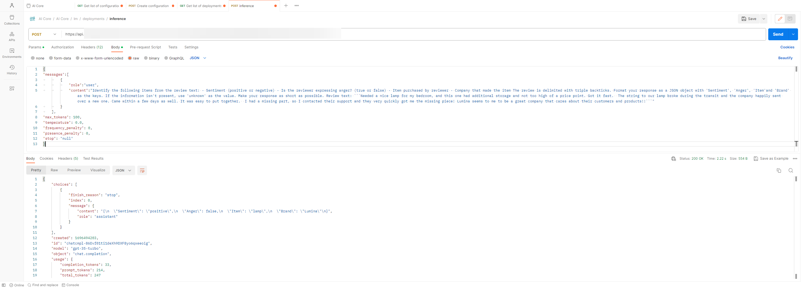

> ### Example:  
> This example identifies the five topics discussed in a story.
> 
> ```
> {
> "messages":[
> 		{
> 			"role":"user",
> 			"content": "Determine five topics that are being discussed in the following text, which is delimited by triple backticks. Make each item one or two words long. Format your response as a list of items separated by commas. Text sample: '''In a recent survey conducted by the government, public sector employees were asked to rate their level of satisfaction with the department they work at. The results revealed that NASA was the most popular department with a satisfaction rating of 95%. One NASA employee, John Smith, commented on the findings, stating, 'I'm not surprised that NASA came out on top. It's a great place to work with amazing people and incredible opportunities. I'm proud to be a part of such an innovative organization.' The results were also welcomed by NASA's management team, with Director Tom Johnson stating, 'We are thrilled to hear that our employees are satisfied with their work at NASA. We have a talented and dedicated team who work tirelessly to achieve our goals, and it's fantastic to see that their hard work is paying off.' The survey also revealed that the Social Security Administration had the lowest satisfaction rating, with only 45% of employees ndicating they were satisfied with their job. The government has pledged to address the concerns raised by employees in the survey and work towards improving job satisfaction across all departments. '''"
> 		}
> 	],
> "max_tokens": 100,
> "temperature": 0.0,
> "frequency_penalty": 0,
> "presence_penalty": 0,
> "stop": "null"
> }
> ```
> 
> 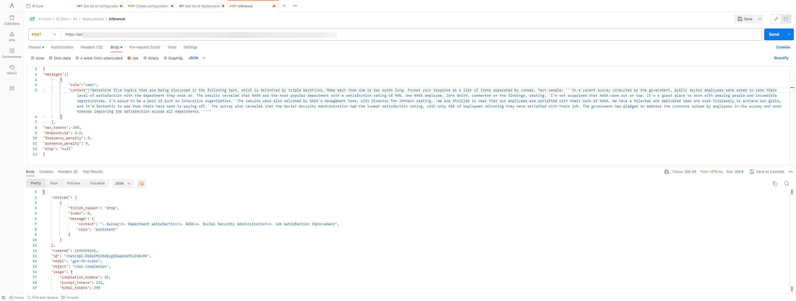

<a name="task_wnl_xyq_zyb"/>

<!-- task\_wnl\_xyq\_zyb -->

## Transformations

Transformations transform a given text into another language or register.


## Procedure

Send a POST request to the endpoint `{{deploymentUrl}}/chat/completions?api-version={{api-version}}`.

Include your query in the body. Mark the text to be transformed with triple back ticks \(\`\).

> ### Example:  
> This example translates text from English to Spanish.
> 
> ```
> {
> "messages":[
> 		{
> 			"role":"user",
> 			"content": "Translate the following English text to Spanish: ```Hi, I would like to order a blender```"
> 		}
> 	],
> "max_tokens": 100,
> "temperature": 0.0,
> "frequency_penalty": 0,
> "presence_penalty": 0,
> "stop": "null"
> }
> ```
> 
> 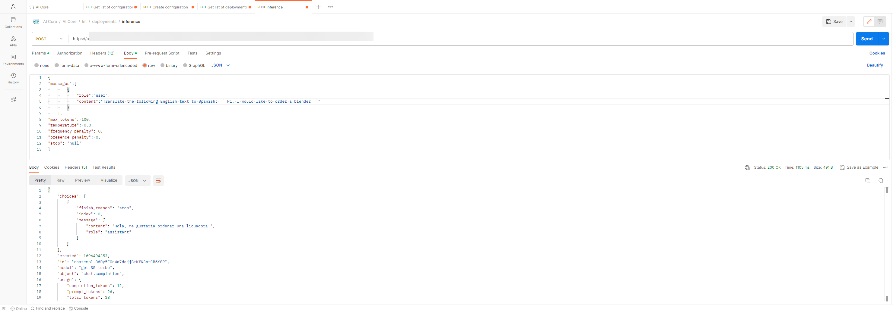

> ### Example:  
> This example detects the language that the text is written in.
> 
> ```
> {
> "messages":[
> 		{
> 			"role":"user",
> 			"content": "Tell me which language this is: ```Combien coûte le lampadaire?```"
> 		}
> 	],
> "max_tokens": 100,
> "temperature": 0.0,
> "frequency_penalty": 0,
> "presence_penalty": 0,
> "stop": "null"
> }
> ```
> 
> 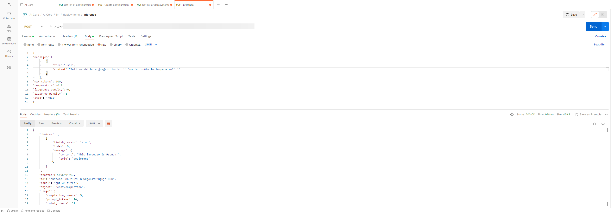

> ### Example:  
> This example translates the given text into multiple languages.
> 
> ```
> {
> "messages":[
> 		{
> 			"role":"user",
> 			"content": "Translate the following  text to French and Spanish and English pirate: ```I want to order a basketball```"
> 		}
> 	],
> "max_tokens": 100,
> "temperature": 0.0,
> "frequency_penalty": 0,
> "presence_penalty": 0,
> "stop": "null"
> }
> ```
> 
> 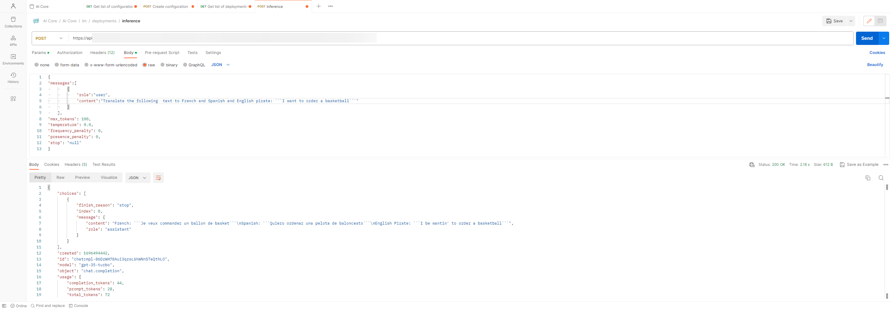

> ### Example:  
> This example translates both the language and register of the text.
> 
> ```
> {
> "messages":[
> 		{
> 			"role":"user",
> 			"content": "Translate the following text to Spanish in both the formal and informal forms: 'Would you like to order a pillow?'"
> 		}
> 	],
> "max_tokens": 100,
> "temperature": 0.0,
> "frequency_penalty": 0,
> "presence_penalty": 0,
> "stop": "null"
> }
> ```
> 
> 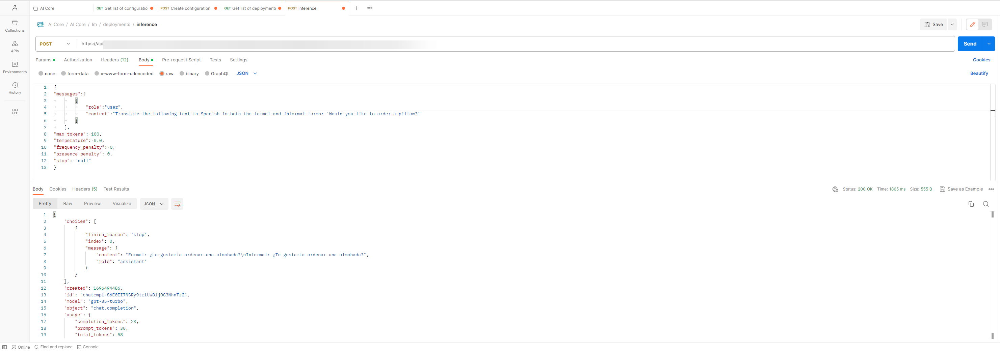

> ### Example:  
> This example transforms the text to a formal register.
> 
> ```
> {
> "messages":[
> 		{
> 			"role":"user",
> 			"content": "Translate the following from slang to a business letter: 'Dude, This is Joe, check out this spec on this standing lamp.'"
> 		}
> 	],
> "max_tokens": 100,
> "temperature": 0.0,
> "frequency_penalty": 0,
> "presence_penalty": 0,
> "stop": "null"
> }
> ```
> 
> 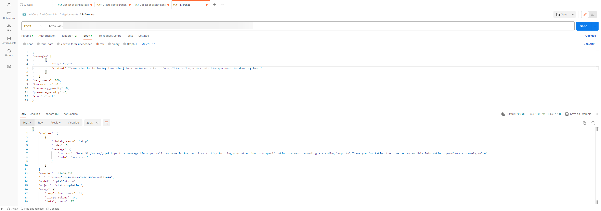

> ### Example:  
> This example translates between output formats. The prompt describes both the input and output format.
> 
> ```
> {
> "messages":[
> 		{
> 			"role":"user",
> 			"content": "Translate the following python dictionary from JSON to an HTML table with column headers and title: { \"resturant employees\" :[     {\"name\":\"Shyam\", \"email\":\"shyamjaiswal@gmail.com\"},    {\"name\":\"Bob\", \"email\":\"bob32@gmail.com\"},    {\"name\":\"Jai\", \"email\":\"jai87@gmail.com\"}]}"
> 		}
> 	],
> "max_tokens": 100,
> "temperature": 0.0,
> "frequency_penalty": 0,
> "presence_penalty": 0,
> "stop": "null"
> }
> ```
> 
> 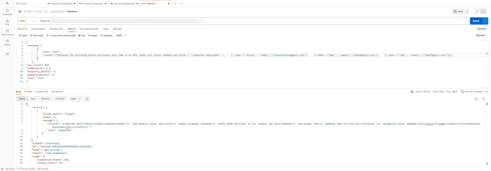

> ### Example:  
> In these examples, a text is proofread. The text can be proofread and corrected, or simply proofread.
> 
> ```
> {
> "messages":[
> 		{
> 			"role":"user",
> 			"content": "Proofread and correct the following text and rewrite the corrected version. If you don't find and errors, just say \"No errors found\". Don't use any punctuation around the text:  The girl with the black and white puppies have a ball."
> 		}
> 	],
> "max_tokens": 100,
> "temperature": 0.0,
> "frequency_penalty": 0,
> "presence_penalty": 0,
> "stop": "null"
> }
> ```
> 
> 
> 
> ```
> {
> "messages":[
> 		{
> 			"role":"user",
> 			"content": "Proofread and correct the following text and rewrite the corrected version. If you don't find and errors, just say \"No errors found\". Don't use any punctuation around the text:  Yolanda has her notebook."
> 		}
> 	],
> "max_tokens": 100,
> "temperature": 0.0,
> "frequency_penalty": 0,
> "presence_penalty": 0,
> "stop": "null"
> }
> ```
> 
> 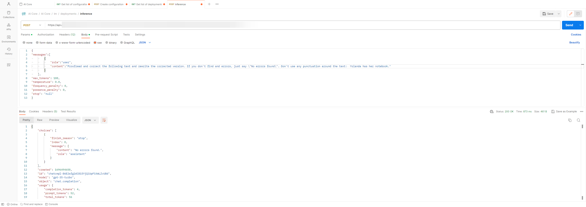
> 
> ```
> {
> "messages":[
> 		{
> 			"role":"user",
> 			"content": "proofread and correct this review: ```Got this for my daughter for her birthday cuz she keeps taking mine from my room.  Yes, adults also like pandas too.  She takes ears is a bit lower than the other, and I don't think that was designed to be asymmetrical. It's a bit small for what I paid for it though. I think there might be other options that are bigger for the same price.  It arrived a day earlier than expected, so I got to play with it myself before I gave it to my daughter.```"
> 		}
> 	],
> "max_tokens": 100,
> "temperature": 0.0,
> "frequency_penalty": 0,
> "presence_penalty": 0,
> "stop": "null"
> }
> ```
> 
> 

<a name="task_qdb_zyq_zyb"/>

<!-- task\_qdb\_zyq\_zyb -->

## Expansions

Expansions generate text based on a prompt.


## Procedure

Send a POST request to the endpoint `{{deploymentUrl}}/chat/completions?api-version={{api-version}}`.

Include your query in the body.

> ### Example:  
> This example generates an automated reply to a customer email.
> 
> ```
> {
> "messages":[
> 		{
> 			"role":"user",
> 			"content": "You are a customer service AI assistant. Your task is to send an email reply to a valued customer. Given the customer email delimited by ```, Generate a reply to thank the customer for their review. If the sentiment is positive or neutral, thank them for their review. If the sentiment is negative, apologize and suggest that they can reach out to customer service. Make sure to use specific details from the review. Write in a concise and professional tone. Sign the email as `AI customer agent`. Customer review: ```So, they still had the 17 piece system on seasonal sale for around $49 in the month of November, about half off, but for some reason (call it price gouging) around the second week of December the prices all went up to about anywhere from between $70-$89 for the same system. And the 11 piece system went up around $10 or so in price also from the earlier sale price of $29. So it looks okay, but if you look at the base, the part where the blade locks into place doesn’t look as good as in previous editions from a few years ago, but I plan to be very gentle with it (example, I crush very hard items like beans, ice, rice, etc. in the blender first then pulverize them in the serving size I want in the blender then switch to the whipping blade for a finer flour, and use the cross cutting blade first when making smoothies, then use the flat blade if I need them finer/less pulpy). Special tip when making smoothies, finely cut and freeze the fruits and vegetables (if using spinach-lightly stew soften the spinach then freeze until ready for use-and if making sorbet, use a small to medium sized food processor) that you plan to use that way you can avoid adding so much ice if at all-when making your smoothie. After about a year, the motor was making a funny noise. I called customer service but the warranty expired already, so I had to buy another one. FYI: The overall quality has gone done in these types of products, so they are kind of counting on brand recognition and consumer loyalty to maintain sales. Got it in about two days.``` Review sentiment: negative"
> 		}
> 	],
> "max_tokens": 100,
> "temperature": 0.0,
> "frequency_penalty": 0,
> "presence_penalty": 0,
> "stop": "null"
> }
> ```
> 
> 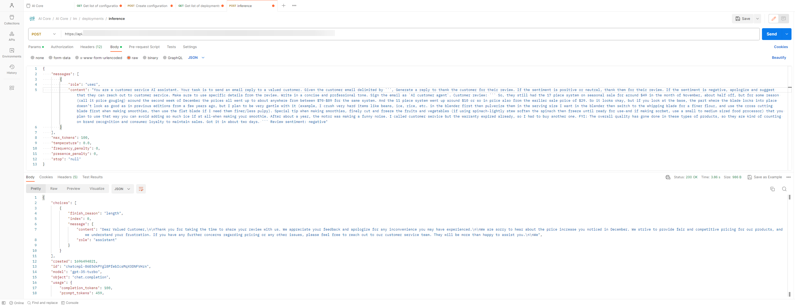

<a name="task_awh_1zq_zyb"/>

<!-- task\_awh\_1zq\_zyb -->

## Chatbot


<a name="task_awh_1zq_zyb__context_fbb_q3y_zyb"/>

## Context

Chatbots use input and give output in the form of conversations.


## Procedure

Send a POST request to the endpoint `{{deploymentUrl}}/chat/completions?api-version={{api-version}}`.

Include your query in the body. To provide more context or set a precedent, include examples of the desired outputs in your prompt.

> ### Example:  
> The following examples include few shot prompts for a chatbot.
> 
> ```
> {
> "messages":[
> 	{ 
> 		"role": "system", 
> 		"content": "You are an assistant that speaks like Shakespeare." 
>         }, 
>         { 
> 		"role": "user", 
> 		"content": "tell me a joke" 
>         }, 
>         { 
> 		"role": "assistant", 
> 		"content": "Why did the chicken cross the road" 
>         }, 
>         { 
> 		"role": "user", 
> 		"content": "I don\"t know" 
>         } 
>     ], 
> "max_tokens": 100,
> "temperature": 0.0,
> "frequency_penalty": 0,
> "presence_penalty": 0,
> "stop": "null"
> }
> ```
> 
> 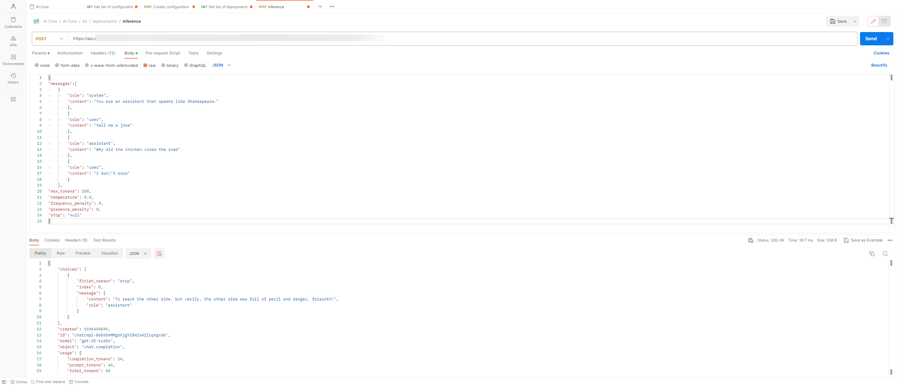
> 
> ```
> {
> "messages":[
> 		{
> 		"role": "system", 
> 		"content": "You are friendly chatbot."
> 		}, 
> 		{
> 		"role": "user", 
> 		"content": "Hi, my name is Isa" 
> 		} 
>     ], 
> "max_tokens": 100,
> "temperature": 0.0,
> "frequency_penalty": 0,
> "presence_penalty": 0,
> "stop": "null"
> }
> ```
> 
> 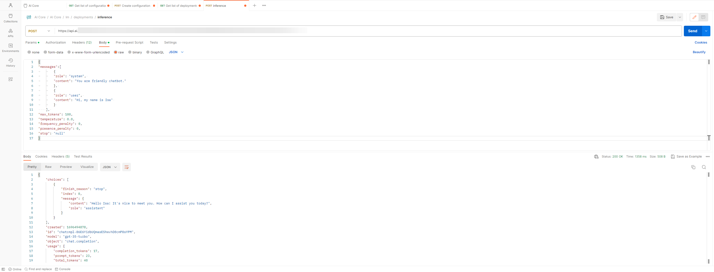
> 
> ```
> {
> "messages":[
> 		{
> 			"role": "system", 
> 			"content": "You are friendly chatbot." 
> 		}, 
> 		{ 
> 			"role": "user", 
> 			"content": "Hi, my name is Isa" 
> 		}, 
> 		{ 
> 			"role": "assistant", 
> 			"content": "Hi Isa! It's nice to meet you. Is there anything I can help you with today?" 
> 		}, 
> 		{ 
> 			"role": "user", 
> 			"content": "Yes, you can remind me, What is my name?"
> 		} 
>     ], 
> "max_tokens": 100,
> "temperature": 0.0,
> "frequency_penalty": 0,
> "presence_penalty": 0,
> "stop": "null"
> }
> ```
> 
> 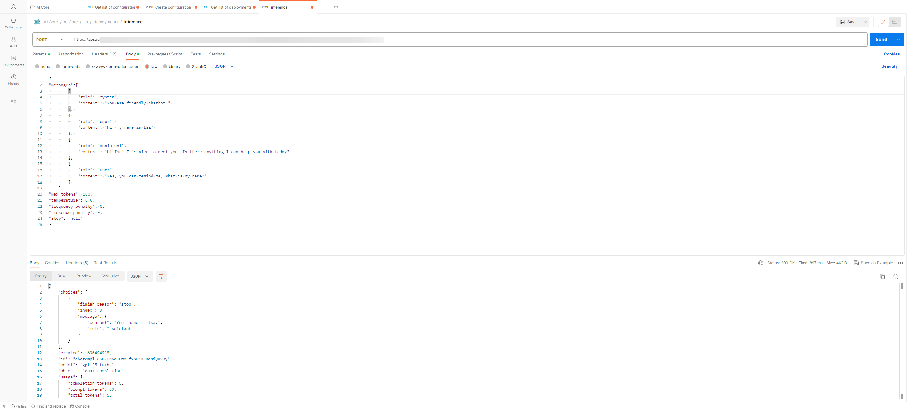

