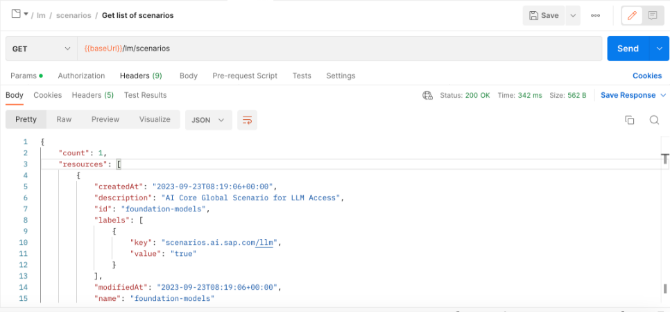
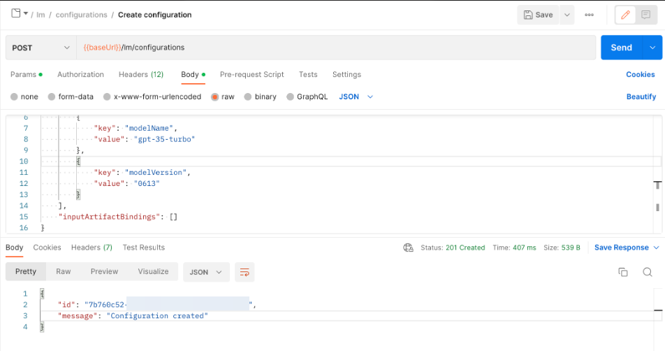
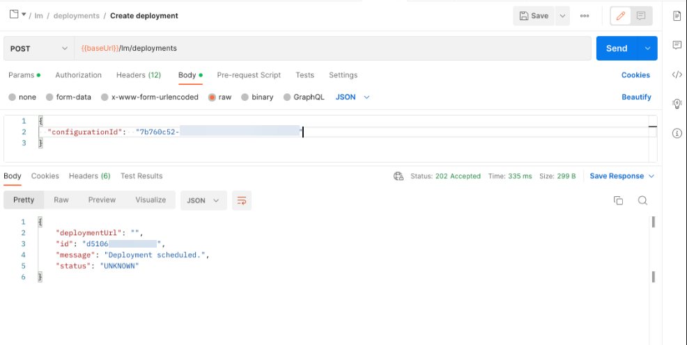
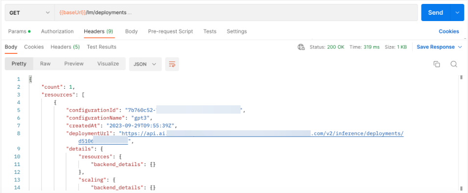

<!-- loiob32e7a85f9e143c1924f31533ee81697 -->

# Create a Deployment for a Generative AI Model

You make a generative AI model available for use by creating a deployment. You can do so one time for each model and model version, and for each resource group that you want to use with generative AI hub. The deployment URL that is generated can be reused.


<a name="loiob32e7a85f9e143c1924f31533ee81697__prereq_nzn_mdw_tyb"/>

## Prerequisites

-   You have an SAP AI Core service instance and service key. For more information, see [SAP AI Core Initial Setup Documentation](https://help.sap.com/docs/AI_CORE/2d6c5984063c40a59eda62f4a9135bee/38c4599432d74c1d94e70f7c955a717d.html?locale=en-US&state=PRODUCTION&version=CLOUD).
-   You’re using the `extended` service plan. For more information, see [Service Plans](service-plans-c7244c6.md) and [Update a Service Plan](update-a-service-plan-924f892.md).
-   You have completed the client authorization for your preferred user interface. For more information, see [Use a Service Key](use-a-service-key-3a97465.md).


<a name="loiob32e7a85f9e143c1924f31533ee81697__context_ll5_4jw_tyb"/>

## Context

You make a model available for use by creating a deployment. You can do so one time for each model and model version. The model deployment includes the `modelName` and `version` of the model you want to access. After the deployment is complete, you have a `deploymentUrl`, which can be used across your organization to access the model version.

<a name="task_m15_5kw_tyb"/>

<!-- task\_m15\_5kw\_tyb -->

## Using the API


<a name="task_m15_5kw_tyb__steps_n15_5kw_tyb"/>

## Procedure

1.  Decide which LLM you want to deploy and note the following information:

    -   Executable ID

    -   Model name

    -   Model version

        > ### Note:  
        > -   Instead of specifying a model version, using “latest” will use the latest version of the model available in SAP AI Core.
        > 
        > -   Where model version is not listed, it is not applicable.


    ****


    <table>
    <tr>
    <th valign="top">

    Executable ID
    
    </th>
    <th valign="top">

    Model Name
    
    </th>
    <th valign="top">

    Model Version
    
    </th>
    <th valign="top">

    More Information
    
    </th>
    </tr>
    <tr>
    <td valign="top">
    
    `azure-openai`
    
    </td>
    <td valign="top">
    
    `gpt-35-turbo`
    
    </td>
    <td valign="top">
    
    0613

    1106
    
    </td>
    <td valign="top">
    
    [Azure Chat Completions](https://learn.microsoft.com/en-us/azure/ai-services/openai/reference#chat-completions)
    
    </td>
    </tr>
    <tr>
    <td valign="top">
    
    `azure-openai`
    
    </td>
    <td valign="top">
    
    `gpt-35-turbo-16k`
    
    </td>
    <td valign="top">
    
    0613
    
    </td>
    <td valign="top">
    
    [Azure Chat Completions](https://learn.microsoft.com/en-us/azure/ai-services/openai/reference#chat-completions)
    
    </td>
    </tr>
    <tr>
    <td valign="top">
    
    `azure-openai`
    
    </td>
    <td valign="top">
    
    `gpt-4`
    
    </td>
    <td valign="top">
    
    0613
    
    </td>
    <td valign="top">
    
    [Azure Chat Completions](https://learn.microsoft.com/en-us/azure/ai-services/openai/reference#chat-completions)
    
    </td>
    </tr>
    <tr>
    <td valign="top">
    
    `azure-openai`
    
    </td>
    <td valign="top">
    
    `gpt-4-32k`
    
    </td>
    <td valign="top">
    
    0613
    
    </td>
    <td valign="top">
    
    [Azure Chat Completions](https://learn.microsoft.com/en-us/azure/ai-services/openai/reference#chat-completions)
    
    </td>
    </tr>
    <tr>
    <td valign="top">
    
    `azure-openai`
    
    </td>
    <td valign="top">
    
    `text-embedding-ada-002`
    
    </td>
    <td valign="top">
    
    2
    
    </td>
    <td valign="top">
    
    [Embeddings](https://learn.microsoft.com/en-us/azure/ai-services/openai/reference#embeddings)
    
    </td>
    </tr>
    <tr>
    <td valign="top">
    
    `azure-openai`
    
    </td>
    <td valign="top">
    
    `text-embedding-3-small`
    
    </td>
    <td valign="top">
    
    N/A
    
    </td>
    <td valign="top">
    
    [Embeddings](https://learn.microsoft.com/en-us/azure/ai-services/openai/reference#embeddings)
    
    </td>
    </tr>
    <tr>
    <td valign="top">
    
    `azure-openai`
    
    </td>
    <td valign="top">
    
    `text-embedding-3-large`
    
    </td>
    <td valign="top">
    
    N/A
    
    </td>
    <td valign="top">
    
    [Embeddings](https://learn.microsoft.com/en-us/azure/ai-services/openai/reference#embeddings)
    
    </td>
    </tr>
    <tr>
    <td valign="top">
    
    `azure-openai`
    
    </td>
    <td valign="top">
    
    `gpt-4o`
    
    </td>
    <td valign="top">
    
    2024-05-13
    
    </td>
    <td valign="top">
    
    [Azure Chat Completions](https://learn.microsoft.com/en-us/azure/ai-services/openai/reference#chat-completions)
    
    </td>
    </tr>
    <tr>
    <td valign="top">
    
    `azure-openai`
    
    </td>
    <td valign="top">
    
    `gpt-4`
    
    </td>
    <td valign="top">
    
    turbo-2024-04-09
    
    </td>
    <td valign="top">
    
    [Azure Chat Completions](https://learn.microsoft.com/en-us/azure/ai-services/openai/reference#chat-completions)
    
    </td>
    </tr>
    <tr>
    <td valign="top">
    
    `aicore-opensource`
    
    </td>
    <td valign="top">
    
    `tiiuae--falcon-40b-instruct`
    
    </td>
    <td valign="top">
    
    N/A
    
    </td>
    <td valign="top">
    
    [Tiiuae Falcon 40b Instruct](https://huggingface.co/tiiuae/falcon-40b-instruct)
    
    </td>
    </tr>
    <tr>
    <td valign="top">
    
    `aicore-opensource`
    
    </td>
    <td valign="top">
    
    `mistralai--mixtral-8x7b-instruct-v01`
    
    </td>
    <td valign="top">
    
    N/A
    
    </td>
    <td valign="top">
    
    [Mistral AI](https://huggingface.co/mistralai/Mixtral-8x7B-Instruct-v0.1)
    
    </td>
    </tr>
    <tr>
    <td valign="top">
    
    `aicore-opensource`
    
    </td>
    <td valign="top">
    
    `meta--llama3-70b-instruct`
    
    </td>
    <td valign="top">
    
    N/A
    
    </td>
    <td valign="top">
    
    [Meta](https://huggingface.co/meta-llama/Meta-Llama-3-70B-Instruct)
    
    </td>
    </tr>
    <tr>
    <td valign="top">
    
    `gcp-vertexai`
    
    </td>
    <td valign="top">
    
    `text-bison`
    
    </td>
    <td valign="top">
    
    002
    
    </td>
    <td valign="top">
    
    [GCP Vertex AI](https://cloud.google.com/vertex-ai/generative-ai/docs/model-reference/text)
    
    </td>
    </tr>
    <tr>
    <td valign="top">
    
    `gcp-vertexai`
    
    </td>
    <td valign="top">
    
    `chat-bison`
    
    </td>
    <td valign="top">
    
    002
    
    </td>
    <td valign="top">
    
    [GCP Vertex AI](https://cloud.google.com/vertex-ai/generative-ai/docs/model-reference/text-chat)
    
    </td>
    </tr>
    <tr>
    <td valign="top">
    
    `gcp-vertexai`
    
    </td>
    <td valign="top">
    
    `textembedding-gecko`
    
    </td>
    <td valign="top">
    
    003
    
    </td>
    <td valign="top">
    
    [GCP Vertex AI](https://cloud.google.com/vertex-ai/generative-ai/docs/model-reference/text-embeddings)
    
    </td>
    </tr>
    <tr>
    <td valign="top">
    
    `gcp-vertexai`
    
    </td>
    <td valign="top">
    
    `textembedding-gecko-multilingual`
    
    </td>
    <td valign="top">
    
    001
    
    </td>
    <td valign="top">
    
    [GCP Vertex AI](https://cloud.google.com/vertex-ai/generative-ai/docs/model-reference/text-embeddings)
    
    </td>
    </tr>
    <tr>
    <td valign="top">
    
    `gcp-vertexai`
    
    </td>
    <td valign="top">
    
    `gemini-1.0-pro`
    
    </td>
    <td valign="top">
    
    001
    
    </td>
    <td valign="top">
    
    [GCP Vertex AI](https://cloud.google.com/vertex-ai/generative-ai/docs/model-reference/gemini)
    
    </td>
    </tr>
    <tr>
    <td valign="top">
    
    `aws-bedrock`
    
    </td>
    <td valign="top">
    
    `anthropic--claude-3-sonnet`
    
    </td>
    <td valign="top">
    
    v1
    
    </td>
    <td valign="top">
    
    [AWS Bedrock](https://docs.aws.amazon.com/bedrock/latest/userguide/model-parameters-anthropic-claude-messages.html)
    
    </td>
    </tr>
    <tr>
    <td valign="top">
    
    `aws-bedrock`
    
    </td>
    <td valign="top">
    
    `anthropic--claude-3-haiku`
    
    </td>
    <td valign="top">
    
    v1
    
    </td>
    <td valign="top">
    
    [AWS Bedrock](https://docs.aws.amazon.com/bedrock/latest/userguide/model-parameters-anthropic-claude-messages.html)
    
    </td>
    </tr>
    <tr>
    <td valign="top">
    
    `aws-bedrock`
    
    </td>
    <td valign="top">
    
    `anthropic--claude-3-opus`
    
    </td>
    <td valign="top">
    
    v1
    
    </td>
    <td valign="top">
    
    [AWS Bedrock](https://docs.aws.amazon.com/bedrock/latest/userguide/model-parameters-anthropic-claude-messages.html)
    
    </td>
    </tr>
    <tr>
    <td valign="top">
    
    `aws-bedrock`
    
    </td>
    <td valign="top">
    
    `amazon--titan-embed-text`
    
    </td>
    <td valign="top">
    
    1.2
    
    </td>
    <td valign="top">
    
    [AWS Bedrock](https://docs.aws.amazon.com/bedrock/latest/userguide/titan-embedding-models.html)
    
    </td>
    </tr>
    <tr>
    <td valign="top">
    
    `aws-bedrock`
    
    </td>
    <td valign="top">
    
    `amazon--titan-text-lite`
    
    </td>
    <td valign="top">
    
    1
    
    </td>
    <td valign="top">
    
    [AWS Bedrock](https://docs.aws.amazon.com/bedrock/latest/userguide/titan-text-models.html)
    
    </td>
    </tr>
    <tr>
    <td valign="top">
    
    `aws-bedrock`
    
    </td>
    <td valign="top">
    
    `amazon--titan-text-express`
    
    </td>
    <td valign="top">
    
    1
    
    </td>
    <td valign="top">
    
    [AWS Bedrock](https://docs.aws.amazon.com/bedrock/latest/userguide/titan-text-models.html)
    
    </td>
    </tr>
    </table>
    
2.  Check that you have access to the scenario containing generative AI by sending a GET request to `{{apiurl}}/v2/lm/scenarios`.

    Set the *Authorization* header with `Bearer $TOKEN` and set your resource group. For more information, see [Create a Resource Group](create-a-resource-group-01753f4.md).

    > ### Note:  
    > You must use the same resource group for all of your generative AI activities. To use a different resource group, these steps must be repeated for each resource group. For more information, see [Manage Resource Groups](manage-resource-groups-8aae6cb.md).

    

    The scenarios listed contain a scenario with the id `foundation-models`.

3.  Create a configuration by sending a POST request to the endpoint `{{apiurl}}/v2/lm/configurations`.

    Include details of the model to which you want to provide access by passing in the following parameters:

    -   `name` is your free choice of identifier.

    -   `executableId`, `modelName`, and `modelVersion` are provided in the table above.

    -   `scenarioId` must be `foundation-models`.

    -   `versionId` is your own version reference.


    > ### Sample Code:  
    > ```
    > {
    > 	"name": "yourNameChoice",
    > 	"executableId": "azure-openai",
    > 	"scenarioId": "foundation-models",
    > 	"versionId": "0.0.1",
    > 	"parameterBindings": [
    > 		{
    > 			"key":"modelName",
    > 			"value":"gpt-35-turbo"
    > 		},
    > 		{
    > 			"key": "modelVersion",
    > 			"value": "0613"
    > 		}
    >   ],
    > 	"inputArtifactBindings": []
    > }
    >    
    > ```

    

    > ### Tip:  
    > You can specify the value `latest` for the `modelVersion` to use the most recent model version available in SAP AI Core.

    You receive a unique `configurationId` in the response.

4.  Create a deployment by sending a POST request to the endpoint `{{apiurl}}/v2/lm/deployments`.

    Include the `configurationId` from the previous step in your request.

    > ### Sample Code:  
    > ```
    > {
    >  "configurationId": "yourConfigurationId"
    > }
    > ```

    

5.  Retrieve the details of your deployment by sending a GET request to the endpoint`{{apiurl}}/v2/lm/deployments`.

    


<a name="task_m15_5kw_tyb__postreq_yrz_5cd_5yb"/>

## Next Steps

When the deployment is running, the model can be accessed using the `deploymentUrl` provided in the response. For more information, see [Consume Generative AI Models](consume-generative-ai-models-bf0373b.md).

<a name="concept_fn1_2qy_szb"/>

<!-- concept\_fn1\_2qy\_szb -->

## Model Lifecycle

Model versions have deprecation dates. Where a model version is specified in a deployment, the deployment will stop working on the deprecation date of that model version.

Implement one of the following model upgrade options:

-   **Auto Upgrade:** Create a new generative AI configuration and deployment or patch a deployment with a new configuration, specifying `modelVersion` `latest`. When a new `modelVersion` is supported by SAP AI Core, existing generative AI deployments will automatically use the latest version of the given model.

-   **Manual Upgrade:** Create a new generative AI configuration with your chosen replacement `modelVersion` and use it to patch your deployment. This model version will be used in generative AI deployments irrespective of updates to the models supported by SAP AI Core.

    > ### Note:  
    > If `modelVersion` isn’t specified, it will be `latest` by default. To upgrade manually, you **must** specify a `modelVersion`.


