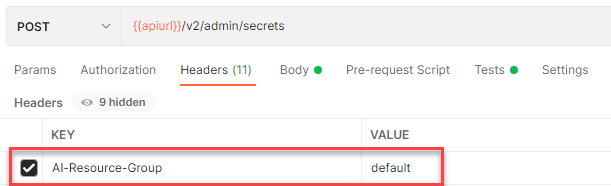
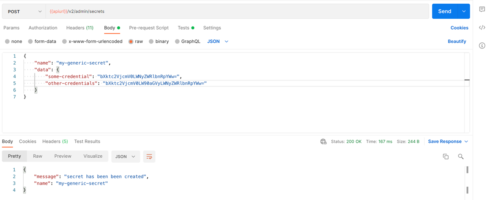

<!-- loio1831845910364e97b3a7c6644a9e1f4b -->

# Create a Generic Secret

A generic secret gives SAP AI Core authorization to utilize your resource group without exposing your credentials.

Generic Secrets are used in addition to store sensitive information when system secrets are not applicable, for example in integration use cases where SAP AI Core is an orchestration layer.

SAP AI Core lets you optionally use generic secrets at two levels: at the main-tenant scope or on a resource-group level.

Generic secrets are different to system secrets \(such as object store, Docker registry, and so on\) and can be used to store sensitive information, either for the main tenant or for each resource group via an API. The latter can be attached to containers in executions or deployments as environment variables or volume mounts.

To create a generic secret in a resource group, send a POST request to the endpoint `{{apiurl}}/v2/admin/secrets`. Note that the API expects sensitive data to be Base64-encoded. You can easily encode your data in Base64 format using the following command on Linux or MacOS: `echo -n 'my-sensitive-data' | base64`


<a name="loio1831845910364e97b3a7c6644a9e1f4b__section_t3r_qmc_gyb"/>

## Prerequisites

You have completed the Initial Setup. For more information, see [Initial Setup](initial-setup-38c4599.md).


<a name="loio1831845910364e97b3a7c6644a9e1f4b__section_apy_mvk_4rb"/>

## Using Postman

1.  Send a POST request and enter the URL `{{apiurl}}/v2/admin/secrets`.
2.  As the request body, select the *raw* radiobutton and enter your credentials in JSON format.:

    ```
    {
    "name": "MY_GENERIC_SECRET",
    "data": {
    		"some-credential": "bXktc2VjcmV0LWNyZWRlbnRpYWw=",
    		"other-credentials": "bXktc2VjcmV0LW90aGVyLWNyZWRlbnRpYWw="
    		}
    }
    ```

    > ### Note:  
    > The secret name is written without hyphens to make it simple to consume as a Unix environment variable later. It is written in capitals as is convention.

    -   `name`: Set the name of your generic secret.
    -   `data`: Enter a JSON string that represents your generic secret.

3.  Specify the scope of the request via the header `AI-Tenant-Scope` and `AI-Resource-Group`:

    -   `AI-Tenant-Scope` : `true`. The operation will be performed at the main tenant level.
    -   `AI-Resource-Group` : <code><i class="varname">&lt;resource-group-name&gt;</i></code>. The operation will be performed at the resource-group level.

    In this example, we are using the resource-group level.

    

4.  Send the request.




<a name="loio1831845910364e97b3a7c6644a9e1f4b__section_l5m_rvk_4rb"/>

## Using curl

Submit a POST request to the endpoint `v2/admin/secrets` and include the name of your generic secret and credentials. Specify the scope through the `AI-Tenant-Scope` and `AI-Resource-Group`:

-   `AI-Tenant-Scope` : `true`. The operation will be performed at the main tenant level.
-   `AI-Resource-Group` : <code><i class="varname">&lt;resource-group-name&gt;</i></code>. The operation will be performed at the resource-group level.

```
curl --location --request POST "$AI_API_URL/v2/admin/secrets" \
--header "Authorization: Bearer $TOKEN" \
--header 'Content-Type: application/json' \
--header 'AI-Resource-Group: default' \
--data-raw '{
	"name": "MY_GENERIC_SECRET",
	"data": {
		"some-credential": "bXktc2Vuc2l0aXZlLWRhdGE="
			}
}'					
```

> ### Note:  
> The secret name is written without hyphens to make it simple to consume as a Unix environment variable later. It is written in capitals as is convention.

