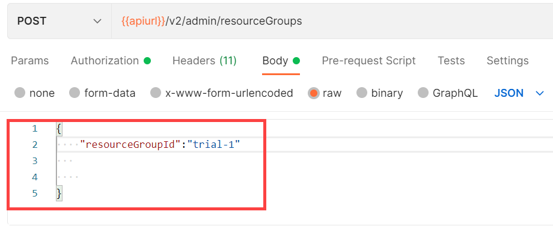

<!-- loio01753f4dcb454401b539ecc4def641be -->

# Create a Resource Group

> ### Note:  
> Resource group Ids must be of length minimum: 3, maximum: 253. The first and last characters must be either a lower case letter, an upper case letter or a number. Character entries from the second to penultimate, may include a lower case letter, an upper case letter, a number, a full stop or a hyphen. No other special characters are permitted.


<a name="loio01753f4dcb454401b539ecc4def641be__section_wbq_3wg_k5b"/>

## Using Postman

1.  Send a POST request to the endpoint `{{apiurl}}/v2/admin/resourceGroups`.
2.  As the request body, select the *raw* radiobutton and enter the following:

    ```json
    {
        "resourceGroupId": "<ID of your resource group>"
    }
    ```

    

3.  Send the request.

    You'll receive a 202 response to confirm that the request to create the resource group has been accepted.


<a name="loio01753f4dcb454401b539ecc4def641be__section_zbq_3wg_k5b"/>

## Using curl

1.  Create a resource group by sending the following:

    ```
    curl --location --request POST "$AI_API_URL/v2/admin/resourceGroups" --header "Authorization: Bearer $TOKEN" --header 'Content-Type: application/json' --data-raw '{ "resourceGroupId": "<ID of your resource group>"}'
    
    ```


**Parent topic:** [Manage Resource Groups](manage-resource-groups-8aae6cb.md "A resource group is a unique dedicated namespace or workspace environment, where users can create or add configurations, executions, deployments, and artifacts. They are used for running training jobs or model servers.")

**Related Information**  


[Resource Group Level Resources](security-a476d3c.md#loiofbfa1badbbfa4981a417299238b82e39 "")

