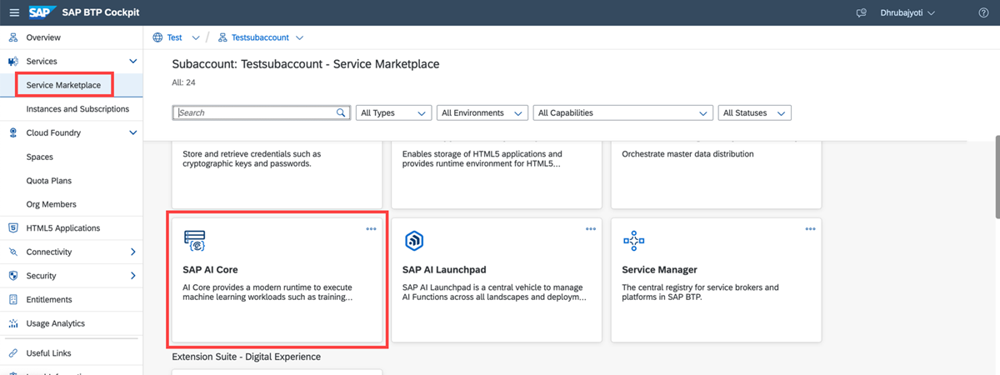
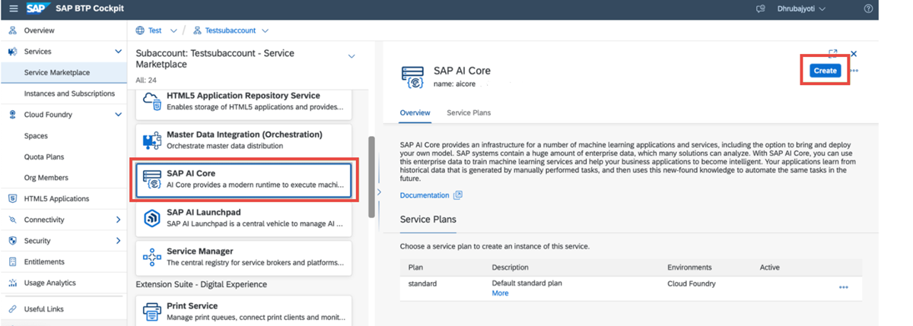
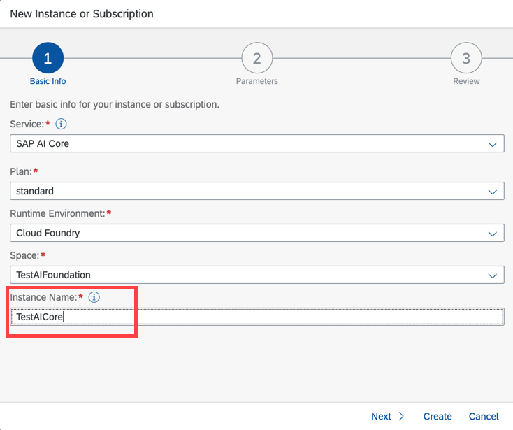
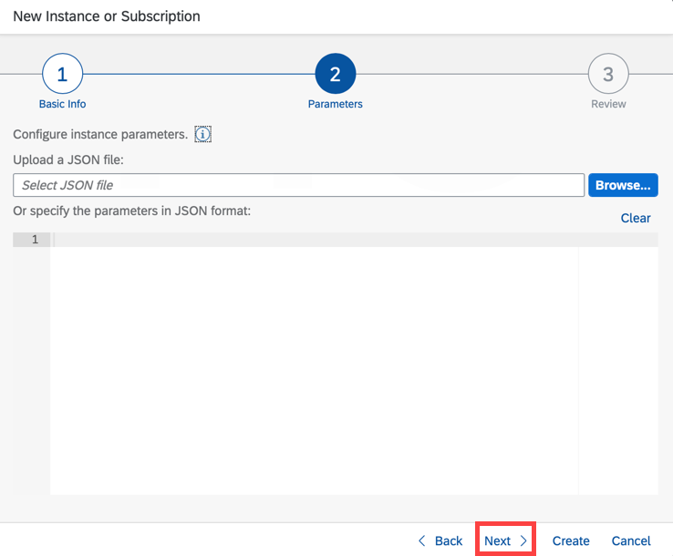
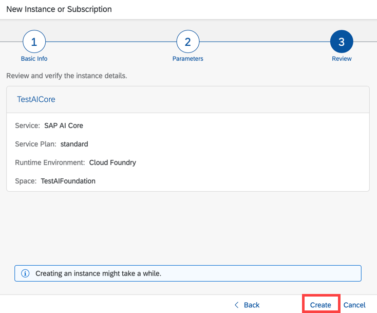
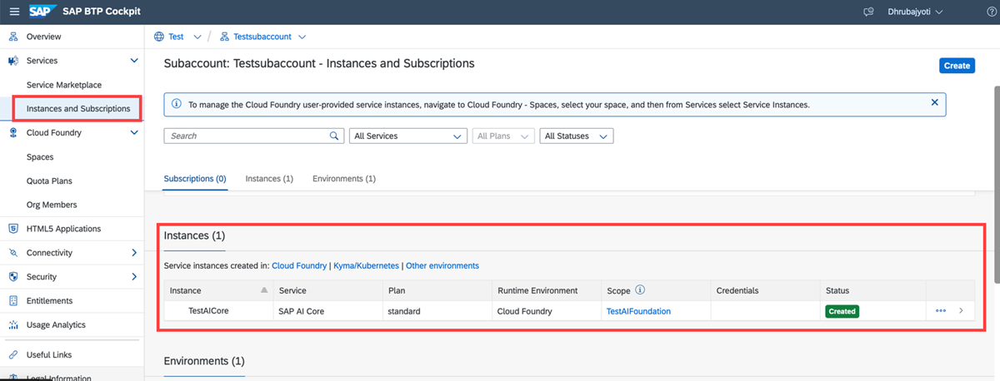

<!-- loio34761f9ae9a2432c99f9a1e4d6798416 -->

# Create a Service Instance

## Procedure

1.  SAP BTP cockpit, navigate to your global account, and choose *Service Marketplace*.

    You will see a tile for SAP AI Core.

    

2.  Open the tile and click *Create*.

    

3.  Enter a name for your instance and choose *Next* \(all other details will be filled by default\).

    

4.  Parameters can be uploaded using a JSON file, this is optional. Choose *Next* to proceed.

    

5.  Review and verify the instance, and then choose *Create*.

    

<a name="loio34761f9ae9a2432c99f9a1e4d6798416__result_x5m_5tq_sqb"/>

## Results

When your service instance is created, you can view it on the *Instances and Subscriptions* page of your subaccount.

**Parent topic:**[Initial Setup](initial-setup-38c4599.md "You provision SAP AI Core from the SAP BTP cockpit in SAP Business Technology Platform. After provisioning, you will have your service key, which provides URLs and credentials for accessing the SAP AI Core instance")

**Next:**[Add a Service Plan](add-a-service-plan-86002d9.md "")

**Previous:**[Create a Service Key](create-a-service-key-7323ff4.md "")

