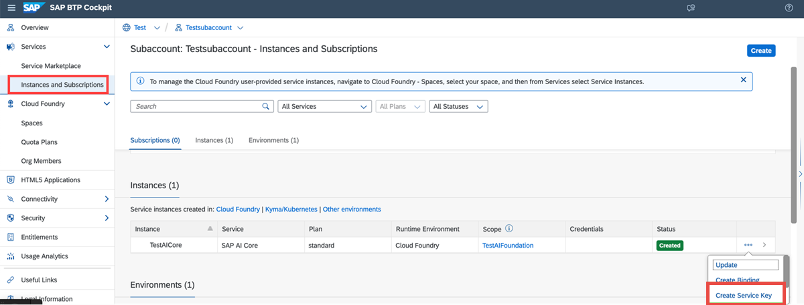
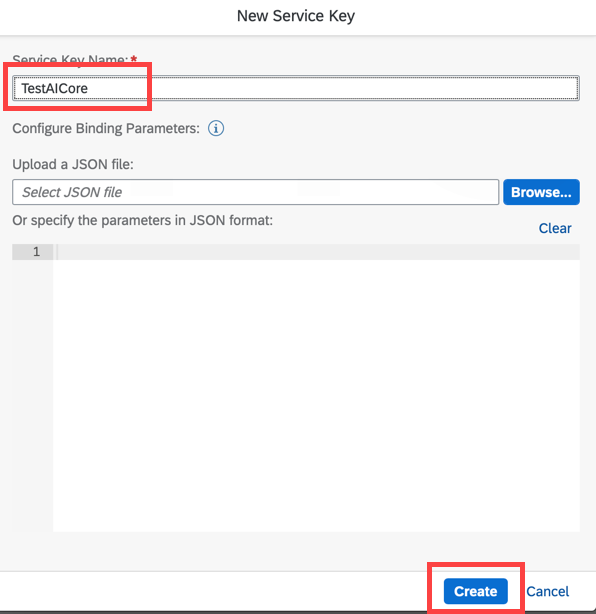
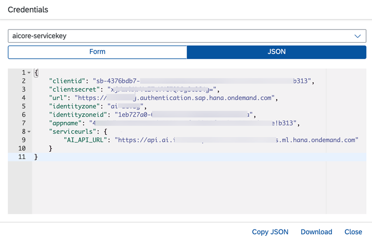

<!-- loio7323ff4e37ba41c198b06e9669b80920 -->

# Create a Service Key


## Procedure

1.  On the *Instances and Subscriptions* page, find your new instance and choose *Create Service Key* from the dropdown.

    

2.  Enter a name for your service key and click *Create*.

    

    **Optional:**To use an x.509 certificate instead of client secret credentials, specify the credentials by updating and uploading the following as a JSON:

    ```
    { "xsuaa": {"credential-type":"x509", "x509": { "key-length": 2048, "validity":7, "validity-type":"DAYS"}
    ```

    -   `key-length`: The byte length of the generated private key. Default: 2048.

    -   `validity`: The validity time unit. DAYS, MONTHS and YEARS are supported. Default: DAYS.

    -   `validity-type`: The number of time units. Default: 7.


    The default combination is a key of length 2048, valid for 7 DAYS.

3.  Download your service key to save it.


<a name="loio7323ff4e37ba41c198b06e9669b80920__result_wml_znv_p4b"/>

## Results

You now have your service key, which provides URLs and credentials for accessing the SAP AI Core instance through SAP AI Launchpad, SAP AI Core toolkit Postman, or curl.



If you have generated a client secret, your key will include:

-   `clientid`, `clientsecret`, and `url` can be used to generate your authentication token.

-   `identityzone` and `identityzoneid` represent your tenant ID.

-   `appname` provides the service instance details if service instance isolation is implemented.

-   `serviceurls` allow you to interact with SAP AI Core once your authentication token has been generated.

    -   `AI_API_URL`: Unified AI API to handle ML artifacts \(such as training, data, models, and deployments\) across multiple hyperscalers.


If you have generated an x.509 certificate, your key will include:

-   `certificate`

-   `certurl` can be used to generate your authentication token.

-   `key` your RSA private key.

-   `identityzone` and `identityzoneid` represent your tenant ID.

-   `appname` provides the service instance details if service instance isolation is implemented.

-   `serviceurls` allow you to interact with SAP AI Core once your authentication token has been generated.

    -   `AI_API_URL`: Unified AI API to handle ML artifacts \(such as training, data, models, and deployments\) across multiple hyperscalers.


