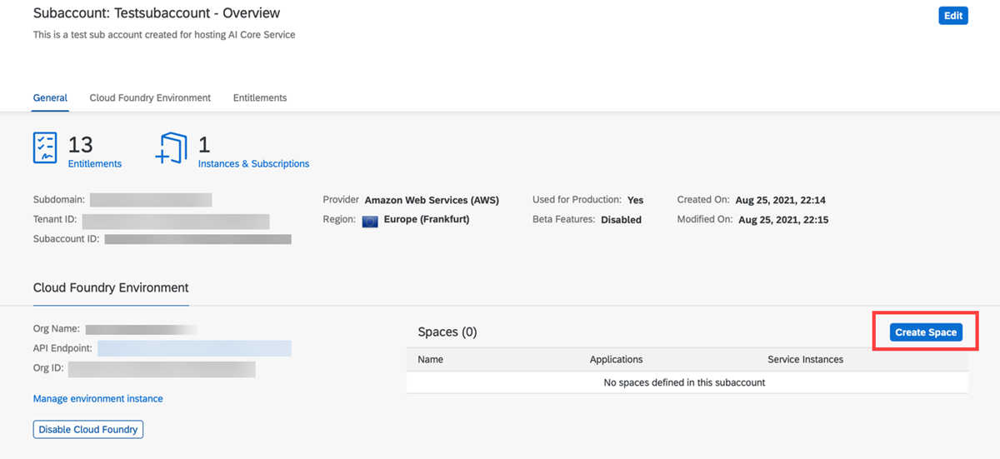
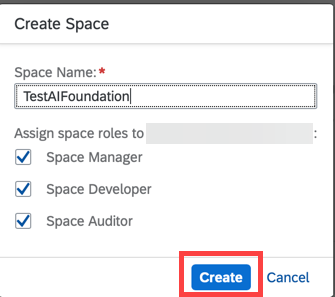

<!-- loio4c1190ccec524abf8556853799eefa2e -->

# Create a Space

## Procedure

1.  On the overview page for your subaccount, choose *Create Space*.

    

2.  Enter a name for your space and assign space roles by selecting the checkboxes..

    

3.  Click *Create*.

**Parent topic:** [Initial Setup](initial-setup-38c4599.md "You provision SAP AI Core from the SAP BTP cockpit in SAP Business Technology Platform. After provisioning, you will have your service key, which provides URLs and credentials for accessing the SAP AI Core instance through SAP AI Launchpad Postman, or curl.")

**Next:** [Enable Cloud Foundry](enable-cloud-foundry-cf0d5d2.md "")

**Previous:** [Add a Service Plan](add-a-service-plan-86002d9.md "")

