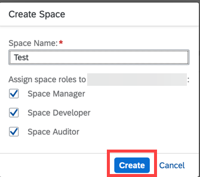

<!-- loio4c1190ccec524abf8556853799eefa2e -->

# Create a Space

## Procedure

1.  On the overview page for your subaccount, choose *Create Space*.

    

2.  Enter a name for your space and assign space roles by selecting the checkboxes.

    

3.  Click *Create*.

