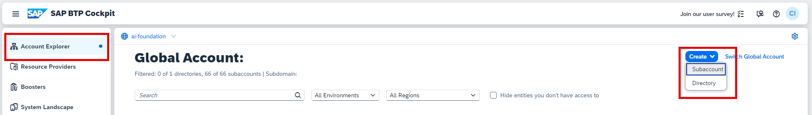
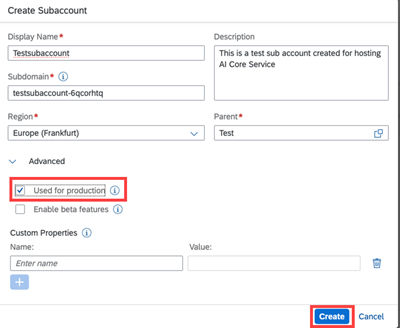
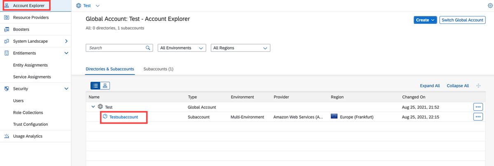

<!-- loio3e3ae8360a814cf59e4c462e4787b5e2 -->

# Create a Subaccount

## Procedure

1.  In SAP Business Technology Platform cockpit, choose *Account Explorer* and then click *Create* \> *Subaccount*.

    

2.  In the *Create Subaccount* dialog, complete the mandatory information, select the *Used for production* checkbox, and click *Create*.

    

3.  Return to the *Account Explorer* to view your subaccount.

    

