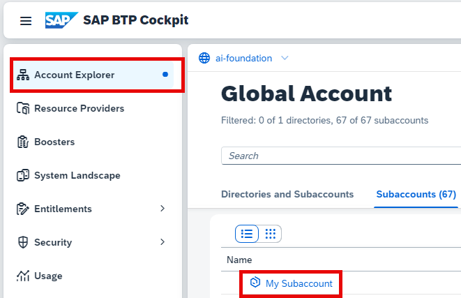

<!-- loio3e3ae8360a814cf59e4c462e4787b5e2 -->

# Create a Subaccount

## Procedure

1.  In SAP Business Technology Platform cockpit, choose *Account Explorer* and then click *Create* \> *Subaccount*.

    

2.  In the *Create Subaccount* dialog, enter a name for your subaccount and select the region.

    The parent defaults to the name of your global account.

    

3.  **Optional:** If your subaccount is used for production purposes, under *Advanced* select the *Used for production* checkbox.

    This setting does not change the configuration of your subaccount. It is intended to help you manage the production subaccounts in your global account. For example, your cloud operator can refer to it when handling incidents related to mission-critical accounts.

    

4.  Click *Create*.

5.  Return to the *Account Explorer* to view your subaccount.

    

**Related Information**  

[SAP BTP Cockpit](https://account.hana.ondemand.com/#/home/welcome)

