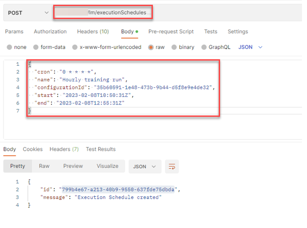
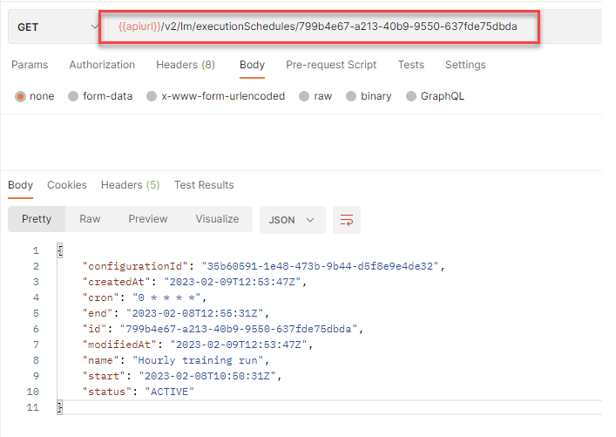

<!-- loiobd409a9eabe14e2f87406f2d3b1ed772 -->

# Create a Training Schedule


<a name="loiobd409a9eabe14e2f87406f2d3b1ed772__section_rry_jtl_lwb"/>

## Using Curl

1.  Create a training schedule by submitting a POST request to `$AI_API_URL/v2/lm/executionSchedules`.

    In the request body you need to define:

    -   The schedule in cron format. For more information, see [Cron Formatting](https://pubs.opengroup.org/onlinepubs/9699919799/utilities/crontab.html) 
    -   A name
    -   The configurationId that you want to use for the training instance
    -   A start timestamp when the schedule should become active
    -   An end timestamp when the schedule should become inactive

    ```
    curl --location --request POST “[/pandoc/div/div/horizontalrule/orderedlist/li/codeblock/span/code
         {"filepath"}) $AI_API_URL/v2/lm/executionSchedules/$EXECUTION_SCHEDULE (code]” \\
    --header “Authorization: Bearer $TOKEN” \
    --header “ai-resource-group: $RESOURCE_GROUP” \
    --data-raw '{ \
    	"cron": "0 * * * *",\
    	"name": "Hourly training run",\
    	"configurationId": "35b60591-1e48-473b-9b44-d5f8e9e4de32",\
    	"start": "2023-02-10T10:50:31Z",\
    	"end": "2023-02-10T12:55:31Z"\
    	}'
    ```

2.  Check the status of the training schedule by submitting a GET request:

    ```
    curl --location -- request GET “$AI_API_URL/v2/lm/executionSchedules/$EXECUTION_SCHEDULE” \\
    --header “Authorization: Bearer $TOKEN” \
    --header “ai-resource-group: $RESOURCE_GROUP”
    ```


<a name="loiobd409a9eabe14e2f87406f2d3b1ed772__section_y5h_3tl_lwb"/>

## Using Postman

1.  Create a training schedule by submitting a POST request to `{{apiurl}}/v2/lm/executionSchedules`.

    In the request body you need to define:

    -   The schedule in cron format. For more information, see [Cron Formatting](https://pubs.opengroup.org/onlinepubs/9699919799/utilities/crontab.html) 
    -   A name
    -   The configurationId that you want to use for the training instance
    -   A start timestamp when the schedule should become active
    -   An end timestamp when the schedule should become inactive

    

2.  Check the status of the training schedule by submitting a GET request to `{{apiurl}}/v2/lm/executionSchedules/{{executionScheduleId}}`

    


**Parent topic:** [Training Schedules](training-schedules-2b702f8.md "")

**Related Information**  


[List Executions Created by a Training Schedule](list-executions-created-by-a-training-schedule-2c1ecfb.md "")

[Change an Exisitng Training Schedule](change-an-exisitng-training-schedule-18caf4b.md "")

[Delete a Training Schedule](delete-a-training-schedule-9dc25e1.md "")

