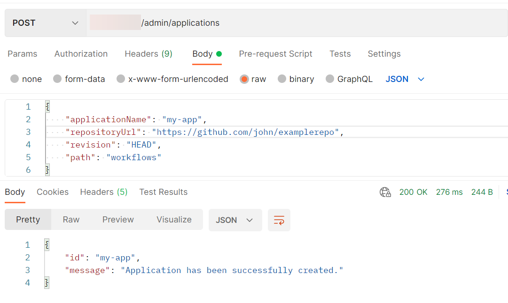

<!-- loio80dbecf3bc224ef5a300ba214de07973 -->

# Create an Application to Sync Your Folders


<a name="loio80dbecf3bc224ef5a300ba214de07973__section_jlp_dc3_dxb"/>

## Context

After you have registered your git repository, you need to create an application to sync the templates in your repository. The first sync will take some time, but you can check the status of the application to see when it is complete. After the first sync, sycing takes place automstically, every ~3 minutes, or can be requested manually.


<a name="loio80dbecf3bc224ef5a300ba214de07973__section_enm_1dy_lvb"/>

## Using Postman


### Procedure

Send a POST request to the endpoint `{{apiurl}}/v2/admin/applications` including details of your application::

-   `applicationName`: Set a name for your application. The name must be between 3 and 64 characters long and match `[A-Za-z0-9\-\_]+`.

-   `repositoryUrl`: The URL of a registered git repository.

-   `revision`: The revision to target. *<HEAD\>* refers to the most recent.

-   `path`: The path to the target folder that contains the templates to be synced.


Since each application points to a particular path and revision in the repository, multiple applications may be created for the same `repositoryUrl`.


### Results

After the GitOps setup is completed, the templates in your git repository are automatically synced to SAP AI Core at ~3 minute intervals.


### Next Steps

Check the synchronization status of your application by sending a GET request to `{{apiurl}}/v2/admin/applications/{{appName}}/status`. As `applicationName`, enter the name of your application that you specified when you created the application.


<a name="loio80dbecf3bc224ef5a300ba214de07973__section_e2w_mgy_lvb"/>

## Using curl

Submit a POST request to the endpoint `{{apiurl}}/v2/admin/applications` including details of your application::

```
curl --location --request POST "$AI_API_URL/v2/admin/applications" \
--header "Authorization: Bearer $TOKEN" \
--header 'Content-Type: application/json' \
--data-raw '{
        "applicationName": "my-app",
        "repositoryUrl": "https://github.com/john/examplerepo",
        "revision": "HEAD",
        "path": "workflows"
    }'
```

-   `applicationName`: Set a name for your application. The name must be between 3 and 64 characters long and match `[A-Za-z0-9\-\_]+`.

-   `repositoryUrl`: The URL of a registered git repository.

-   `revision`: The revision to target. *<HEAD\>* refers to the most recent.

-   `path`: The path to the target folder that contains the templates to be synced.


Since each application points to a particular path and revision in the repository, multiple applications may be created for the same `repositoryUrl`.


### Results

After the GitOps setup is completed, the templates in your git repository are automatically synced to SAP AI Core at ~3 minute intervals.


### Next Steps

Check the synchronization status of your application by submitting a GET request to `{{apiurl}}/v2/admin/applications/{{appName}}/status`:

```
curl --location --request GET "$AI_API_URL/v2/admin/applications/{{appName}}/status" \
--header "Authorization: Bearer $TOKEN" \
--header 'Content-Type: application/json'
```

As `applicationName`, enter the name of your application that you specified when you created the application.


<a name="loio80dbecf3bc224ef5a300ba214de07973__section_m4l_4cy_3wX"/>

## Sync an Application Manually


### Applications sync with your GitHub repository automatically at intervals of ~3 minutes. Use the endpoint below to manually request a sync:

`{{apiurl}}/admin/applications/{{appName}}/refresh`

