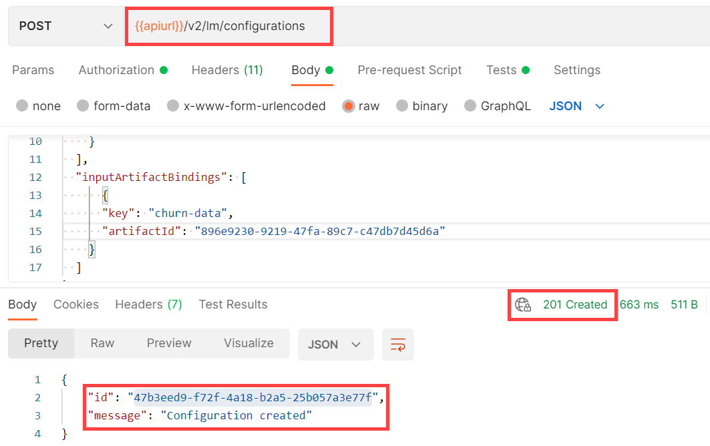

<!-- loio884ae340eb4a409b9548aee135e98b3f -->

# Create Configurations

A configuration is a collection of parameters, artifact references, and executables that are used to run an execution or deployment.


<a name="loio884ae340eb4a409b9548aee135e98b3f__section_d4p_rk4_ynb"/>

## Using Postman

1.  Send a POST request to the endpoint `{{apiurl}}/v2/lm/configurations`

2.  On the *Authorization* tab, set the type to *Bearer Token*.

3.  Set the token value to `{{token}}`.

    

4.  On the *Header* tab, add the following entries:


    <table>
    <tr>
    <th valign="top">

    KEY
    
    </th>
    <th valign="top">

    VALUE
    
    </th>
    </tr>
    <tr>
    <td valign="top">
    
    `ai-resource-group` 
    
    </td>
    <td valign="top">
    
    *<Name of your resourceGroup\>* \(in the example, `default` is used\)
    
    </td>
    </tr>
    <tr>
    <td valign="top">
    
    `Content-Type` 
    
    </td>
    <td valign="top">
    
    `application/json` 
    
    </td>
    </tr>
    </table>
    
5.  On the *Body* tab, select the *raw* radio button and add the request body as given below:

    ```
    {
        "name": "configuration-name",
        "executableId": "<executable ID>",
        "scenarioId": "<scenario ID>",
        "parameterBindings": [
          {
            "key": "<parameter name>",
            "value": "<value>"
          }
        ],
        "inputArtifactBindings": [
          {
            "key": "<artifact name>",
            "artifactId": "<artifact ID>"
          }
        ]
      }
    
    ```

    

6.  Send the request.


<a name="loio884ae340eb4a409b9548aee135e98b3f__section_d4p_rk4_ccc"/>

## Using curl

```
curl --request POST "$AI_API_URL/v2/lm/configurations" --header "Authorization: Bearer $TOKEN" --header "ai-resource-group: $RESOURCE_GROUP" --header "Content-Type: application/json" \
-d '{ 
    "name": "dummy-configuration", 
    "executableId": "'"$EXECUTABLE"'", 
    "scenarioId": "'"$SCENARIO"'", 
    "parameterBindings": [ 
      { 
        "key": "parameter_name_in_template", 
        "value": "some_value" 
      } 
    ], 
    "inputArtifactBindings": [ 
      { 
        "key": "input_artifact_name_in_template", 
        "artifactId": "a4d62a76-52aa-44cf-a789-743246d6d55b" 
      } 
    ] 
  }' 
```

> ### Output Code:  
> ```json
> {
>    "id":"f5bf305f-7c3f-4882-9f6b-8b95e3687b9b",
>    "message":"Configuration created"
> }
> ```

**Parent topic:**[Train Your Model](train-your-model-a9ceb06.md "You execute a training workflow to train your AI learning model.")

**Related Information**  


[Choose a Resource Plan](choose-a-resource-plan-57f4f19.md "You can configure SAP AI Core to use different infrastructure resources for different tasks, based on demand. SAP AI Core provides several preconfigured infrastructure bundles called “resource plans” for this purpose.")

[Workflow Templates](workflow-templates-83523ab.md "Here, you can find a minimal workflow example template, which you can adjust to meet the requirements of your workflow.")

[List Scenarios](list-scenarios-deedde5.md "")

[List Executables](list-executables-80895a4.md "")

[List Configurations](list-configurations-8074b2a.md "")

[Using Artifact Signatures](using-artifact-signatures-2f02a1d.md "Artifact signatures in the form of a hash can be added to output artifacts from executions.")

[Start Training](start-training-54b44e4.md "")

[Stop Training Instances](stop-training-instances-3d85344.md "")

[Delete Training Instances](delete-training-instances-612ce17.md "")

[Efficiency Features](efficiency-features-4cb76f7.md "Discover features of the SAP AI Core runtime that improve efficiency and help manage resource consumption.")

[Retrieve Execution Logs](retrieve-execution-logs-fbc55d3.md "accessed in the deployment and execution logs.")

[Training Schedules](training-schedules-2b702f8.md "")

