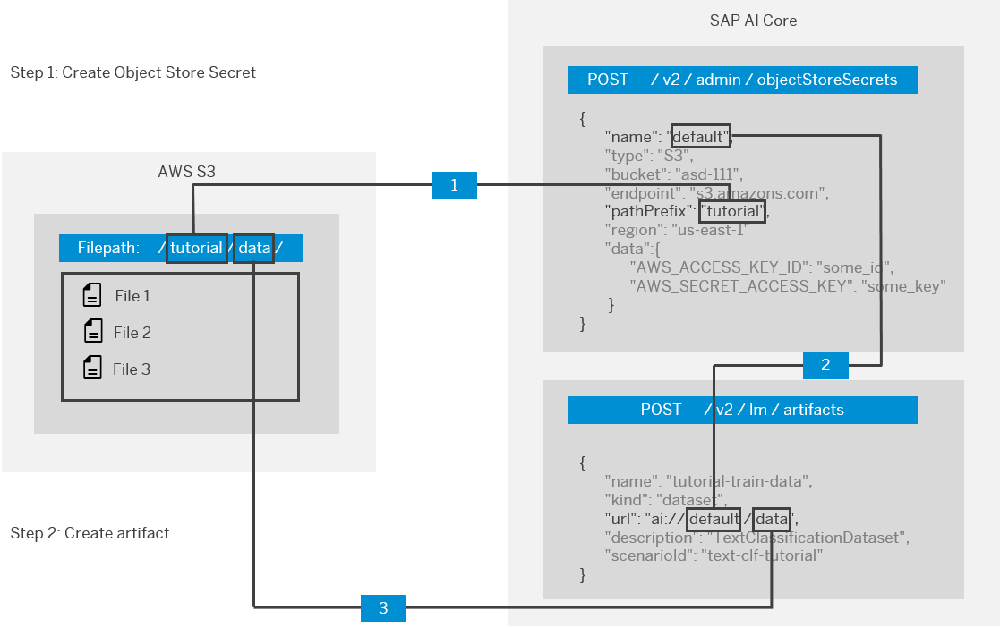

<!-- loio66413f1d9fbf4758a0d739eaf1c95dc7 -->

# Create Files

> ### Restriction:  
> The `objectStore name`, `data path` and `scenarioId` refer to pre-existing values. For the `objectStore name` and `data path` values, you must use the values that you used when registering the object storage, following the naming convention outlined in the diagram below. In example output codeblocks, these values are represented by `ai://default/data`.

  


<a name="loio66413f1d9fbf4758a0d739eaf1c95dc7__section_rtq_mxp_brb"/>

## Using Postman

1.  Create a new ***POST*** request using URL `{{apiurl}}/v2/lm/artifacts`
2.  Toggle the body tab, and enter the following JSON:

    ```
    {
      "name": "name of artifact",
      "kind": "dataset",
      "url": "ai://<objectStore name>/<data path>",
      "description": "<description of artifact>",
      "scenarioId": "<scenarioID>"
    }
    ```


The response body contains the ID of your new artifact.

```
{
    "id": "3x4mpl3-651c-4f3e-8e1d-81a408041bc1",
    "message": "Artifact acknowledged",
    "url": "ai://default/data"
}
```


<a name="loio66413f1d9fbf4758a0d739eaf1c95dc7__section_shh_nxp_brb"/>

## Using curl

```
curl --location --request POST "$API_URL/v2/lm/artifacts" \
--header "Authorization: Bearer $TOKEN" \
--header "Content-Type: application/json" \
--header "AI-Resource-Group: <Resource group>" \
--data-raw '{
   "name": "name of artifact",
   "kind": "dataset",
   "url": "ai://<objectStore name>/<data path>",
   "description": "<description of artifact>",
   "scenarioId": "<scenarioID>"
}
```

The response body contains the ID of your new artifact.

```
{
    "id": "3x4mpl3-651c-4f3e-8e1d-81a408041bc1",
    "message": "Artifact acknowledged",
    "url": "ai://default/data"
}
```

**Parent topic:** [Manage Files](manage-files-386ba71.md "An artifact refers to data or a file that is produced or consumed by executions or deployments. They are managed through SAP AI Core and your connected object store.")

**Related Information**  


[List Files](list-files-1d613e0.md "")

