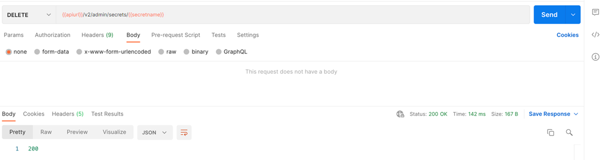

<!-- loiod5d5187da4d2483baa6a203f1bcbe33a -->

# Delete a Generic Secret

Manage the lifespan of your generic secrets.

To delete a generic secret, call the DELETE endpoint with the corresponding secret name as shown below. To get a secret name, see [List All Generic Secrets](list-all-generic-secrets-05a3713.md).


<a name="loiod5d5187da4d2483baa6a203f1bcbe33a__section_xnr_myk_4rb"/>

## Using Postman

1.  Create a DELETE request and enter the URL ***\{\{apiurl\}\}/v2/admin/secrets/\{\{secretName\}\}***
2.  As the request body, select the *none* radiobutton.
3.  Specify the scope of the request via the header `AI-Tenant-Scope` or `AI-Resource-Group`:
    -   ***AI-Tenant-Scope*** : ***true***. The operation will be performed at the main tenant level.
    -   ***AI-Resource-Group*** : ****<resource-group-name\>****. The operation will be performed at the resource-group level.

4.  Send the request.

 


<a name="loiod5d5187da4d2483baa6a203f1bcbe33a__section_y24_pyk_4rb"/>

## Using curl

Submit a DELETE request to the endpoint `/v2/admin/secrets/"$SECRET_NAME"`. Here we use the resource-group scope. For main-tenant scope level, replace the last header with `AI-Tenant-Scope: true`.

```
curl --location --request DELETE "[/pandoc/div/div/horizontalrule/codeblock/span/code
     {"filepath"}) $AI_API_URL/v2/admin/secrets/$SECRET_NAME (code][/pandoc/div/div/horizontalrule/codeblock/span/code
     {"filepath"}) $AI_API_URL/v2/admin/secrets/$SECRET_NAME (code]" \
--header "Authorization: Bearer $TOKEN" \
--header 'AI-Resource-Group: default' 

```

**Parent topic:** [Manage Resource Groups](manage-resource-groups-8aae6cb.md "A resource group represents a unique workspace environment, where users can create or add entities such as configurations, executions, deployments, and artifacts.")

**Related Information**  


[Create a Resource Group](create-a-resource-group-01753f4.md "You can create resource groups to isolate ML workloads.")

[Create a Generic Secret](create-a-generic-secret-1831845.md "A generic secret gives SAP AI Core authorization to utilize your resource group without exposing your credentials.")

[List All Generic Secrets](list-all-generic-secrets-05a3713.md "Locate a generic secret, without revealing sensitive information.")

[Update a Generic Secret](update-a-generic-secret-b5d5970.md "Generic secrets can be amended.")

[Consume Generic Secrets in Executions or Deployments](consume-generic-secrets-in-executions-or-deployments-185a324.md "Utilize generic secrets in executions or deployments.")

