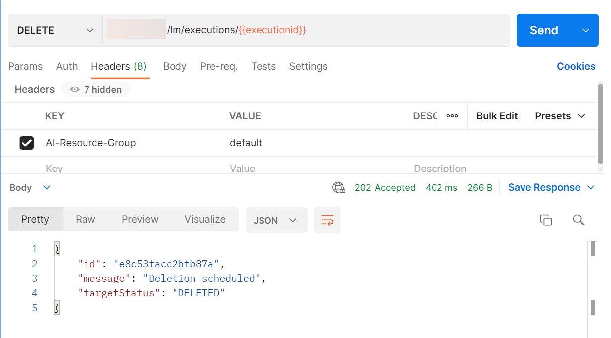

<!-- loiodd71f165135f49a194e131fa4ca9d5d3 -->

# Delete a Single Training Instance


<a name="loiodd71f165135f49a194e131fa4ca9d5d3__section_imm_lgp_brb"/>

## Using curl

```
curl --request DELETE $AI_API_URL/v2/lm/executions/$EXECUTION \ \
    --header "Authorization: Bearer $TOKEN" \
    --header "ai-resource-group: $RESOURCE_GROUP"  


```

> ### Output Code:  
> ```json
> {
>     "id": "ee6769e4dc19c0fd",
>     "message": "Deletion scheduled",
>     "targetStatus": "DELETED"
> }
> 
> ```


<a name="loiodd71f165135f49a194e131fa4ca9d5d3__section_t44_kqd_lwb"/>

## Using Postman

Send a DELETE request to `{{apiurl}}/v2/lm/executions/{{executionid}}`. The header for this request is: `AI-Resource-Group: {YOUR-Resource-Group}`.



**Parent topic:** [Delete Training Instances](delete-training-instances-612ce17.md "")

**Related Information**  


[Delete Multiple Training Instances](delete-multiple-training-instances-c1c3cc3.md "")

