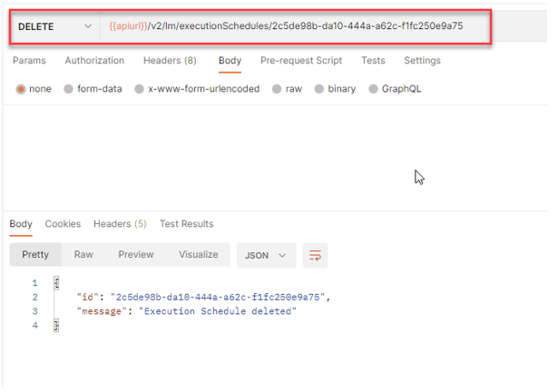

<!-- loio9dc25e11c3b64fc59621082679f0e01f -->

# Delete a Training Schedule


<a name="loio9dc25e11c3b64fc59621082679f0e01f__section_sfr_4wl_lwb"/>

## Using Curl

You can delete training schedules that are in states ACTIVE and INACTIVE.

Submit a DELETE request:

```
curl --location -- request DELETE “$AI_API_URL/v2/lm/executionSchedules/$EXECUTION_SCHEDULE” \\
--header “Authorization: Bearer $TOKEN” \
--header “ai-resource-group: $RESOURCE_GROUP”
```


<a name="loio9dc25e11c3b64fc59621082679f0e01f__section_m2r_4wl_lwb"/>

## Using Postman

You can delete training schedules that are in states ACTIVE and INACTIVE.

Send a DELETE request to the endpoint `{{apiurl}}/v2/lm/executionSchedules/{{executionScheduleId}}`



**Parent topic:** [Training Schedules](training-schedules-2b702f8.md "")

**Related Information**  


[Create a Training Schedule](create-a-training-schedule-bd409a9.md "")

[List Executions Created by a Training Schedule](list-executions-created-by-a-training-schedule-2c1ecfb.md "")

[Change an Existing Training Schedule](change-an-existing-training-schedule-18caf4b.md "")

