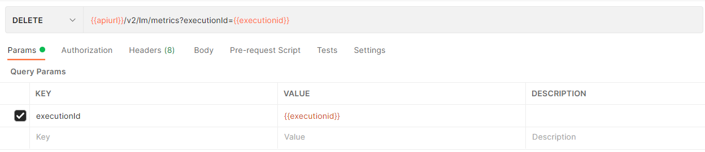
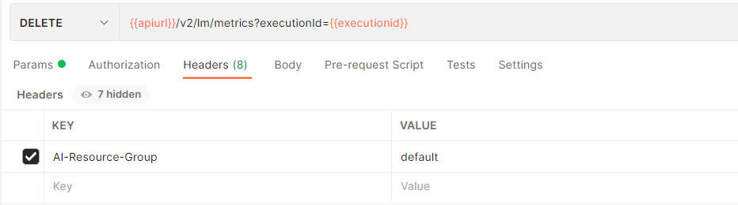
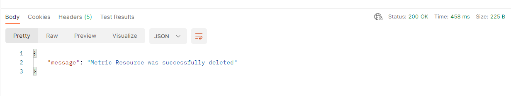

<!-- loio1474d4304d474d78902fdf9d0fb3179e -->

# Delete Metrics

You can delete metrics by submitting a DELETE request to the endpoint `/v2/lm/metrics`. To delete tracking data, you must provide the following parameters:

-   `AI-Resource-Group` \(header\) – string
-   `executionId` \(query\)


<a name="loio1474d4304d474d78902fdf9d0fb3179e__section_gmg_2m1_zpb"/>

## Responses of DELETE API


<table>
<tr>
<th valign="top">

Response Code


</th>
<th valign="top">

Description


</th>
</tr>
<tr>
<td valign="top">

200


</td>
<td valign="top">

Metric resource was successfully deleted


</td>
</tr>
<tr>
<td valign="top">

404


</td>
<td valign="top">

The specified resource was not found


</td>
</tr>
</table>

> ### Sample Code:  
> Sample 404 response:
> 
> ```
> { 
>   "error": { 
>     "code": "02010055", 
>     "message": "Metrics was not found.", 
>     "requestId": "9832bf934f3743v3948v3", 
>     "target": "/metrics", 
>     "details": [ 
>       { 
>         "code": "9827389374", 
>         "message": "Empty result set." 
>       } 
>     ] 
>   } 
> } 
> ```


<a name="loio1474d4304d474d78902fdf9d0fb3179e__section_b4h_nx2_vrb"/>

## Delete Metrics Using Postman

You can delete metrics by sending a DELETE request to the endpoint `{{apiurl}}/v2/lm/metrics` with the following query parameters and headers:

**Query Parameters**


<table>
<tr>
<th valign="top">

Parameter


</th>
<th valign="top">

Required


</th>
<th valign="top">

Data Type


</th>
<th valign="top">

Description


</th>
</tr>
<tr>
<td valign="top">

`executionIds`


</td>
<td valign="top">

Yes


</td>
<td valign="top">

Array of String


</td>
<td valign="top">

ID of execution


</td>
</tr>
</table>

**Header**


<table>
<tr>
<th valign="top">

Field


</th>
<th valign="top">

Required


</th>
<th valign="top">

Data Type


</th>
<th valign="top">

Description


</th>
</tr>
<tr>
<td valign="top">

`AI-Resource-Group`


</td>
<td valign="top">

Yes


</td>
<td valign="top">

String


</td>
<td valign="top">

ID of the resource group that contains the execution.


</td>
</tr>
</table>

1.  Create a new HTTP request with the endpoint.

2.  On the *Authorization* tab, set the type to *Bearer Token*.

3.  Set the token value to ***\{\{token\}\}***.

      

4.  Set the query parameters in *Params*.

    

5.  Set the *Header*.

    

6.  Send the request.

    You should receive the message ***Metric Resource was successfully deleted***.

    


<a name="loio1474d4304d474d78902fdf9d0fb3179e__section_d1q_vrc_vrb"/>

## Delete Metrics Using curl

```

curl --location --request DELETE '[/pandoc/div/div/horizontalrule/codeblock/span/code
     {"filepath"}) $AI_API_URL/v2/lm/metrics?executionId=e1c49497ccf6dde8 (code]' \
--header 'AI-Resource-Group: default' \
--header 'Authorization: Bearer $TOKEN'
```

