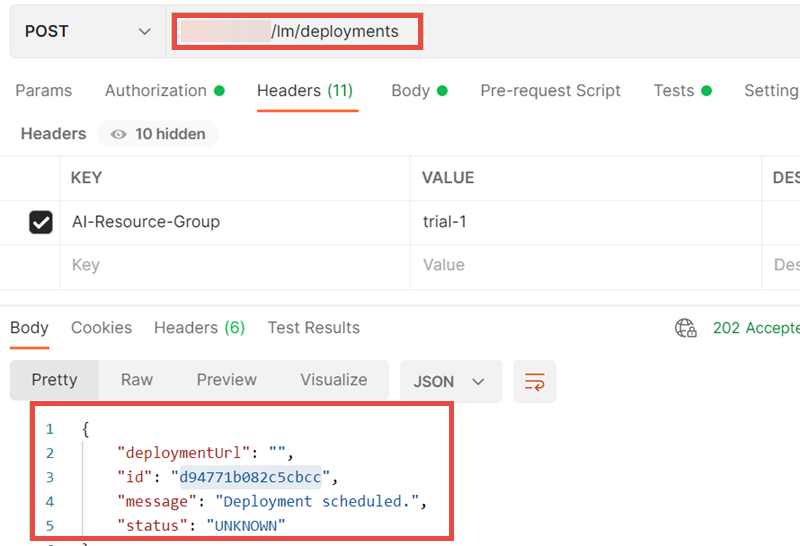

<!-- loiodd16e8ef75654dde831e7b812688e4fa -->

# Deploy Models


<a name="loiodd16e8ef75654dde831e7b812688e4fa__section_wwg_g4s_vnb"/>

## Using Postman

1.  Send a POST request to the endpoint `{{apiurl}}/v2/lm/deployments`.

2.  Pass the `configurationId` in the request body.

    

3.  Check the status of the deployment by sending a GET request to `{{apiurl}}/v2/lm/deployments/{{deploymentid}}`.

    


> ### Note:  
> If the status is dead or pending, there might be errors in the deployment. You can check the deployment logs for more details, see [Retrieve Deployment Logs](retrieve-deployment-logs-4c86b88.md).


<a name="loiodd16e8ef75654dde831e7b812688e4fa__section_wvn_3h4_apb"/>

## Using curl

1.  Trigger the deployment.

    ```
    curl --request POST $AI_API_URL/v2/lm/deployments \
        --header "Authorization: Bearer $TOKEN" \
        --header "ai-resource-group: $RESOURCE_GROUP"
        --data-raw '{
            "configurationId": " 2b72d740-5a89-4cf7-b37c-85973eeed6ae "
        }'
    
    ```

    > ### Output Code:  
    > ```json
    > {
    >   "deploymentUrl": "",
    >   "id": "dda5d19065d5b1f4",
    >   "message": "Deployment created.",
    >   "status": "UNKNOWN"
    > }
    > ```

2.  Note the deploy environment variable for later use.
3.  Check the status of the deployment.

    ```
    curl --request GET $AI_API_URL/v2/lm/deployments/$DEPLOYMENT_ID \
        --header "Authorization: Bearer $TOKEN" \
        --header "ai-resource-group: $RESOURCE_GROUP"   
    ```

    > ### Output Code:  
    > ```json
    > {
    >   "configurationExecutableId": "hello-tf-1-15",
    >   "configurationId": "2b72d740-5a89-4cf7-b37c-85973eeed6ae",
    >   "configurationName": "hello-tf-1-15-config",
    >   "createdAt": "2020-11-11T06:34:24Z",
    >   "createdBy": "user",
    >   "deploymentUrl": "https://my-deployment-url.com",
    >   "id": "d291766fd1072b3f",
    >   "modifiedAt": "2020-11-11T06:37:29Z",
    >   "modifiedBy": "user",
    >   "scenarioId": "dba85cf3-2d69-498d-8ce5-4a415c9116dc",
    >   "status": "RUNNING",
    >   "targetStatus": "RUNNING",
    >   "versionId": "0.1.0"
    > }
    > ```


> ### Note:  
> If the status is dead or pending, there might be errors in the deployment. You can check the deployment logs for more details, see [Retrieve Deployment Logs](retrieve-deployment-logs-4c86b88.md).


<a name="loiodd16e8ef75654dde831e7b812688e4fa__section_zsf_4c2_1vb"/>

## Optional Parameters

The duration of a deployment can be limited using the `ttl` parameter. It takes an integer for quantity, and a single letter to specify units of time. Only minutes \(***m***\), hours \(***h***\) and days \(***d***\), are supported, and values must be natural numbers. For example, `"ttl": "5h"` gives the deployment a duration of 5 hours. ***4.5h*** and ***4h30m*** are not valid inputs. If no value is passed, the duration of the deployment if indefinite. Once the duration expires, the deployment is stopped and deleted.


<a name="loiodd16e8ef75654dde831e7b812688e4fa__section_w5l_cf2_1vb"/>

## Deployment Quotas

Each tenant is assigned a default quota that limits the number of deployments and replicas per deployment. If you reach this quota, your deployment will not be created, and you will be notified. You can free up your quota by deleting existing deployments.

Alternatively, you can request a quota increase by creating a ticket. The `component` name is ***CA-ML-AIC*** and ticket title is ***Request to Increase Quota***.

**Parent topic:** [Use Your Model](use-your-model-7f93e8f.md "You deploy your AI learning model to run inferences against it.")

**Related Information**  


[Choose a Resource Plan](choose-a-resource-plan-8deca74.md "You can configure SAP AI Core to use different infrastructure resources for different tasks, based on demand. SAP AI Core provides several preconfigured infrastructure bundles called “resource plans” for this purpose.")

[Serving Templates](serving-templates-20a8667.md "You use serving templates to manage your serving instances at the level of the main tenant. Serving templates define how a model is to be deployed.")

[List Executables](list-executables-6af8e60.md "An executable is a template that is instantiated for a purpose, such as training a model or creating a deployment. You can list all of the executables in a resource group and get details of specific executables from a resource group. Serving templates are mapped to deployment executables.")

[Inferencing](inferencing-e348ecf.md "")

[Update a Deployment](update-a-deployment-9789ddd.md "")

[Stop Deployments](stop-deployments-b7d2577.md " ")

[Delete Deployments](delete-deployments-0193d17.md " ")

[Efficiency Features](efficiency-features-9fad26a.md "Discover features of the SAP AI Core runtime that improve efficiency and help manage resource consumption.")

[Retrieve Deployment Logs](retrieve-deployment-logs-4c86b88.md "Information about API processing and metrics, are stored and accessed in the deployment and execution logs.")

[Support.](https://itsm.services.sap/itsupport)

[Service Plans](service-plans-c7244c6.md "The SAP AI Core service plan you choose determines pricing, conditions of use, resources, available services, and hosts.")

