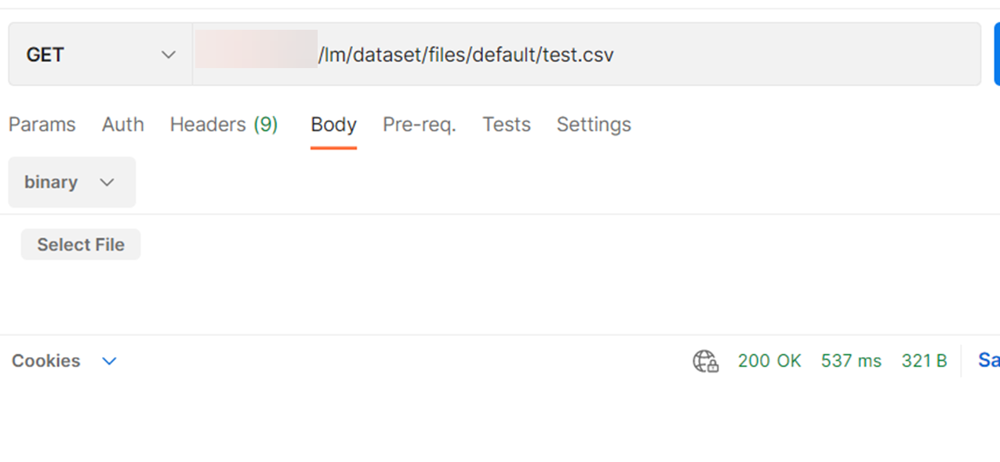

<!-- loio0a641f3e5e35421ba9ebdbf43b68decc -->

# Download Files


<a name="loio0a641f3e5e35421ba9ebdbf43b68decc__section_uk3_jds_2xb"/>

## Using Postman

Send a GET request to the endpoint `{{apiurl}}/v2/lm/dataset/files/{secret name}/{full file path}`




<a name="loio0a641f3e5e35421ba9ebdbf43b68decc__section_dw3_kds_2xb"/>

## Using Curl

```
curl --location --request GET “$AI_API_URL/v2/lm/dataset/files/$SECRET_NAME/$FILE_PATH” \\
	--header “Authorization: Bearer $TOKEN” \
	--header “ai-resource-group: $RESOURCE_GROUP” \
	--data @$FILE_LOCATION
```

