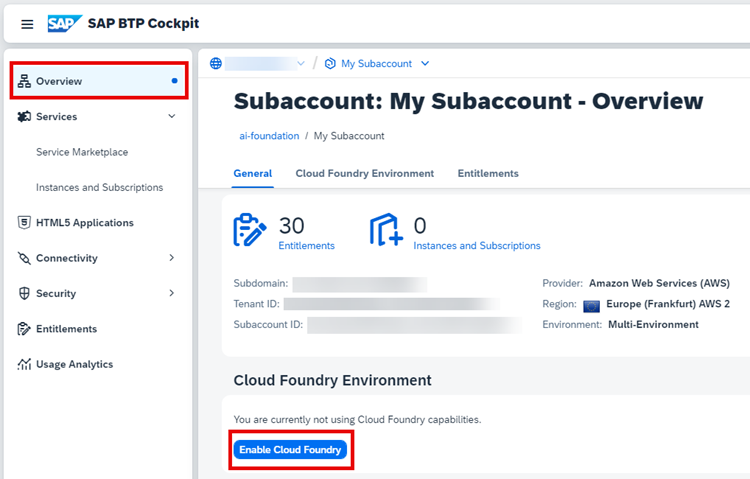
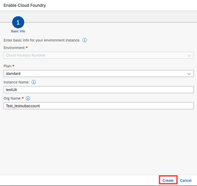

<!-- loiocf0d5d28f43645118d20b7a04fbab946 -->

# Enable Cloud Foundry

## Procedure

1.  Choose your subaccount and on the *Overview* page, choose *Enable Cloud Foundry*.

    

2.  Enter the basic information for your Cloud Foundry environment instance and click *Create*.

    

**Parent topic:**[Initial Setup](initial-setup-38c4599.md "You provision SAP AI Core from the SAP BTP cockpit in SAP Business Technology Platform. After provisioning, you will have your service key, which provides URLs and credentials for accessing the SAP AI Core instance")

**Next:**[Create a Subaccount](create-a-subaccount-3e3ae83.md "")

**Previous:**[Create a Space](create-a-space-4c1190c.md "")

