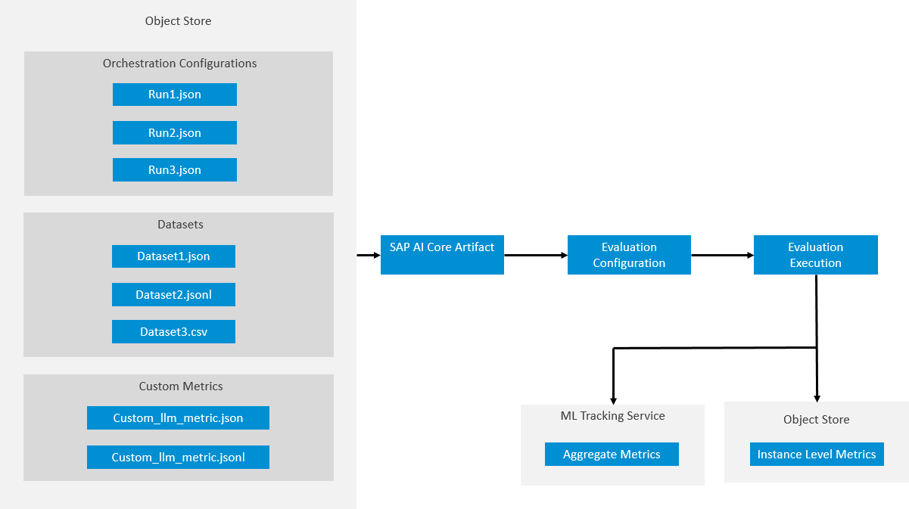

<!-- loio14699b00e7944751bbf07f148bdcb44b -->

# Evaluations

Evaluations provides tools for benchmarking large language models and prompts via orchestration configurations.

Evaluations can be used for the following use cases:

-   Evaluating prompt templates and models as orchestration configurations to determine the most effective combination for a use case.

-   Use industry-standard predefined metrics for model and prompt comparison with your use-case-specific dataset.

-   Use your own custom-defined metrics for your prompt and model evaluations.

**Evaluations Overview**

-   **[View Evaluation Results](view-evaluation-results-aa46126.md "")**  

