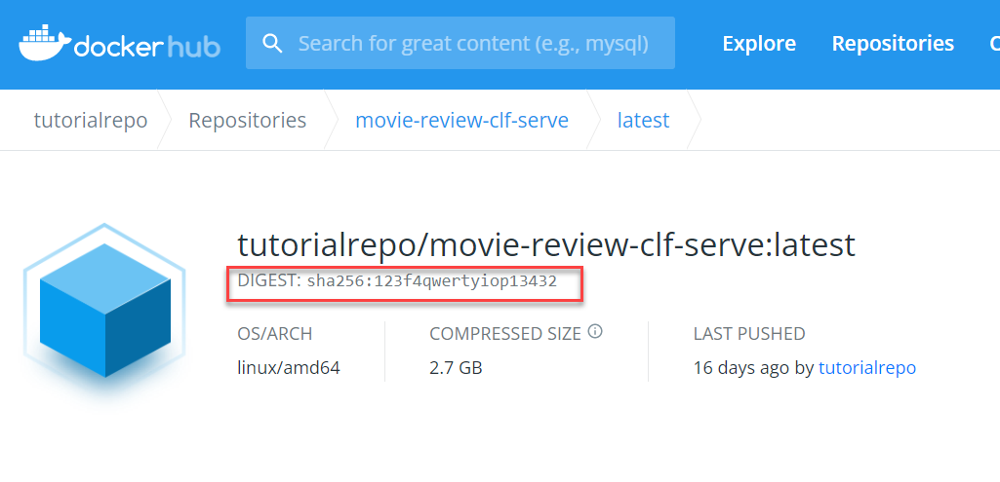

<!-- loio5ccde4d02118436c9facf4208ae0633e -->

# Execution


<a name="loio5ccde4d02118436c9facf4208ae0633e__section_arf_yqk_vsb"/>

## Execution status is DEAD or PENDING for a long time


### Check the following:

1.  Check the execution logs.
2.  Check that the parameter name and execution name that you provided match those in your template. Note that the names are case-sensitive.


<a name="loio5ccde4d02118436c9facf4208ae0633e__section_f3l_vln_wsb"/>

## Images from private docker.io cannot be pulled for execution


### Follow the solution:

1.  Specify the domain name of your Docker Hub. For example:

    ```
    ...
    				none: {}
    		container:
    			image: "docker.io/tutorialrepo/movie-review-clf-serve@sha256:123f4qwertyiop13432"
    			imagePullPolicy: Always
    ...
    ```

    If you do not already know your domain name, refer to the image:

2.  Specify your Docker Image digest instead of the image version in your templates:

    image tutorialrepo/movie-review-clf-serve@sha256:123f4qwertyiop13432


<a name="loio5ccde4d02118436c9facf4208ae0633e__section_ahp_yqk_vsb"/>

## Output artifacts in the execution list are empty and have status UNKNOWN for a long time


### Check the following:

1.  Check thatan object secret with the name `default` exists in the current resource group. For more information, see [Register an Object Store Secret](register-an-object-store-secret-b083d73.md) 
2.  Check that you have created the Docker Registry secrets required to pull your Docker Images. Logs will be available only after the execution has started.


<a name="loio5ccde4d02118436c9facf4208ae0633e__section_bcq_yqk_vsb"/>

## `GET` execution has the status UNKNOWN for a long time


### Check the following:

1.  Check if an object secret with the name `default` exists in the current resource group. For more information, see [Register an Object Store Secret](register-an-object-store-secret-b083d73.md) 
2.  Check that you have created the Docker Registry secrets required to pull your Docker Images. Logs will be available only after the execution has started.


<a name="loio5ccde4d02118436c9facf4208ae0633e__section_rrr_yqk_vsb"/>

## Execution status changes to DEAD without any log


### Check the following:

1.  Check that your templates meet the Argo specifications and that they can be executed by SAP AI Core.
2.  To identify errors automatically in your templates, use the Argo linter.
3.  Check that you have created Docker folders, to store artifacts that will be created during an execution.

**Parent topic:**[Troubleshooting](troubleshooting-3da90ba.md "For troubleshooting information, see the following sections:")

**Related Information**  


[Repository](repository-fcad603.md "")

[Configuration](configuration-047fad5.md "")

[Artifacts](artifacts-c655daa.md "")

[Application](application-7f1e35b.md "")

[Docker](docker-1945aa4.md "")

[Deployment](deployment-a10fa8a.md "")

[Miscellaneous](miscellaneous-10622b5.md "")

