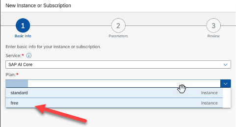

<!-- loio4533adc472074698b355c70f04b2cf49 -->

# Free Tier

Enable the free tier option to get to know SAP AI Core with usage limits, to familiarize yourself with the service. Note that usage is limited with this option.

You can use the free tier option and benefit from the following advantages:

-   Explore SAP AI Core features and capabilities without cost.

-   Migrate from the free tier to a standard service plan while retaining your work.

**Free Tier Scope**

-   For region information, see [SAP Discovery center](https://discovery-center.cloud.sap/serviceCatalog/sap-ai-core?region=all&tab=feature&commercialModel=cpea).

-   Only community support is available for free tier service plans and these are not subject to SLAs.

-   The free tier option is subject to usage limits. For more information, see [Service Plans](service-plans-c7244c6.md).

> ### Note:  
> Customers can create one SAP AI Core free plan instance, if and only if there are no active standard plan instances within the subaccount. Tenants can update their plan from free to standard, but not from standard to free. A standard plan SAP AI Core instance cannot be created if there is an active free plan instance in the subaccount.

**Related Information**  

[Service Plans](service-plans-c7244c6.md "The SAP AI Core service plan you choose determines pricing, conditions of use, resources, available services, and hosts.")

<a name="task_tgn_r35_15b"/>

<!-- task\_tgn\_r35\_15b -->

## Enabling Free Tier

Enable free tier to experience SAP AI Core for trial and testing purposes. Alternatively, follow the tutorial [here.](https://developers.sap.com/tutorials/ai-core-launchpad-provisioning.html)

<a name="task_tgn_r35_15b__prereq_asd_w25_txb"/>

## Prerequisites

> ### Restriction:  
> SAP AI Core free tier is only available in SAP BTP free tier, not SAP BTP trial.

<a name="task_tgn_r35_15b__steps_qtp_xmn_15b"/>

## Procedure

1.  Open your global account in the SAP BTP cockpit.

2.  Go to your subaccount.

3.  In the navigation area, choose *Instances and Subscriptions*.

4.  Choose *New Instance or Subscripton*

5.  Search for SAP AI Core in the *Service* field.

6.  Choose *Free* in the *Plan* field.

    

    > ### Note:  
    > A free tenant will be created.

**Related Information**  

[Service Plans](service-plans-c7244c6.md "The SAP AI Core service plan you choose determines pricing, conditions of use, resources, available services, and hosts.")

[Using Free Service Plans](https://help.sap.com/docs/BTP/65de2977205c403bbc107264b8eccf4b/524e1081d8dc4b0f9d055a6bec383ec3.html)

