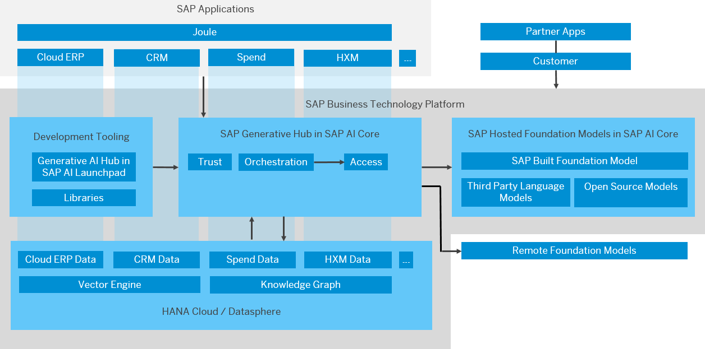
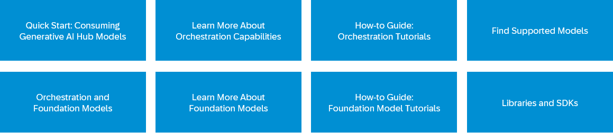

<!-- loio7db524ee75e74bf8b50c167951fe34a5 -->

# Generative AI Hub

The generative AI hub incorporates generative AI into your AI activities in SAP AI Core and SAP AI Launchpad.

Generative AI models are self-supervised, deep learning models trained on vast amounts of unlabeled data. They use AI technology and industrial-scale computational resources to learn complex patterns and semantic knowledge bases. These models excel in tasks like natural language processing \(NLP\). By parsing inputs, such as prompts, and predicting target words, they return contextually relevant responses in natural language. A single model can handle multiple tasks by using different input formats and output modes.

Generative AI models are general by design, but you can fine-tune them with additional embeddings. In this way, you can make them suitable for specialized or domain-specific use cases.

SAP AI Core and the generative AI hub help you to integrate LLMs and AI into new business processes in a cost-efficient manner.

  
  
**Generative AI Hub Architecture Overview**

<a name="loio7db524ee75e74bf8b50c167951fe34a5__section_jnp_r2n_s2c"/>

## Next Steps

Click the tiles below to find out more about the generative AI hub.

-   **[Quick Start](quick-start-ef03b58.md "In this section, we'll show you how you can get started with the generative AI hub.")**  
In this section, we'll show you how you can get started with the generative AI hub.
-   **[Accessing Generative AI Models Through Global Scenarios](accessing-generative-ai-models-through-global-scenarios-4ca11f6.md "")**  

-   **[Supported Models](supported-models-509e588.md "")**  

**Related Information**  

[Monitoring and Troubleshooting](monitoring-and-troubleshooting-f559038.md "Explore solutions to potential issues, and find out how to get support.")

