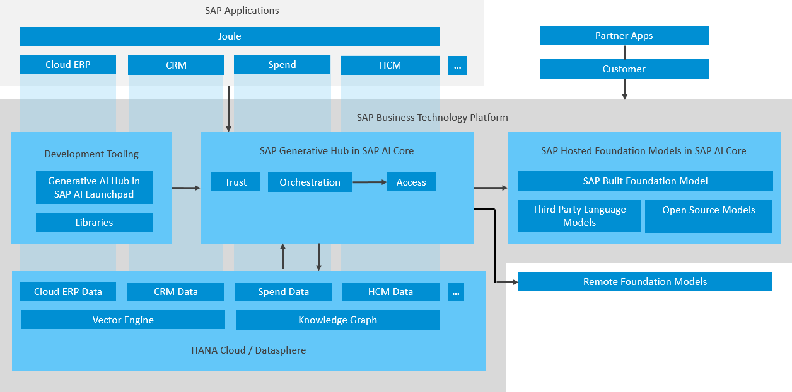

<!-- loio7db524ee75e74bf8b50c167951fe34a5 -->

# Generative AI Hub in SAP AI Core

The generative AI hub incorporates generative AI into your AI activities in SAP AI Core and SAP AI Launchpad.

LLMs are self-supervised, deep learning models that have been trained on vast amounts of unlabeled data. They leverage AI technology and industrial-scale computational resources to learn complex language patterns and semantic knowledge bases for natural language processing \(NLP\) tasks. They parse input, such as prompts, and by predicting a target word, can return contextually relevant responses written in natural language. A single LLM can perform multiple NLP tasks by using different input formats and output modes.

LLMs are general models but can be fine-tuned with additional embeddings for specialized or domain-specific use cases.

SAP AI Core and the generative AI hub help you to integrate LLMs and AI into new business processes in a cost-efficient manner.

  
  
**Generative AI Hub Architecture Overview**

-   **[Models and Scenarios in the Generative AI Hub](models-and-scenarios-in-the-generative-ai-hub-729dd9e.md)**  

-   **[Create a Deployment for a Generative AI Model](create-a-deployment-for-a-generative-ai-model-b32e7a8.md "You make a generative AI model available for use by creating a deployment. You can do so one time for each model and model version, and
		for each resource group that you want to use with generative AI hub. The deployment
		URL that is generated can be reused.")**  
You make a generative AI model available for use by creating a deployment. You can do so one time for each model and model version, and for each resource group that you want to use with generative AI hub. The deployment URL that is generated can be reused.
-   **[Consume Generative AI Models](consume-generative-ai-models-bf0373b.md "The generative AI hub helps you
		to complete tasks like summarizing text, inferencing, and transforming content. To do so,
		you consume a generative AI model by sending a request to the model's endpoint.")**  
The generative AI hub helps you to complete tasks like summarizing text, inferencing, and transforming content. To do so, you consume a generative AI model by sending a request to the model's endpoint.

