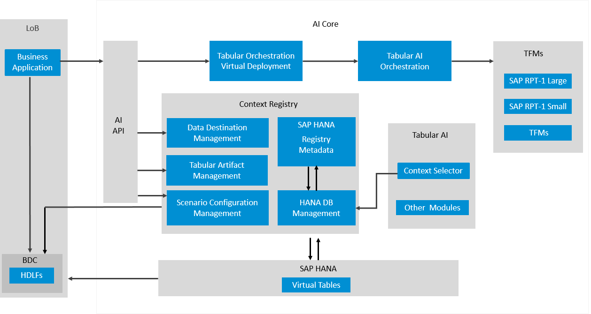

<!-- loio1cdac2032c124408bacc9b488bc356b5 -->

# Consume Tabular Orchestration

The Tabular AI Orchestration service manages the end-to-end prediction workflow, from context retrieval to model inference.

The Tabular AI Orchestration service is the runtime inference layer of the Tabular AI platform. It provides a unified prediction endpoint that orchestrates the end-to-end prediction workflow. The service validates incoming requests, retrieves context rows from the Context Selector service, combines them with any user-provided context, and forwards the assembled payload to a Tabular Foundation Model \(TFM\) for inference.

> ### Note:  
> Before calling the orchestration endpoint, complete the design-time setup. A data destination, tabular artifact, and scenario configuration must exist in the Context Registry.

For more information, see the following topics:

-   [API Specification](api-specification-e7f9915.md) 
-   [Troubleshooting](troubleshooting-46af3f9.md)
-   [Prediction Examples for Tabular AI Orchestration](prediction-examples-for-tabular-ai-orchestration-2577090.md)

-   **[API Specification](api-specification-e7f9915.md "Use the Tabular AI Orchestration Prediction API to submit inference requests, configure
        context selection strategies and generate classification or regression predictions with
        supported tabular foundation models.")**  
Use the Tabular AI Orchestration Prediction API to submit inference requests, configure context selection strategies and generate classification or regression predictions with supported tabular foundation models.
-   **[Prediction Examples for Tabular AI Orchestration](prediction-examples-for-tabular-ai-orchestration-2577090.md)**  

-   **[Troubleshooting](troubleshooting-46af3f9.md "Use the following troubleshooting information to identify and resolve common validation,
		service, and performance issues when calling the API.")**  
Use the following troubleshooting information to identify and resolve common validation, service, and performance issues when calling the API.

