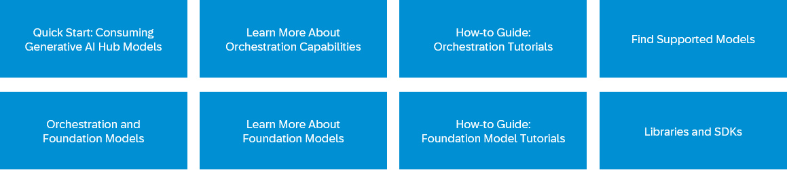

<!-- loio7db524ee75e74bf8b50c167951fe34a5 -->

# Generative AI Hub 

The generative AI hub is a capability of SAP AI Core and SAP AI Launchpad that enables access to and orchestration of generative AI models within a governed, enterprise-ready runtime environment.

SAP AI Core provides the runtime and lifecycle management foundation for AI scenarios on SAP Business Technology Platform \(SAP BTP\). Within this foundation, the generative AI hub allows you to integrate and manage large language models \(LLMs\) and other generative AI services while leveraging the security, scalability, and operational controls of SAP AI Core.

With the generative AI hub, you can:

-   Access supported generative AI models
-   Submit prompts and manage model interactions
-   Integrate generative AI capabilities into business applications
-   Operate generative AI workloads under enterprise governance

The generative AI hub doesn't replace SAP AI Core; it extends it. All model execution, resource management, and operational control are handled by SAP AI Core.

For a general overview of the service architecture and runtime capabilities, see [What Is SAP AI Core?](https://help.sap.com/viewer/2d6c5984063c40a59eda62f4a9135bee/CLOUD/en-US/d029a32c22fb45fbb607e6a2c48c8a0e.html "Learn more about the SAP AI Core service on SAP Business Technology Platform (SAP BTP). Build a platform for your artificial intelligence solutions.") :arrow_upper_right:.

> ### Tip:  
> If you want a guided, hands-on environment, you can explore the generative AI hub using the 30-day free trial. For more information, see [Try now: 30-Day Basic Trial](https://www.sap.com/products/artificial-intelligence/generative-ai-hub-trial.html).

<a name="loio7db524ee75e74bf8b50c167951fe34a5__section_jnp_r2n_s2c"/>

## Next Steps

Click the following tiles to find out more about the generative AI hub.

-   **[Quick Start](quick-start-ef03b58.md "This section walks you through the essential steps for getting started with the generative AI hub in SAP AI Core. You'll authenticate,
		retrieve your orchestration deployment URL, and make your first model call using the
		Harmonized API.")**  
This section walks you through the essential steps for getting started with the generative AI hub in SAP AI Core. You'll authenticate, retrieve your orchestration deployment URL, and make your first model call using the Harmonized API.
-   **[Models](models-6440777.md "")**  

-   **[Foundation Models](foundation-models-2d981fb.md "The foundation models service operates under the global AI scenario
			foundation-models, which is managed by SAP AI Core.")**  
The foundation models service operates under the global AI scenario `foundation-models`, which is managed by SAP AI Core.
-   **[Orchestration](orchestration-8d02235.md "The orchestration service runs on SAP AI Core under the global AI scenario
                orchestration. It provides unified access to multiple generative AI models through consistent
            code, configuration, and deployment.")**  
The orchestration service runs on SAP AI Core under the global AI scenario `orchestration`. It provides unified access to multiple generative AI models through consistent code, configuration, and deployment.

**Related Information**  

[What Is SAP AI Core?](https://help.sap.com/viewer/2d6c5984063c40a59eda62f4a9135bee/CLOUD/en-US/d029a32c22fb45fbb607e6a2c48c8a0e.html "Learn more about the SAP AI Core service on SAP Business Technology Platform (SAP BTP). Build a platform for your artificial intelligence solutions.") :arrow_upper_right:

[Initial Setup](https://help.sap.com/viewer/2d6c5984063c40a59eda62f4a9135bee/CLOUD/en-US/38c4599432d74c1d94e70f7c955a717d.html "Get started with SAP AI Core using the standard procedures for the SAP BTP, Cloud Foundry environment or Kyma environment.") :arrow_upper_right:

[Generative AI Hub](https://www.sap.com/products/artificial-intelligence/generative-ai-hub.html)

