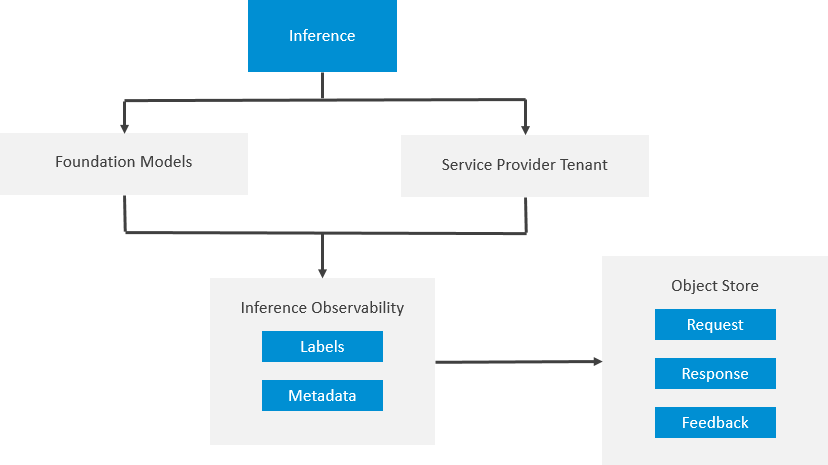

<!-- loio8e9daccf82af44718b26ec7eae45ac50 -->

# Inference Observability

Inference observability stores the payloads of inferences to foundation models or orchestration. The payload can be retrieved later for analytical purposes.

Key features include:

-   You can add labels to be able to filter inferences.

-   You can store feedback to a given inference after the inference has been recorded in inference observability.

To store the inference request, response, and feedback, you'll need an object store that was registered using an object store secret. For more information, see [Register an Object Store for Inference Observability](register-an-object-store-for-inference-observability-babcd84.md) 

> ### Restriction:  
> Only S3 object stores are supported by inference observability.

Alternatively, you can opt to store only metadata and labels. In this case, no object store is required.

Metadata is additional information about the inference such as:

-   Model name

-   Model version

-   Input tokens

-   Output tokens

-   Latency

Inferences \(including metadata\) are only stored if you explicitly declare in the inference headers that the request should be recorded.

> ### Note:  
> Request, response, and feedback are stored without data masking or additional processing in the object store. It is your responsibility to ensure that personal data is only recorded with appropriate consent.

> ### Caution:  
> The feedback, request and response are not sanitized throughout the inference observability workflow. It is the your responsibility to sanitize the input and to guard against injection attacks.

Inference Observability Architecture and Workflow

APIs are documented on the SAP Business Accelerator Hub. For more information, see [REST API](https://api.sap.com/package/SAPAICore/rest).

The costs for inference record storage are detailed in [3720903](https://me.sap.com/notes/3720903).

## Inference Observability Workflow

-   To store the inference request, response, and feedback, you'll need to register an object store for observability. For more information, see [Register an Object Store for Inference Observability](register-an-object-store-for-inference-observability-babcd84.md).
-   You specify in the headers of your requests that you want the request to be recorded. For more information, see [Record an Inference in Inference Observability](record-an-inference-in-inference-observability-7d493c7.md).

-   You can add labels or feedback to an inference record. For more information, see [Adding to an Inference Record](adding-to-an-inference-record-e57dbe5.md)

-   You can retrieve inference records for your own analysis. For more information, see [Retrieving an Inference Record](retrieving-an-inference-record-04c4e0e.md)

-   You can retrieve feedback associated with your inference records for your own analysis. For more information, see [Retrieving Feedback](retrieving-feedback-f9bc27d.md)

-   You can remove labels, feedback and metadata from an inference record. For more information, see [Deleting Inference Record Data](deleting-inference-record-data-637b8a8.md)

-   **[Record an Inference in Inference Observability](record-an-inference-in-inference-observability-7d493c7.md "")**  

-   **[Adding to an Inference Record](adding-to-an-inference-record-e57dbe5.md "")**  

-   **[Retrieving an Inference Record](retrieving-an-inference-record-04c4e0e.md "You can retrieve inference records individually by ID, or by retrieving multiple records associated with a predefined label. ")**  
You can retrieve inference records individually by ID, or by retrieving multiple records associated with a predefined label.
-   **[Retrieving Feedback](retrieving-feedback-f9bc27d.md "You can retrieve all stored feedback of an inference record.")**  
You can retrieve all stored feedback of an inference record.
-   **[Deleting Inference Record Data](deleting-inference-record-data-637b8a8.md "Deletion of inference record data includes all of metadata and labels, but not the request, response, or feedback.")**  
Deletion of inference record data includes all of metadata and labels, but not the request, response, or feedback.

