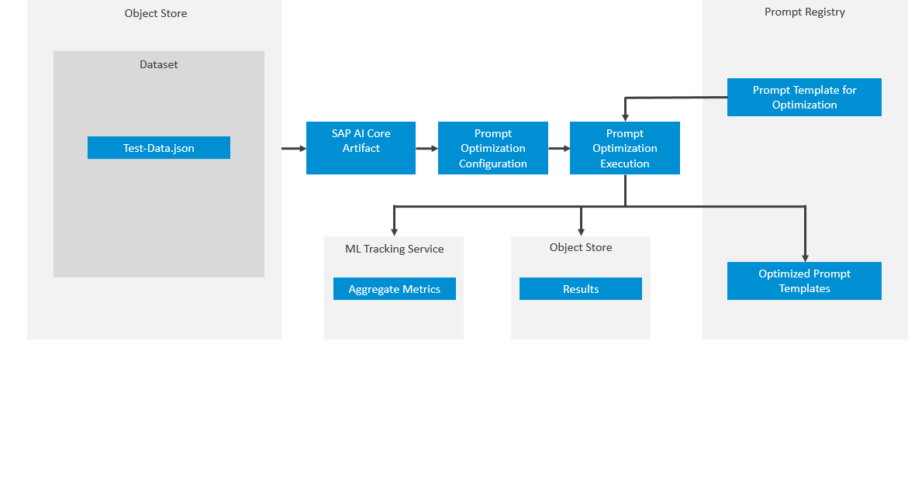

<!-- loiof5af0bdc021041e0a3fb69ede1b4a545 -->

# Prompt Optimization

Prompt Optimization utilizes an input prompt template from the prompt registry and a JSON dataset in the object store containing desirable responses. It optimizes the input prompt to maximize a specified metric, with metrics tracked in the ML Tracking Service. The resulting optimized prompt is saved back to the prompt registry, and additional result information is stored in the object store. This optimization process is model-specific to accommodate different model behaviors and is executed as a distinct run.

> ### Note:  
> Prompt optimization executions can take from minutes to multiple hours to run, and will submit a large number of prompt requests to the target models.

> ### Restriction:  
> Mistral and DeepSeek models are not supported for prompt optimization.

## Prompt Optimization Workflow

The workflow for prompt optimization is as follows:

1.  Register your object store secrets. You need one for output artifacts with the name `default`. If you want separate object stores for input and output artifacts, register another object store secret with a name of your choice. For more information, see [Register an Object Store for Optimizations](register-an-object-store-for-optimizations-54068a9.md).
2.  Prepare a prompt template. For more information, see [Template Preparation](template-preparation-4526dde.md).

3.  Prepare an optimization dataset. For more information, see [Dataset Preparation](dataset-preparation-b2625d7.md).

4.  Register your optimization dataset as a prompt optimization artifact. For more information, see [Register Optimization Artifacts](register-optimization-artifacts-b8a9cd8.md).

5.  Create a configuration for your prompt optimization. For more information, see [Create a Configuration for a Prompt Optimization](create-a-configuration-for-a-prompt-optimization-40ba168.md) 

    > ### Note:  
    > Optimization calls often require multiple repetitions to an LLM, with each repetition incurring costs. Additionally, some calls may involve extra internal processes, leading to actual costs that differ from those predicted by cost calculators.
    > 
    > For more information, see the [Cost Calculator](https://ai-core-calculator.cfapps.eu10.hana.ondemand.com/uimodule/index.html#/gen).

6.  Create an execution for your configuration. For more information, see [Create an Execution for your Prompt Optimization](create-an-execution-for-your-prompt-optimization-9ddbaab.md).

-   **[Create a Configuration for a Prompt Optimization](create-a-configuration-for-a-prompt-optimization-40ba168.md "Configuration for a prompt optimization defines the parameters, artifacts, and model settings that SAP AI Core uses to execute a prompt
		optimization.")**  
Configuration for a prompt optimization defines the parameters, artifacts, and model settings that SAP AI Core uses to execute a prompt optimization.
-   **[Create an Execution for your Prompt Optimization](create-an-execution-for-your-prompt-optimization-9ddbaab.md "")**  

