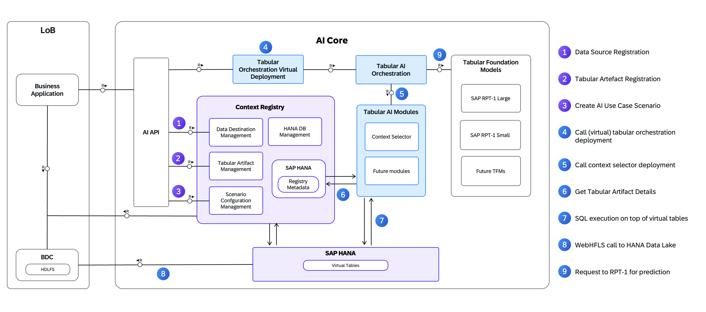

<!-- loio5b457e9f2d4544b5b062158c253a5353 -->

# Tabular AI

## Prerequisites

-   You have an SAP AI Core service instance and service key. For more information, see [SAP AI Core Initial Setup Documentation](https://help.sap.com/docs/AI_CORE/2d6c5984063c40a59eda62f4a9135bee/38c4599432d74c1d94e70f7c955a717d.html?locale=en-US&state=PRODUCTION&version=CLOUD).
-   You’re using the `extended` service plan. For more information, see [Service Plans](https://help.sap.com/viewer/2d6c5984063c40a59eda62f4a9135bee/CLOUD/en-US/c7244c6a7e3b4ffc928a2564c216e7c7.html "The SAP AI Core service plan you choose determines pricing, conditions of use, resources, available services, and hosts.") :arrow_upper_right: and [Update a Service Plan](https://help.sap.com/viewer/2d6c5984063c40a59eda62f4a9135bee/CLOUD/en-US/924f892e67b7443fbb4476b3e81959b2.html "Update your SAP AI Core service instance from the standard plan to the extended plan while keeping your data and models.") :arrow_upper_right:.
-   You've chosen the model that you want to make a deployment for. For more information, see [Choose a Model](choose-a-model-0ba2f0e.md).

## Introduction

Structured enterprise data, represented as rows and columns, underpins business processes across SAP systems. Tabular AI enables artificial intelligence capabilities directly on this structured data to generate predictions and insights.

While large language models focus on unstructured text, most enterprise business value resides in relational data. Tabular AI addresses this gap by operating specifically on tabular data sources.

SAP RPT-1 is a foundation model designed for tabular data. It uses in-context learning and does not require training on a specific dataset. You provide representative rows as context at inference time, and the model generates predictions immediately.

Tabular AI extends beyond the model itself. It provides the orchestration layer that integrates predictive models into enterprise business processes by managing context, metadata, and execution complexity.

## Core Principles

Tabular AI is built around the following core principles:

-   A unified interface for existing and future predictive models.

-   Integrated tooling that manages context selection automatically.

-   End-to-end workflow support across design time and runtime.

The Context Registry is a central component of this architecture. It manages data source connectivity, schema metadata, and scenario configuration. This abstraction ensures that application developers do not need to manage these details directly.

## Architecture Overview

The Tabular AI architecture separates design-time configuration from runtime execution. This separation supports scalability across multiple teams and use cases.

Design-time activities define how data is accessed, interpreted, and used for prediction. Runtime execution focuses on invoking predictions using the predefined configuration.

**Architecture Overview**

## Design-Time Configuration

During design time, you define the data source, tabular artifact, and scenario configuration. These elements remain unchanged during runtime prediction requests.

After design-time configuration is complete, the system is ready to serve predictions without further setup.

For more information, see [Design-Time Setup](design-time-setup-dbf9e8b.md).

## Runtime Execution

At runtime, an application invokes the Tabular AI orchestration layer to request a prediction. The system automatically retrieves relevant context, assembles the inference request, and routes it to the appropriate model.

The application interacts only with the invocation interface, while the platform manages all internal steps required to generate the prediction result.

To setup your tabular AI runtime, create a tabular AI deployment. For more information, see [Create a Tabular AI Deployment](create-a-tabular-ai-deployment-db2da6d.md).

After setup, you can consume tabular AI. For more information, see [Consume Tabular Orchestration](consume-tabular-orchestration-1cdac20.md).

-   **[Design-Time Setup](design-time-setup-dbf9e8b.md)**  

-   **[Runtime Setup](runtime-setup-4562e3d.md "")**  

