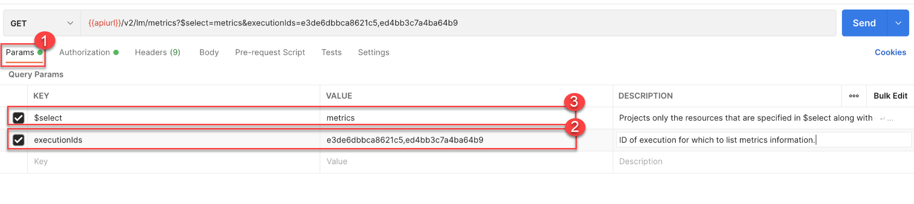
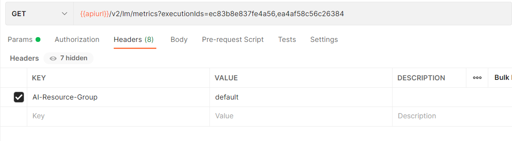
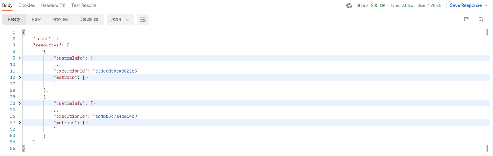
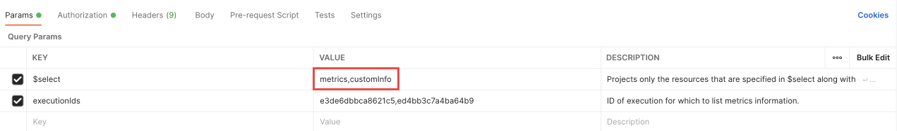
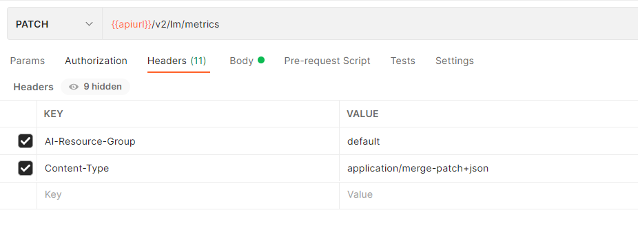
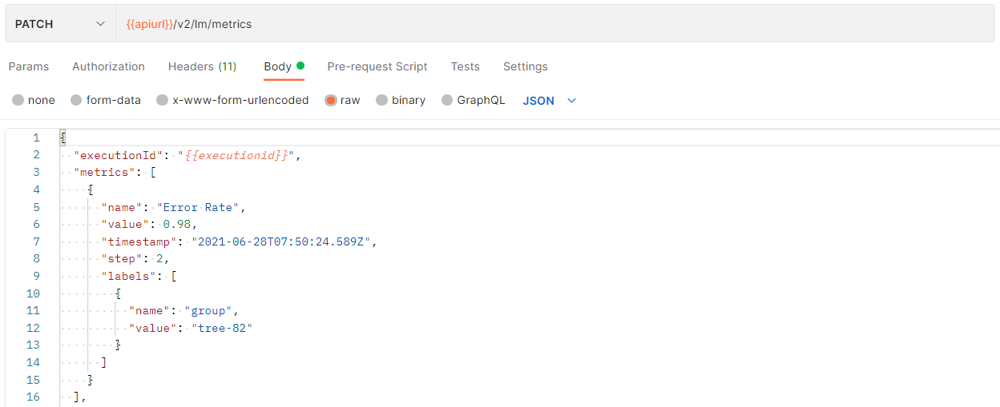

<!-- loio44d73d48d11b41f2be6092186041649b -->

# Get Metrics

The following demonstrates how you can manually track metrics information, and patch and delete metrics.


<a name="loio44d73d48d11b41f2be6092186041649b__section_ggm_5rc_vrb"/>

## Get Metrics Using Postman

1.  Prepare a GET request to the endpoint `{{apiurl}}/v2/lm/metrics` with the following query parameters and headers:

    **Query Parameters**


    <table>
    <tr>
    <th valign="top">

    Parameter
    
    </th>
    <th valign="top">

    Required
    
    </th>
    <th valign="top">

    Data Type
    
    </th>
    <th valign="top">

    Description
    
    </th>
    </tr>
    <tr>
    <td valign="top">
    
    `executionIds`
    
    </td>
    <td valign="top">
    
    Yes
    
    </td>
    <td valign="top">
    
    Array of String
    
    </td>
    <td valign="top">
    
    ID of execution for which to list metrics information.
    
    </td>
    </tr>
    <tr>
    <td valign="top">
    
    `$select`
    
    </td>
    <td valign="top">
    
    No
    
    </td>
    <td valign="top">
    
    Array of String
    
    </td>
    <td valign="top">
    
    Projects only the resources that are specified in the $select parameter, and executionId.

    The supported values of $select are `metrics`, `tags` and `customInfo` or any combination of these and `*`.

    If the value is `*`, all metric resource data is returned.
    
    </td>
    </tr>
    </table>
    
    **Header**


    <table>
    <tr>
    <th valign="top">

    Field
    
    </th>
    <th valign="top">

    Required
    
    </th>
    <th valign="top">

    Data Type
    
    </th>
    <th valign="top">

    Description
    
    </th>
    </tr>
    <tr>
    <td valign="top">
    
    `AI-Resource-Group`
    
    </td>
    <td valign="top">
    
    Yes
    
    </td>
    <td valign="top">
    
    String
    
    </td>
    <td valign="top">
    
    ID of the resource group that contains the execution.
    
    </td>
    </tr>
    </table>
    
2.  On the *Authorization* tab, set the type to *Bearer Token*.

3.  Set the token value to `{{token}}`.

    

4.  Set the query parameters in *Params*.

    

5.  Set the resource group *Header*.

    

6.  Send the request.

    You will receive the following response:

    **Response**


    <table>
    <tr>
    <th valign="top">

    JSON Field
    
    </th>
    <th valign="top">

    Description
    
    </th>
    </tr>
    <tr>
    <td valign="top">
    
    `customInfo`
    
    </td>
    <td valign="top">
    
    Array of dictionary. Each dictionary is a contains custom information in string.
    
    </td>
    </tr>
    <tr>
    <td valign="top">
    
    `executionId`
    
    </td>
    <td valign="top">
    
    ID of the execution, which the metrics belong to.
    
    </td>
    </tr>
    <tr>
    <td valign="top">
    
    `metrics`
    
    </td>
    <td valign="top">
    
    Array of dictionary of metric.
    
    </td>
    </tr>
    <tr>
    <td valign="top">
    
    `tags`
    
    </td>
    <td valign="top">
    
     
    
    </td>
    </tr>
    </table>
    
    


> ### Note:  
> It is possible to use more than one metric in the $select parameter by separating valid entries with a comma.




<a name="loio44d73d48d11b41f2be6092186041649b__section_emg_vrc_vrb"/>

## Get Metrics Using curl

```

curl --location -g --request GET '$AI_API_URL/v2/lm/metrics?$select=metrics,tags,customInfo&executionIds=e3de6dbbca8621c5,ed4bb3c7a4ba64b9'
--header 'AI-Resource-Group: default' \
--header 'Authorization: Bearer $TOKEN'
```

> ### Note:  
> It is possible to use any one of the allowed values or combination of the allowed values \(metrics, tags,customInfo\) or \* in the $select parameter.

> ### Output Code:  
> ```json
> 
> {
> 	"count": 2,
> 	"resources": [
> 		{
> 		"customInfo": [
> 			{
> 				"name": "confusion matrix",
> 				"value": "[{'Predicted': 'False', 'Actual': 'False','value': 34},{'Predicted': 'False','Actual': 'True', 'value': 124}, {'Predicted': 'True','Actual': 'False','value': 165},{ 'Predicted': 'True','Actual': 'True','value': 36}]"
> 			}
> 		],
> 		"executionId": "ec83b8e837fe4a56",
> 		"metrics": [
> 			{
> 			"labels": [
> 				{
> 					"name": "m11",
> 					"value": "alpha"
> 				},
> 				{
> 					"name": "metrics.ai.sap.com/Artifact.name",
> 					"value": "text-model-tutorial"
> 				}
> 			],
> 			"name": "Error Rate",
> 			"step": 2,
> 			"timestamp": "2020-09-29T11:40:10.330000Z",
> 			"value": 0.98
> 			}
> 		],
> 		"tags": [
> 			{
> 				"name": "text-model-tutorial",
> 				"value": "beta-3"
> 			}
> 		]
> 	},
> 	{
> 	"customInfo": [
> 		{
> 		"name": "confusion matrix",
> 		"value": " precision recall f1-score support\n\n 0 0.85 0.97 0.91 273\n 1 0.96 0.79 0.87 227\n\n accuracy 0.89 500\n macro avg 0.90 0.88 0.89 500\nweighted avg 0.90 0.89 0.89 500\n"
> 		}
> 	],
> 	"executionId": "ea4af58c56c26384",
> 	"metrics": [
> 		{
> 		"labels": [
> 				{
> 				"name": "train",
> 				"value": "range 0-400"
> 				}
> 			],
> 			"name": "Accuracy",
> 			"step": 1,
> 			"timestamp": "2021-12-03T06:23:57.945336Z",
> 			"value": 0.9675
> 		},
> 		{
> 			"labels": [
> 				{
> 					"name": "train",
> 					"value": "range 400-800"
> 				}
> 			],
> 			"name": "Accuracy",
> 			"step": 2,
> 			"timestamp": "2021-12-03T06:23:58.089152Z",
> 			"value": 0.94
> 		},
> 		{
> 			"labels": [
> 				{
> 					"name": "train",
> 					"value": "range 800-1200"
> 				}
> 			],
> 			"name": "Accuracy",
> 			"step": 3,
> 			"timestamp": "2021-12-03T06:23:58.195216Z",
> 			"value": 0.9625
> 		},
> 		{
> 			"labels": [
> 				{
> 					"name": "train",
> 					"value": "range 1200-1600"
> 				}
> 			],
> 			"name": "Accuracy",
> 			"step": 4,
> 			"timestamp": "2021-12-03T06:23:58.306945Z",
> 			"value": 0.9425
> 		},
> 		{
> 			"labels": [
> 				{
> 					"name": "train",
> 					"value": "range 1600-2000"
> 				}
> 			],
> 			"name": "Accuracy",
> 			"step": 5,
> 			"timestamp": "2021-12-03T06:23:58.421745Z",
> 			"value": 0.945
> 		},
> 		{
> 			"labels": [
> 				{
> 					"name": "metrics.ai.sap.com/Artifact.name",
> 					"value": "text-model-tutorial"
> 				}
> 			],
> 			"name": "Error Rate",
> 			"step": 0,
> 			"timestamp": "2021-12-03T06:23:58.569476Z",
> 			"value": 0.10999999999999999
> 		},
> 		{
> 			"labels": [],
> 			"name": "n_compiments",
> 			"step": 0,
> 			"timestamp": "2021-12-03T06:23:57.576040Z",
> 			"value": 1173.0
> 		},
> 		{
> 			"labels": [],
> 			"name": "n_complaints",
> 			"step": 0,
> 			"timestamp": "2021-12-03T06:23:57.575618Z",
> 			"value": 1327.0
> 		},
> 		{
> 			"labels": [],
> 			"name": "n_samples",
> 			"step": 0,
> 			"timestamp": "2021-12-03T06:23:57.574852Z",
> 			"value": 2500.0
> 		},
> 		{
> 			"labels": [
> 				{
> 					"name": "train",
> 					"value": "80%"
> 				},
> 				{
> 					"name": "step",
> 					"value": "preprocessing"
> 				}
> 			],
> 			"name": "split_samples",
> 			"step": 0,
> 			"timestamp": "2021-12-03T06:23:57.757594Z",
> 			"value": 2000.0
> 		},
> 		{
> 			"labels": [
> 				{
> 					"name": "validation",
> 					"value": "20%"
> 				},
> 				{
> 					"name": "step",
> 					"value": "preprocessing"
> 				}
> 			],
> 			"name": "split_samples",
> 			"step": 0,
> 			"timestamp": "2021-12-03T06:23:57.757608Z",
> 			"value": 500.0
> 			}
> 		],
> 		"tags": [
> 			{
> 				"name": "Reading Model",
> 				"value": "OK"
> 			},
> 			{
> 					"name": "Test Inference",
> 					"value": "checked"
> 				}
> 			]
> 		}
> 	]
> }
> 
> ```

```
curl --location -g --request GET '$AI_API_URL/v2/lm/metrics?$select=tags,customInfo&executionIds=e3de6dbbca8621c5,ed4bb3c7a4ba64b9'
--header 'AI-Resource-Group: default' \
--header 'Authorization: Bearer $TOKEN'
```

> ### Output Code:  
> ```json
> 
> {
> 	"count": 2,
> 	"resources": [
> 	{
> 		"customInfo": [
> 			{
> 				"name": "confusion matrix",
> 				"value": "[{'Predicted': 'False', 'Actual': 'False','value': 34},{'Predicted': 'False','Actual': 'True', 'value': 124}, {'Predicted': 'True','Actual': 'False','value': 165},{ 'Predicted': 'True','Actual': 'True','value': 36}]"
> 			}
> 		],
> 		"executionId": "ec83b8e837fe4a56",
> 		"tags": [
> 			{
> 				"name": "text-model-tutorial",
> 				"value": "beta-3"
> 			}
> 		]
> 	},
> 	{
> 	  "customInfo": [
> 	  	{
> 	          "name": "confusion matrix",
> 		  "value": " precision recall f1-score support\n\n 0 0.85 0.97 0.91 273\n 1 0.96 0.79 0.87 227\n\n accuracy 0.89 500\n macro avg 0.90 0.88 0.89 500\nweighted avg 0.90 0.89 0.89 500\n"
> 		}
> 	  ],
> 	  "executionId": "ea4af58c56c26384",
> 	  "tags": [
> 	        {
> 		 "name": "Reading Model",
> 		 "value": "OK"
> 		},
> 		{
> 		  "name": "Test Inference",
> 		  "value": "checked"
> 	        }
> 	  ]
> 	}
>         ]
> }
> 
> ```


<a name="loio44d73d48d11b41f2be6092186041649b__section_kgy_r52_vrb"/>

## Patch Metrics Using Postman

1.  Prepare a PATCH request to the endpoint `{{apiurl}}/v2/lm/metrics` with the following headers:

    **Header**


    <table>
    <tr>
    <th valign="top">

    Field
    
    </th>
    <th valign="top">

    Required
    
    </th>
    <th valign="top">

    Data Type
    
    </th>
    <th valign="top">

    Description
    
    </th>
    </tr>
    <tr>
    <td valign="top">
    
    `AI-Resource-Group`
    
    </td>
    <td valign="top">
    
    Yes
    
    </td>
    <td valign="top">
    
    String
    
    </td>
    <td valign="top">
    
    ID of the resource group that contains the execution.
    
    </td>
    </tr>
    <tr>
    <td valign="top">
    
    `Content-Type`
    
    </td>
    <td valign="top">
    
    Yes
    
    </td>
    <td valign="top">
    
    value = `application/merge-patch+json`
    
    </td>
    <td valign="top">
    
     
    
    </td>
    </tr>
    </table>
    
2.  On the *Authorization* tab, set the type to *Bearer Token*.

3.  Set the token value to `{{token}}`.

    

4.  Set the *Header*.

    

5.  Add the *Body*.

    > ### Sample Code:  
    > ```json
    > 
    > {
    >   "executionId": "{{executionid}}",
    >   "metrics": [
    >   {
    >     "name": "Error Rate",
    >     "value": 0.98,
    >     "timestamp": "2021-06-28T07:50:24.589Z",
    >     "step": 2,
    >     "labels": [
    >       {
    >         "name": "group",
    >         "value": "tree-82"
    >       }
    >     ]
    >   }
    >   ],
    >   "tags": [
    >     {
    >       "name": "Artifact Group",
    >       "value": "RFC-1"
    >     }
    >   ],
    >   "customInfo": [
    >     {
    >       "name": "Confusion Matrix",
    >       "value": "[{'Predicted': 'False', 'Actual': 'False','value': 34},{'Predicted': 'False','Actual': 'True', 'value': 124}, {'Predicted': 'True','Actual': 'False','value': 165},{ 'Predicted': 'True','Actual': 'True','value': 36}]"
    >     }
    >   ]
    > }
    > ```

    

6.  Send the request.

    As the response, you will receive a 204 \(no content\) response.


<a name="loio44d73d48d11b41f2be6092186041649b__section_drp_vrc_vrb"/>

## Patch Metrics Using curl

```

curl --location --request GET '$AI_API_URL/v2/lm/metrics?executionId=e1c49497ccf6dde8' \
--header 'AI-Resource-Group: default' \
--header 'Authorization: Bearer $TOKEN'
\
--data-raw '{
"executionId": "e1c49497ccf6dde8",
"metrics": [
{
"name": "Error Rate",
"value": 0.98,
"timestamp": "2021-06-28T07:50:24.589Z",
"step": 2,
"labels": [
{
"name": "group",
"value": "tree-82"
}
]
}
],
"tags": [
{
"name": "Artifact Group",
"value": "RFC-1"
}
],
"customInfo": [
{
"name": "Confusion Matrix",
"value": "[{'\''Predicted'\'': '\''False'\'', '\''Actual'\'': '\''False'\'','\''value'\'': 34},{'\''Predicted'\'': '\''False'\'','\''Actual'\'': '\''True'\'', '\''value'\'': 124}, {'\''Predicted'\'': '\''True'\'','\''Actual'\'': '\''False'\'','\''value'\'': 165},{ '\''Predicted'\'': '\''True'\'','\''Actual'\'': '\''True'\'','\''value'\'': 36}]"
}
]
}'
```

