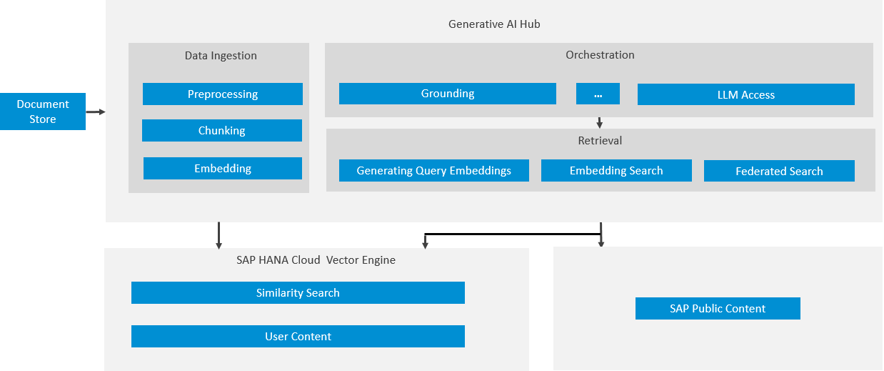

<!-- loio454c5582ca434884bbdaf53480f6e993 -->

# Grounding

Grounding integrates external, contextually relevant, domain-specific, or real-time data into AI processes. This data enhances the natural language processing capabilities of pretrained models, which are trained on general material.

Grounding is a service designed to handle data-related tasks, such as grounding and retrieval, using vector databases. It provides specialized data retrieval through these databases, grounding the retrieval process with your own external and context-relevant data. Grounding combines generative AI capabilities with the ability to use real-time, precise data to improve decision-making and business operations for specific AI-driven business solutions.

Grounding converts user provided documents into vector reprentations which are stored as a database. The indexing pipeline preprocesses unstructured and semi structured data into chunks and embeddings. For more information, see [Pipeline API](pipeline-api-a9badce.md) and [Vector API](vector-api-0358c5c.md).

The retrieval pipeline takes incoming user queries and converts them into vector representations. The query vectors are used to search the database and retrieva relevant information. For more information, see [Retrieval API](retrieval-api-a27f4ad.md).

The Pipeline API is compatible with the following data repositories:

<table>
<tr>
<th valign="top">

Document Repository

</th>
<th valign="top">

Document \(File\) Format

</th>
<th valign="top">

Content Refresh

</th>
<th valign="top">

Document Content

</th>
<th valign="top">

Maximum Number of Documents

</th>
</tr>
<tr>
<td valign="top">

Microsoft SharePoint

</td>
<td valign="top">

PDF, DOCX

</td>
<td valign="top">

Daily

</td>
<td valign="top">

Plain Text

</td>
<td valign="top">

Maximum of 2000 Documents

</td>
</tr>
<tr>
<td valign="top">

AWS S3

</td>
<td valign="top">

PDF, DOCX

</td>
<td valign="top">

Daily

</td>
<td valign="top">

Plain Text

</td>
<td valign="top">

Maximum of 2000 Documents

</td>
</tr>
<tr>
<td valign="top">

SFTP

</td>
<td valign="top">

PDF, DOCX

</td>
<td valign="top">

Daily

</td>
<td valign="top">

Plain Text

</td>
<td valign="top">

Maximum of 2000 Documents

</td>
</tr>
</table>

The grounding architecture in generative AI hub is as follows:

<a name="loio454c5582ca434884bbdaf53480f6e993__section_jqm_flh_12c"/>

## Prerequisites

To use the *Grounding* module in the orchestration pipeline, you need to prepare the knowledge base in advance.

Generative AI hub offers multiple options for users to provide data \(prepare knowledge base\):

-   For Option 1: Upload the documents to a supported data repository and run the data pipeline to vectorize the documents. For more information, see [Pipeline API](pipeline-api-a9badce.md).
-   For Option 2: Provide the chunks of document via Vector API directly. Provide the chunks of document via Vector API directly. For more information, see [Vector API](vector-api-0358c5c.md).

To use grounding, choose from one of the following options.

<a name="loio454c5582ca434884bbdaf53480f6e993__section_m5z_hlh_12c"/>

## Option 1: Upload the documents to the supported data repository and run Data Pipeline

In this case, the pipeline collects documents and segments the data into chunks. It generates embeddings, which are multidimensional representations of textual information, and stores them efficiently in a vector database.

The process for providing unstructured documents with the Pipeline API looks like this:

### Perform Initial One-Time Administrative Steps

Before you can prepare your data for the Pipeline API, you must create a resource group and a generic secret for grounding. For more information, see:

-   [Create a Resource Group for Grounding](create-a-resource-group-for-grounding-6712bfe.md)
-   [Grounding Generic Secrets for Microsoft SharePoint](grounding-generic-secrets-for-microsoft-sharepoint-bdea357.md)

### Prepare Vector Knowledge Base

You configure the Pipeline API to read unstructured data from data repositories and store it in a vector database. Use the Pipeline API to:

1.  Read unstructured documents from various data repositories. Segment the data into chunks and generate embeddings.
2.  Store the multidimensional representations of the textual information in the vector database.
3.  Provide a repository ID to access the data.

For more information, see [Preparing Data Using the Pipeline API](preparing-data-using-the-pipeline-api-9c972e2.md).

### Configure Grounding Module in the Orchestration

In the orchestration pipeline, you add configuration for the grounding requests:

1.  Create a grounding request configuration in the orchestration pipeline using the repository IDs and filters.
2.  Run the orchestration pipeline and check that the response refers to the user data.

For more information, see [Using the Grounding Module](using-the-grounding-module-4b6d4a8.md).

<a name="loio454c5582ca434884bbdaf53480f6e993__section_gzf_jlh_12c"/>

## Option 2: Provide the chunks of document via Vector API directly

In this case, you provide chunks of data directly and store them using the Vector API.

The process for providing chunks of data with the Vector API looks like this:

### 

Hover over each action for a description. Click the action for more information.

### Perform Initial One-Time Administrative Steps

Before you can prepare your data for the Vector API, you must create a resource group. For more information, see [Create a Resource Group for Grounding](create-a-resource-group-for-grounding-6712bfe.md).

> ### Note:  
> When working with the Vector API, you do not need to create a generic secret for grounding.

### Prepare Vector Knowledge Base

You provide chunks of information directly and store data in the vector database using the Vector API. Use the Vector API to:

1.  Create collections.
2.  Create documents by directly using the chunks of data provided by users.
3.  Store data in the vector database.
4.  Assign repository IDs to access the data.

For more information, see [Preparing Data Using the Vector API](preparing-data-using-the-vector-api-221b03f.md).

### Configure Grounding Module in the Orchestration

In the orchestration pipeline, you add configuration for the grounding requests:

1.  Create a grounding request configuration in the orchestration pipeline using the repository IDs and filters.
2.  Run the orchestration pipeline and check that the response refers to the user data.

For more information, see [Using the Grounding Module](using-the-grounding-module-4b6d4a8.md).

<a name="loio454c5582ca434884bbdaf53480f6e993__section_wby_jrw_c2c"/>

## Next Steps

Use the retrieval API to search your data repositories.

For more information, see [Retrieval API](retrieval-api-a27f4ad.md).

-   **[Using the Grounding Module](using-the-grounding-module-4b6d4a8.md "")**  

