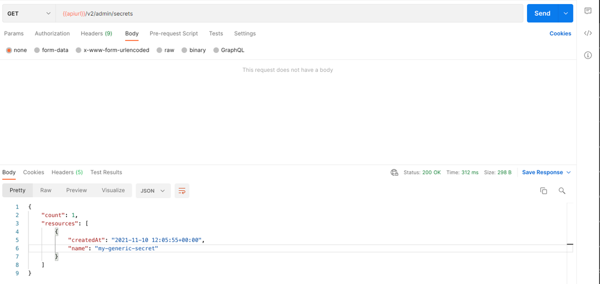

<!-- loio05a3713aa6a94356b08e09e86260b16d -->

# List All Generic Secrets


<a name="loio05a3713aa6a94356b08e09e86260b16d__section_vtj_nwk_4rb"/>

## Using Postman

1.  Send a GET request to the endpoint `{{apiurl}}/v2/admin/secrets`.
2.  As the request body, select the *none* radiobutton.
3.  Specify the scope of the request via the header `AI-Tenant-Scope` or `AI-Resource-Group`:
    -   `AI-Tenant-Scope` : `true`. The operation will be performed at the main tenant level.
    -   `AI-Resource-Group` : <code><i class="varname">&lt;resource-group-name&gt;</i></code>. The operation will be performed at the resource-group level.

4.  Send the request.




<a name="loio05a3713aa6a94356b08e09e86260b16d__section_mkn_wwk_4rb"/>

## Using curl

Submit a GET request to the endpoint `/v2/admin/secrets`, and include he resource-group scope:

-   `AI-Tenant-Scope` : `true`. The operation will be performed at the main tenant level.
-   `AI-Resource-Group` : <code><i class="varname">&lt;resource-group-name&gt;</i></code>. The operation will be performed at the resource-group level.

```
curl --location --request GET "$AI_API_URL/v2/admin/secrets" \
--header "Authorization: Bearer $TOKEN" \
--header 'AI-Resource-Group: default'

```


The response includes a list of generic secrets, their name, and their creation timestamp. No sensitive information is revealed in the response.

