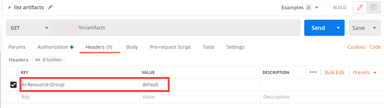

<!-- loio1d613e0d1518435fb07b32a70c35345d -->

# List Artifacts

Retrieve a list of existing artifacts.


<a name="loio1d613e0d1518435fb07b32a70c35345d__section_wwg_g4s_vnb"/>

## Using Postman

1.  Create a new GET request and enter the URL `{{apiurl}}/v2/lm/artifacts`

2.  On the *Authorization* tab, set the type to *Bearer Token*.

3.  Set the token value to ***\{\{token\}\}***.

      

4.  On the *Header* tab, add the following entry:


    <table>
    <tr>
    <th valign="top">

    Key


    
    </th>
    <th valign="top">

    Value


    
    </th>
    </tr>
    <tr>
    <td valign="top">

     `ai-resource-group` 


    
    </td>
    <td valign="top">

     *<Name of your resourceGroup\>* \(in the example, `default` is used\)


    
    </td>
    </tr>
    </table>
    
      

5.  Send the request.


<a name="loio1d613e0d1518435fb07b32a70c35345d__section_wwg_g4s_anb"/>

## Using curl

```
curl --request GET "[/pandoc/div/div/horizontalrule/codeblock/span/code
     {"filepath"}) $AI_API_URL/v2/lm/artifacts (code]" --header "Authorization: Bearer $TOKEN" --header "ai-resource-group: $RESOURCE_GROUP"
```

> ### Output Code:  
> ```json
> {
>    "count":3,
>    "resources":[
>       {
>          "createdAt":"2021-02-09T08:08:12Z",
>          "description":"",
>          "executionId":"d44edae36c187cf6",
>          "id":"3088b75f-5448-4c19-8055-392668a043ec",
>          "kind":"model",
>          "modifiedAt":"2021-02-09T08:08:12Z",
>          "name":"pytf-model",
>          "scenarioId":"ae0bd260-41ef-4162-81b0-861bd78a8516",
>          "url":"ai://default/d44edae36c187cf6/pytf-model"
>       },
>       {k
>          "createdAt":"2021-02-09T07:56:37Z",
>          "description":"",
>          "executionId":"d44edae36c187cf6",
>          "id":"38f7a46b-454d-4543-9457-b1eede5036f8",
>          "kind":"model",
>          "modifiedAt":"2021-02-09T07:56:37Z",
>          "name":"churn-pickle",
>          "scenarioId":"ae0bd260-41ef-4162-81b0-861bd78a8516",
>          "url":"ai://default/d44edae36c187cf6/churn-pickle"
>       },
>       {
>          "createdAt":"2021-02-07T16:07:16Z",
>          "description":"Churn and Text Classifier Dataset",
>          "id":"b45265f2-9bc3-441a-a0e1-fac1438acb79",
>          "kind":"dataset",
>          "modifiedAt":"2021-02-07T16:07:16Z",
>          "name":"pytf",
>          "scenarioId":"84fe6957-1145-4183-b682-8f11ca56d060",
>          "url":"ai://default/pytf/"
>       }
>    ]
> }
> ```

**Parent topic:** [Manage Artifacts](manage-artifacts-386ba71.md "An artifact is a reference to data or a file that is produced or consumed by an execution or deployment. They are managed through SAP AI Core and your connected object store.")

**Related Information**  


[Create Artifacts](create-artifacts-66413f1.md "Create an artifact to connect a dataset or model, to make it available for use in SAP AI Core.")

