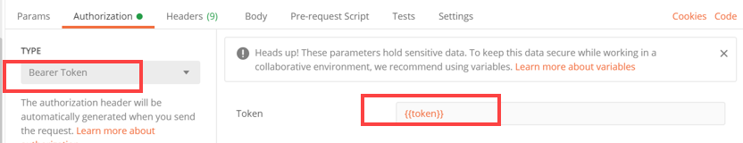
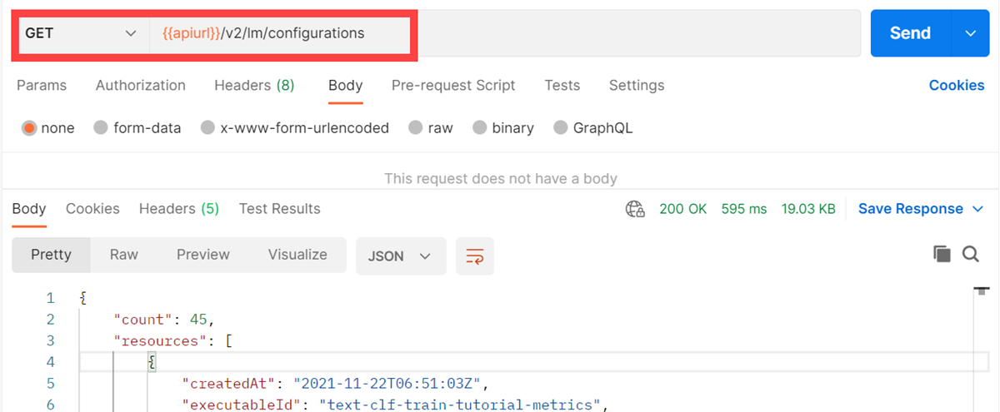

<!-- loio8074b2a206cb41a2a68ba149a2150ea1 -->

# List Configurations


<a name="loio8074b2a206cb41a2a68ba149a2150ea1__section_a2q_fps_vnb"/>

## Using Postman

1.  Send a GET request to the endpoint `{{apiurl}}/v2/lm/configurations`

2.  On the *Authorization* tab, set the type to *Bearer Token*.

3.  Set the token value to `{{token}}`.

    

4.  On the *Header* tab, add the following entry:


    <table>
    <tr>
    <th valign="top">

    KEY
    
    </th>
    <th valign="top">

    VALUE
    
    </th>
    </tr>
    <tr>
    <td valign="top">
    
    `ai-resource-group` 
    
    </td>
    <td valign="top">
    
    *<Name of your resourceGroup\>* \(in the example, `default` is used\)
    
    </td>
    </tr>
    </table>
    
5.  Send the request.

    


<a name="loio8074b2a206cb41a2a68ba149a2150ea1__section_a2q_fps_ppp"/>

## Using curl

```
curl --request GET "$AI_API_URL/v2/lm/configurations" --header "Authorization: Bearer $TOKEN" --header "ai-resource-group: $RESOURCE_GROUP"
```

> ### Output Code:  
> ```json
> {
>    "count":2,
>    "resources":[
>       {
>          "createdAt":"2021-02-04T11:50:45Z",
>          "executableId":"pytf-training",
>          "id":"1e6c2a5f-eabe-49a2-88e7-887145a2ef88",
>          "inputArtifactBindings":[
>             {
>                "artifactId":"521f7f17-876e-4369-9162-09748b56d27a",
>                "key":"churn-data"
>             },
>             {
>                "artifactId":"521f7f17-876e-4369-9162-09748b56d27a",
>                "key":"textclass-data"
>             }
>          ],
>          "name":"pytf-demo-config1",
>          "parameterBindings":[
>             {
>                "key":"train-epoch",
>                "value":"100"
>             }
>          ],
>          "scenarioId":"84fe6957-1145-4183-b682-8f11ca56d060"
>       },
>       {
>          "createdAt":"2021-02-04T11:59:22Z",
>          "executableId":"pytf-training",
>          "id":"42147d0d-5e3a-424d-a3a1-545b842379c5",
>          "inputArtifactBindings":[
>             {
>                "artifactId":"521f7f17-876e-4369-9162-09748b56d27a",
>                "key":"churn-data"
>             },
>             {
>                "artifactId":"521f7f17-876e-4369-9162-09748b56d27a",
>                "key":"textclass-data"
>             }
>          ],
>          "name":"pytf-demo-config2",
>          "parameterBindings":[
>             {
>                "key":"train-epoch",
>                "value":"1"
>             }
>          ],
>          "scenarioId":"84fe6957-1145-4183-b682-8f11ca56d060"
>       }
>    ]
> }
> ```

**Parent topic:**[Train Your Model](train-your-model-a9ceb06.md "You execute a training workflow to train your AI learning model.")

**Related Information**  


[Choose a Resource Plan](choose-a-resource-plan-57f4f19.md "You can configure SAP AI Core to use different infrastructure resources for different tasks, based on demand. SAP AI Core provides several preconfigured infrastructure bundles called “resource plans” for this purpose.")

[Workflow Templates](workflow-templates-83523ab.md "Here, you'll find a basic workflow example template. Feel free to adjust it to suit your workflow needs.")

[List Scenarios](list-scenarios-deedde5.md "")

[List Executables](list-executables-80895a4.md "")

[Create Configurations](create-configurations-884ae34.md "")

[Using Artifact Signatures](using-artifact-signatures-2f02a1d.md "Artifact signatures in the form of a hash can be added to output artifacts from executions.")

[Start Training](start-training-54b44e4.md "")

[Stop Training Instances](stop-training-instances-3d85344.md "")

[Delete Training Instances](delete-training-instances-612ce17.md "")

[Efficiency Features](efficiency-features-4cb76f7.md "Discover features of the SAP AI Core runtime that improve efficiency and help manage resource consumption.")

[Retrieve Execution Logs](retrieve-execution-logs-fbc55d3.md "accessed in the deployment and execution logs.")

[Training Schedules](training-schedules-2b702f8.md "")

