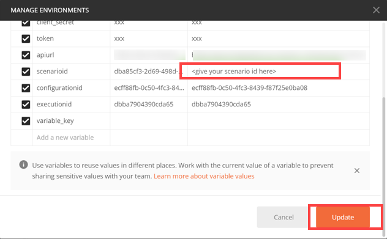
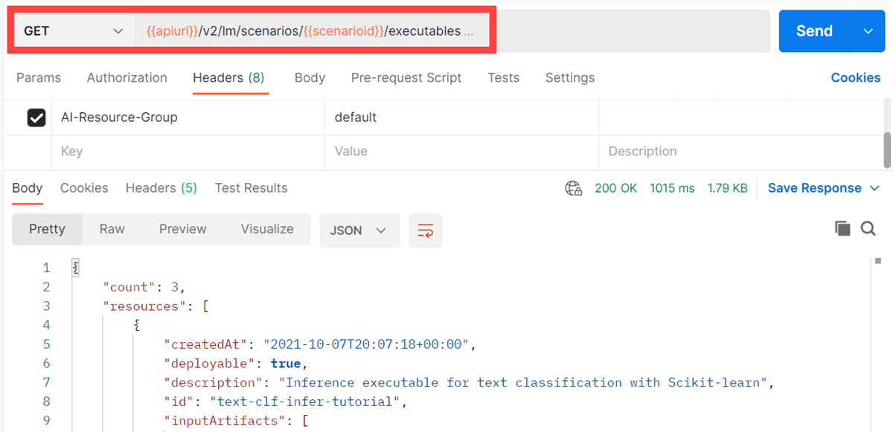
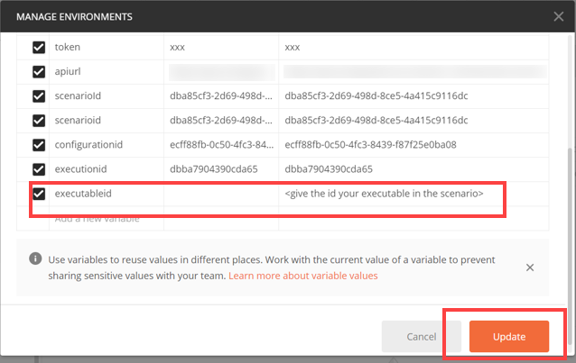

<!-- loio6af8e60ffeea4ff2b047279d3165a31a -->

# List Executables

An executable is a template that is instantiated for a purpose, such as training a model or creating a deployment. You can list all of the executables in a resource group and get details of specific executables from a resource group. Serving templates are mapped to deployment executables.


<a name="loio6af8e60ffeea4ff2b047279d3165a31a__section_apf_kx5_tvb"/>

## List Executables with Postman

1.  Define your scenario ID as the `scenarioid` environment variable.

    

2.  Send a GET request to the endpoint `{{apiurl}}/v2/lm/scenarios/{{scenarioid}}/executables`

3.  On the *Authorization* tab, set the type to *Bearer Token*.

4.  Set the token value to `{{token}}`.

    

5.  On the *Header* tab, add the following entry:


    <table>
    <tr>
    <th valign="top">

    Key
    
    </th>
    <th valign="top">

    Value
    
    </th>
    </tr>
    <tr>
    <td valign="top">
    
    `ai-resource-group` 
    
    </td>
    <td valign="top">
    
    *<Name of your resourceGroup\>*`default` is used\)
    
    </td>
    </tr>
    </table>
    
6.  Send the request.

    


> ### Note:  
> The *<modifiedAt\>* field denotes the timestamp of the latest successful sync. The output ***1970-01-01T00:00:00+00:00*** indicates an error.


<a name="loio6af8e60ffeea4ff2b047279d3165a31a__section_wt3_sx5_tvb"/>

## List Executables with curl

```
curl --request GET "$AI_API_URL/v2/lm/scenarios" --header "Authorization: Bearer $TOKEN" --header "ai-resource-group: $RESOURCE_GROUP"
```

> ### Output Code:  
> ```json
> {
>    "count":4,
>    "resources":[
>       {
>          "createdAt":"2021-02-04T13:11:01+00:00",
>          "deployable":true,
>          "description":"churn n text class serving executable desc",
>          "id":"pytf-serving",
>          "inputArtifacts":[
>             {
>                "name":"model_uri"
>             }
>          ],
>          "labels":[
>             
>          ],
>          "modifiedAt":"2021-02-04T13:11:01+00:00",
>          "name":"churntextclassexecname",
>          "parameters":[
>             {
>                "name":"modelName",
>                "type":"string",
>                 "default": "value",
>                 "description": "description of the parameter"
>             }
>          ],
>          "scenarioId":"ae0bd260-41ef-4162-81b0-861bd78a8516",
>          "versionId":"0.0.1"
>       },
>       {
>          "createdAt":"2021-02-09T07:35:02+00:00",
>          "deployable":true,
>          "description":"churn n text class serving executable desc",
>          "id":"pytf-serving-tracking",
>          "inputArtifacts":[
>             {
>                "name":"textmodel",
>                "kind": "model",
>                "description": "artifact description",
>                "labels": [
>                   {
>                     "key": "ext.ai.sap.com/customkey1",
>                     "value": "customvalue1"
>                   },
>                   {
>                    "key": "ext.ai.sap.com/customkey2",
>                    "value": "customvalue2"
>                  }
>                ]
>             }
>          ],
>          "labels":[
>             
>          ],
>          "modifiedAt":"2021-02-09T07:35:02+00:00",
>          "name":"churntextclassexecname",
>          "parameters":[
>             {
>                "name":"modelName",
>                "type":"string"
>             }
>          ],
>          "scenarioId":"ae0bd260-41ef-4162-81b0-861bd78a8516",
>          "versionId":"0.0.1"
>       },
>       {
>          "createdAt":"2021-02-09T07:35:03+00:00",
>          "deployable":false,
>          "description":"churn and text class executable desc",
>          "id":"pytf-training-tracking",
>          "inputArtifacts":[
>             {
>                "name":"churn-data"
>             },
>             {
>                "name":"textclass-data"
>             }
>          ],
>          "labels":[
>             
>          ],
>          "modifiedAt":"2021-02-09T07:35:03+00:00",
>          "name":"churnntextclassexecutablename",
>          "outputArtifacts":[
>             {
>                "name":"churn-pickle",
>                "kind": "model",
>                "description": "artifact description",
>                "labels": [
>                  {
>                    "key": "ext.ai.sap.com/customkey1",
>                    "value": "customvalue1"
>                  },
>                  {
>                   "key": "ext.ai.sap.com/customkey2",
>                   "value": "customvalue2"
>                 }
>               ]
>             },
>             {
>                "name":"pytf-model"
>             }
>          ],
>          "parameters":[
>             {
>                "name":"train-epoch",
>                "type":"string"
>             }
>          ],
>          "scenarioId":"ae0bd260-41ef-4162-81b0-861bd78a8516",
>          "versionId":"0.0.1"
>       },
>       {
>          "createdAt":"2021-02-04T14:11:02+00:00",
>          "deployable":false,
>          "description":"churn and text class executable desc",
>          "id":"test-training",
>          "inputArtifacts":[
>             {
>                "name":"churn-data"
>             },
>             {
>                "name":"textclass-data"
>             }
>          ],
>          "labels":[
>             
>          ],
>          "modifiedAt":"2021-02-04T14:11:02+00:00",
>          "name":"churnntextclassexecutablename",
>          "outputArtifacts":[
>             {
>                "name":"churn-pickle"
>             },
>             {
>                "name":"pytf-model"
>             }
>          ],
>          "parameters":[
>             {
>                "name":"train-epoch",
>                "type":"string"
>             }
>          ],
>          "scenarioId":"ae0bd260-41ef-4162-81b0-861bd78a8516",
>          "versionId":"0.0.1"
>       }
>    ]
> }
> ```

> ### Note:  
> The *<modifiedAt\>* field denotes the timestamp of the latest successful sync. The output ***1970-01-01T00:00:00+00:00*** indicates an error.


<a name="loio6af8e60ffeea4ff2b047279d3165a31a__section_rxr_lz5_tvb"/>

## Get Executable Details with Postman

1.  Add the environment variable `executableid` and as its value, enter the ID of the executable.

    

2.  Send a GET request to the endpoint `{{apiurl}}/v2/lm/scenarios/{{scenarioid}}/executables/{{executableid}}`

3.  On the *Authorization* tab, set the type to *Bearer Token*.

4.  Set the token value to `{{token}}`.

    

5.  On the *Header* tab, add the following entry:


    <table>
    <tr>
    <th valign="top">

    Key
    
    </th>
    <th valign="top">

    Value
    
    </th>
    </tr>
    <tr>
    <td valign="top">
    
    `ai-resource-group` 
    
    </td>
    <td valign="top">
    
    *<Name of your resourceGroup\>* \(in the example, `default` is used\)
    
    </td>
    </tr>
    </table>
    
6.  Send the request.


> ### Note:  
> The *<modifiedAt\>* field denotes the timestamp of the latest successful sync. The output ***1970-01-01T00:00:00+00:00*** indicates an error.


<a name="loio6af8e60ffeea4ff2b047279d3165a31a__section_lzw_mz5_tvb"/>

## Get Executable Details with curl

```
curl --request GET "$AI_API_URL/v2/lm/scenarios" --header "Authorization: Bearer $TOKEN" --header "ai-resource-group: $RESOURCE_GROUP" 
```

> ### Output Code:  
> ```json
> {
>    "createdAt":"2021-02-04T14:11:02+00:00",
>    "deployable":false,
>    "description":"churn and text class executable desc",
>    "id":"test-training",
>    "inputArtifacts":[
>       {
>          "name":"churn-data"
>       },
>       {
>          "name":"textclass-data"
>       }
>    ],
>    "labels":[
>       
>    ],
>    "modifiedAt":"2021-02-04T14:11:02+00:00",
>    "name":"churnntextclassexecutablename",
>    "outputArtifacts":[
>       {
>          "name":"churn-pickle"
>       },
>       {
>          "name":"pytf-model"
>       }
>    ],
>    "parameters":[
>       {
>          "name":"train-epoch",
>          "type":"string"
>       }
>    ],
>    "scenarioId":"ae0bd260-41ef-4162-81b0-861bd78a8516",
>    "versionId":"0.0.1"
> }
> ```

> ### Note:  
> The *<modifiedAt\>* field denotes the timestamp of the latest successful sync. The output ***1970-01-01T00:00:00+00:00*** indicates an error.

**Parent topic:**[Use Your Model](use-your-model-7f93e8f.md "You deploy your AI learning model to run inferences against it.")

**Related Information**  


[Choose a Resource Plan](choose-a-resource-plan-abd672f.md "You can configure SAP AI Core to use different infrastructure resources for different tasks, based on demand. SAP AI Core provides several preconfigured infrastructure bundles called “resource plans” for this purpose.")

[Serving Templates](serving-templates-20a8667.md "You use serving templates to manage your serving instances at the level of the main tenant. Serving templates define how a model is to be deployed.")

[Deploy Models](deploy-models-dd16e8e.md "")

[Inferencing](inferencing-e348ecf.md "")

[Update a Deployment](update-a-deployment-9789ddd.md "")

[Stop Deployments](stop-deployments-b7d2577.md " ")

[Delete Deployments](delete-deployments-0193d17.md " ")

[Efficiency Features](efficiency-features-9fad26a.md "Discover features of the SAP AI Core runtime that improve efficiency and help manage resource consumption.")

[Retrieve Deployment Logs](retrieve-deployment-logs-4c86b88.md "accessed in the deployment and execution logs.")

