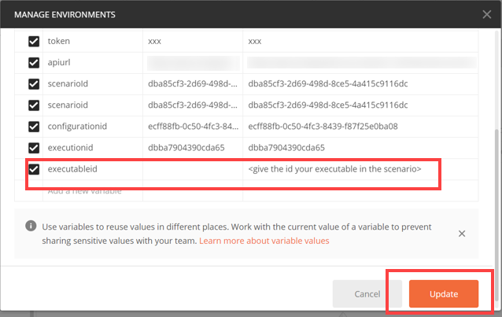

<!-- loio80895a495b4a466b8976735995e23753 -->

# List Executables

An executable is a template that is instantiated for a purpose, such as training a model or creating a deployment. You can list all of the executables in a scenario and get details of specific executables from a scenario. Workflow templates are mapped to training executables.


<a name="loio80895a495b4a466b8976735995e23753__section_apf_kx5_tvb"/>

## List Executables with Postman

1.  Define your scenario ID as the `scenarioid` environment variable.

      

2.  Create a new GET request and enter the URL `{{apiurl}}/v2/lm/scenarios/{{scenarioid}}/executables`

3.  On the *Authorization* tab, set the type to *Bearer Token*.

4.  Set the token value to ***\{\{token\}\}***.

      

5.  On the *Header* tab, add the following entry:


    <table>
    <tr>
    <th valign="top">

    Key


    
    </th>
    <th valign="top">

    Value


    
    </th>
    </tr>
    <tr>
    <td valign="top">

     `ai-resource-group` 


    
    </td>
    <td valign="top">

     *<Name of your resourceGroup\>*`default` is used\)


    
    </td>
    </tr>
    </table>
    
6.  Send the request.

    


> ### Note:  
> The *<modifiedAt\>* \(in the example, field denotes the timestamp of the latest successful sync. The output ***1970-01-01T00:00:00+00:00*** indicates an error.


<a name="loio80895a495b4a466b8976735995e23753__section_wt3_sx5_tvb"/>

## List Executables with curl

```
curl --request GET "[/pandoc/div/div/horizontalrule/codeblock/span/code
     {"filepath"}) $AI_API_URL/v2/lm/scenarios (code]" --header "Authorization: Bearer $TOKEN" --header "ai-resource-group: $RESOURCE_GROUP"
```

> ### Output Code:  
> ```json
> {
>    "count":4,
>    "resources":[
>       {
>          "createdAt":"2021-02-04T13:11:01+00:00",
>          "deployable":true,
>          "description":"churn n text class serving executable desc",
>          "id":"pytf-serving",
>          "inputArtifacts":[
>             {
>                "name":"model_uri"
>             }
>          ],
>          "labels":[
>             
>          ],
>          "modifiedAt":"2021-02-04T13:11:01+00:00",
>          "name":"churntextclassexecname",
>          "parameters":[
>             {
>                "name":"modelName",
>                "type":"string"
>             }
>          ],
>          "scenarioId":"ae0bd260-41ef-4162-81b0-861bd78a8516",
>          "versionId":"0.0.1"
>       },
>       {
>          "createdAt":"2021-02-09T07:35:02+00:00",
>          "deployable":true,
>          "description":"churn n text class serving executable desc",
>          "id":"pytf-serving-tracking",
>          "inputArtifacts":[
>             {
>                "name":"model_uri"
>             }
>          ],
>          "labels":[
>             
>          ],
>          "modifiedAt":"2021-02-09T07:35:02+00:00",
>          "name":"churntextclassexecname",
>          "parameters":[
>             {
>                "name":"modelName",
>                "type":"string"
>             }
>          ],
>          "scenarioId":"ae0bd260-41ef-4162-81b0-861bd78a8516",
>          "versionId":"0.0.1"
>       },
>       {
>          "createdAt":"2021-02-09T07:35:03+00:00",
>          "deployable":false,
>          "description":"churn and text class executable desc",
>          "id":"pytf-training-tracking",
>          "inputArtifacts":[
>             {
>                "name":"churn-data"
>             },
>             {
>                "name":"textclass-data"
>             }
>          ],
>          "labels":[
>             
>          ],
>          "modifiedAt":"2021-02-09T07:35:03+00:00",
>          "name":"churnntextclassexecutablename",
>          "outputArtifacts":[
>             {
>                "name":"churn-pickle"
>             },
>             {
>                "name":"pytf-model"
>             }
>          ],
>          "parameters":[
>             {
>                "name":"train-epoch",
>                "type":"string"
>             }
>          ],
>          "scenarioId":"ae0bd260-41ef-4162-81b0-861bd78a8516",
>          "versionId":"0.0.1"
>       },
>       {
>          "createdAt":"2021-02-04T14:11:02+00:00",
>          "deployable":false,
>          "description":"churn and text class executable desc",
>          "id":"test-training",
>          "inputArtifacts":[
>             {
>                "name":"churn-data"
>             },
>             {
>                "name":"textclass-data"
>             }
>          ],
>          "labels":[
>             
>          ],
>          "modifiedAt":"2021-02-04T14:11:02+00:00",
>          "name":"churnntextclassexecutablename",
>          "outputArtifacts":[
>             {
>                "name":"churn-pickle"
>             },
>             {
>                "name":"pytf-model"
>             }
>          ],
>          "parameters":[
>             {
>                "name":"train-epoch",
>                "type":"string"
>             }
>          ],
>          "scenarioId":"ae0bd260-41ef-4162-81b0-861bd78a8516",
>          "versionId":"0.0.1"
>       }
>    ]
> }
> ```

> ### Note:  
> The *<modifiedAt\>* field denotes the timestamp of the latest successful sync. The output ***1970-01-01T00:00:00+00:00*** indicates an error.


<a name="loio80895a495b4a466b8976735995e23753__section_rxr_lz5_tvb"/>

## Get Executable Details with Postman

1.  Add the environment variable `executableid` and as its value, enter the ID of the executable.

    

2.  Create a new GET request and enter the URL `{{apiurl}}/v2/lm/scenarios/{{scenarioid}}/executables/{{executableid}}`

3.  On the *Authorization* tab, set the type to *Bearer Token*.

4.  Set the token value to ***\{\{token\}\}***.

      

5.  On the *Header* tab, add the following entry:


    <table>
    <tr>
    <th valign="top">

    Key


    
    </th>
    <th valign="top">

    Value


    
    </th>
    </tr>
    <tr>
    <td valign="top">

     `ai-resource-group` 


    
    </td>
    <td valign="top">

     *<Name of your resourceGroup\>* \(in the example, `default` is used\)


    
    </td>
    </tr>
    </table>
    
6.  Send the request.


> ### Note:  
> The *<modifiedAt\>* field denotes the timestamp of the latest successful sync. The output ***1970-01-01T00:00:00+00:00*** indicates an error.


<a name="loio80895a495b4a466b8976735995e23753__section_lzw_mz5_tvb"/>

## Get Executable Details with curl

```
curl --request GET "[/pandoc/div/div/horizontalrule/codeblock/span/code
     {"filepath"}) $AI_API_URL/v2/lm/scenarios (code]" --header "Authorization: Bearer $TOKEN" --header "ai-resource-group: $RESOURCE_GROUP" 
```

> ### Output Code:  
> ```json
> {
>    "createdAt":"2021-02-04T14:11:02+00:00",
>    "deployable":false,
>    "description":"churn and text class executable desc",
>    "id":"test-training",
>    "inputArtifacts":[
>       {
>          "name":"churn-data"
>       },
>       {
>          "name":"textclass-data"
>       }
>    ],
>    "labels":[
>       
>    ],
>    "modifiedAt":"2021-02-04T14:11:02+00:00",
>    "name":"churnntextclassexecutablename",
>    "outputArtifacts":[
>       {
>          "name":"churn-pickle"
>       },
>       {
>          "name":"pytf-model"
>       }
>    ],
>    "parameters":[
>       {
>          "name":"train-epoch",
>          "type":"string"
>       }
>    ],
>    "scenarioId":"ae0bd260-41ef-4162-81b0-861bd78a8516",
>    "versionId":"0.0.1"
> }
> ```

> ### Note:  
> The *<modifiedAt\>* field denotes the timestamp of the latest successful sync. The output ***1970-01-01T00:00:00+00:00*** indicates an error.

**Parent topic:** [Train Your Model](train-your-model-a9ceb06.md "You execute a training workflow to train your AI learning model.")

**Related Information**  


[Choose a Resource Plan](choose-a-resource-plan-57f4f19.md "You can configure SAP AI Core to use different infrastructure resources for different tasks, based on task demand. SAP AI Core provides several preconfigured infrastructure bundles called “resource plans” for this purpose.")

[Workflow Templates](workflow-templates-83523ab.md "Here, you can find a minimal workflow example template, that can be adapted to meet the requirements of your workflow.")

[List Scenarios](list-scenarios-deedde5.md "A scenario is a group of related executables for a use case within the user's tenant. A scenario can have multiple versions that further correspond to the different versions of executables.")

[Create Configurations](create-configurations-884ae34.md "A configuration is a collection of parameters, artifact references, and executables that are used to run an execution or deployment.")

[List Configurations](list-configurations-8074b2a.md "")

[Start Training](start-training-54b44e4.md "Start training and check the status of the execution.")

[Stop Training Instances](stop-training-instances-3d85344.md#loio3d853443027449d9a33723165b19b25a "")

[Delete Training Instances](delete-training-instances-612ce17.md#loio612ce172e609432a840a22eb211ecf7b "Deleting a training instance releases the SAP AI Core resources that it used.")

[Retrieve Execution Logs](retrieve-execution-logs-fbc55d3.md "Information about API processing and metrics, are stored and accessed in the deployment and execution logs.")

[Training Schedules](training-schedules-2b702f8.md "")

