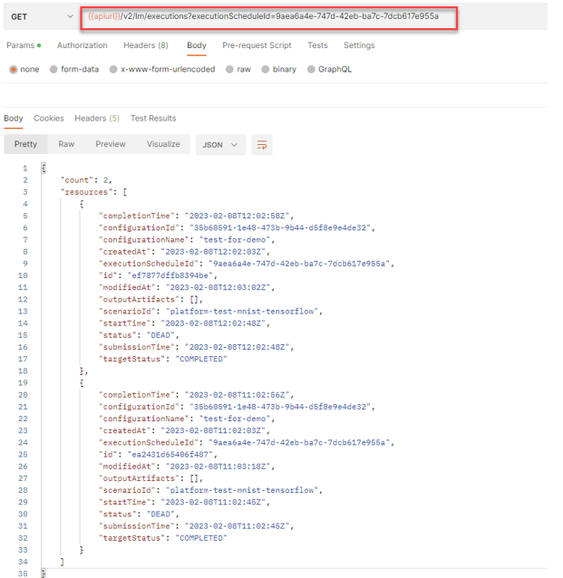

<!-- loio2c1ecfb94988479b95d6a7bfd2784e2e -->

# List Executions Created by a Training Schedule


<a name="loio2c1ecfb94988479b95d6a7bfd2784e2e__section_ort_jwl_lwb"/>

## Using Curl

Get a list of executions created by a training schedule by submitting a GET request:

```
curl --location -- request GET “[/pandoc/div/div/horizontalrule/codeblock/span/code
     {"filepath"}) $AI_API_URL/v2/lm/executionSchedules/$EXECUTION_SCHEDULE (code]” \\
--header “Authorization: Bearer $TOKEN” \
--header “ai-resource-group: $RESOURCE_GROUP”
```


<a name="loio2c1ecfb94988479b95d6a7bfd2784e2e__section_lgp_bdp_mwb"/>

## Using Postman

Get a list of executions created by a training schedule by submitting a GET request to `{{apiurl}}/v2/lm/executions?executionScheduleId={{executionScheduleId}}`



**Parent topic:** [Training Schedules](training-schedules-2b702f8.md "")

**Related Information**  


[Create a Training Schedule](create-a-training-schedule-bd409a9.md "")

[Change an Exisitng Training Schedule](change-an-exisitng-training-schedule-18caf4b.md "")

[Delete a Training Schedule](delete-a-training-schedule-9dc25e1.md "")

