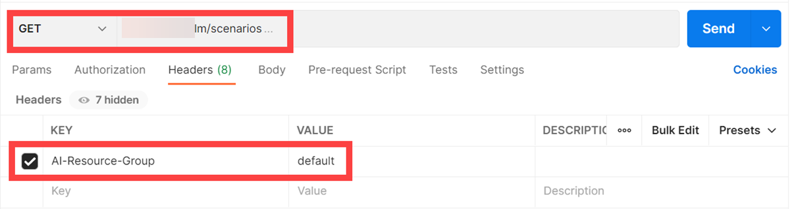
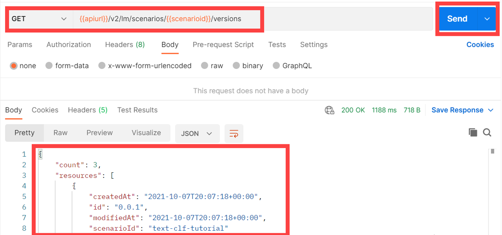

<!-- loiodeedde5c7def40eab20d0e04edfee4b5 -->

# List Scenarios

A scenario is a group of related executables for a use case within the user's tenant. A scenario can have multiple versions that further correspond to the different versions of executables.


<a name="loiodeedde5c7def40eab20d0e04edfee4b5__section_wwg_g4s_vnb"/>

## List Scenarios with Postman

1.  Create a new GET request and enter the URL `{{apiurl}}/v2/lm/scenarios`

2.  On the *Authorization* tab, set the type to *Bearer Token*.

3.  Set the token value to ***\{\{token\}\}***.

      

4.  On the *Header* tab, add the following entry:


    <table>
    <tr>
    <th valign="top">

    Key


    
    </th>
    <th valign="top">

    Value


    
    </th>
    </tr>
    <tr>
    <td valign="top">

     `ai-resource-group` 


    
    </td>
    <td valign="top">

     *<Name of your resourceGroup\>* \(in the example, `default` is used\)


    
    </td>
    </tr>
    </table>
    
      

5.  Send the request.


> ### Note:  
> Only scenarios that have a defined training executable can be created. When a new scenario ID is specified in the workflow template for a training executable, a new scenario will be created along with the training executable.
> 
> For now, a new scenario with only a deployment executable cannot be created. A possible work-around is to create a scenario with a dummy training executable and then use the same scenario ID in the serving template.


<a name="loiodeedde5c7def40eab20d0e04edfee4b5__section_wwg_g4s_sce"/>

## List Scenarios with curl

```
curl --request GET "" --header "Authorization: Bearer $TOKEN" --header "ai-resource-group: $RESOURCE_GROUP"
```

> ### Output Code:  
> ```json
> {
>    "count":2,
>    "resources":[
>       {
>          "createdAt":"2021-02-03T18:38:32+00:00",
>          "description":"churn and text class scenario desc",
>          "id":"84fe6957-1145-4183-b682-8f11ca56d060",
>          "labels":[
>             
>          ],
>          "modifiedAt":"2021-02-04T11:14:02+00:00",
>          "name":"churntextclassscenname"
>       },
>       {
>          "createdAt":"2021-02-04T14:11:02+00:00",
>          "description":"churn and text class scenario desc",
>          "id":"ae0bd260-41ef-4162-81b0-861bd78a8516",
>          "labels":[
>             
>          ],
>          "modifiedAt":"2021-02-09T07:35:03+00:00",
>          "name":"churntextclassscenname"
>       }
>    ]
> } 
> ```

> ### Note:  
> Only scenarios that have a defined training executable can be created. When a new scenario ID is specified in the workflow template for a training executable, a new scenario will be created along with the training executable.
> 
> For now, a new scenario with only a deployment executable cannot be created. A possible work-around is to create a scenario with a dummy training executable and then use the same scenario ID in the serving template.


<a name="loiodeedde5c7def40eab20d0e04edfee4b5__section_ocj_lwp_brb"/>

## Get Scenario Versions with Postman

1.  1.  Create a new GET request and enter the URL `{{apiurl}}/v2/lm/scenarios/{{scenarioid}}/versions`


     


<a name="loiodeedde5c7def40eab20d0e04edfee4b5__section_tqz_5wp_brb"/>

## Get Scenario Versions with curl

```
curl --location --request GET '[/pandoc/div/div/horizontalrule/codeblock/span/code
     {"filepath"}) $API_URL/v2/lm/scenarios/$SCENARIO_ID/versions (code]' \
```

**Parent topic:** [Train Your Model](train-your-model-a9ceb06.md "You execute a training workflow to train your AI learning model.")

**Related Information**  


[Choose a Resource Plan](choose-a-resource-plan-57f4f19.md "You can configure SAP AI Core to use different infrastructure resources for different tasks, based on task demand. SAP AI Core provides several preconfigured infrastructure bundles called “resource plans” for this purpose.")

[Workflow Templates](workflow-templates-83523ab.md "Here, you can find a minimal workflow example template, that can be adapted to meet the requirements of your workflow.")

[List Executables](list-executables-80895a4.md "An executable is a template that is instantiated for a purpose, such as training a model or creating a deployment. You can list all of the executables in a scenario and get details of specific executables from a scenario. Workflow templates are mapped to training executables.")

[Create Configurations](create-configurations-884ae34.md "A configuration is a collection of parameters, artifact references, and executables that are used to run an execution or deployment.")

[List Configurations](list-configurations-8074b2a.md "")

[Start Training](start-training-54b44e4.md "Start training and check the status of the execution.")

[Stop Training Instances](stop-training-instances-3d85344.md#loio3d853443027449d9a33723165b19b25a "")

[Delete Training Instances](delete-training-instances-612ce17.md#loio612ce172e609432a840a22eb211ecf7b "Deleting a training instance releases the SAP AI Core resources that it used.")

[Retrieve Execution Logs](retrieve-execution-logs-fbc55d3.md "Information about API processing and metrics, are stored and accessed in the deployment and execution logs.")

[Training Schedules](training-schedules-2b702f8.md "")

